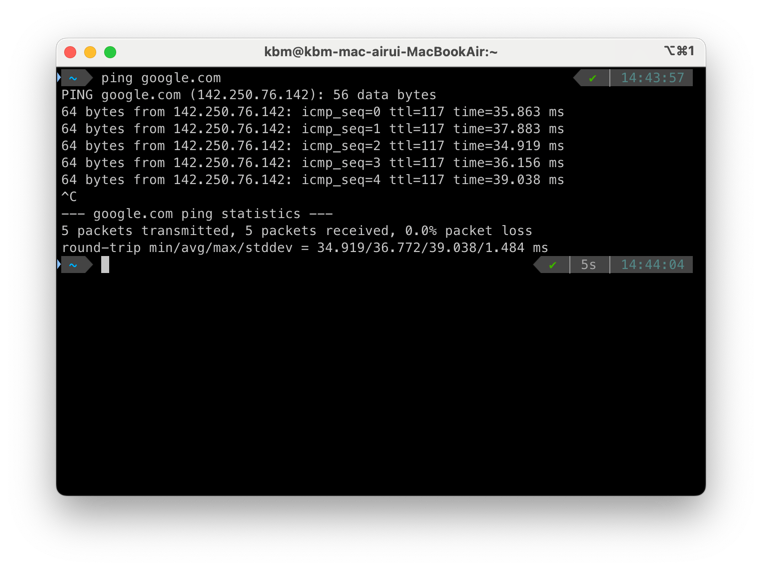
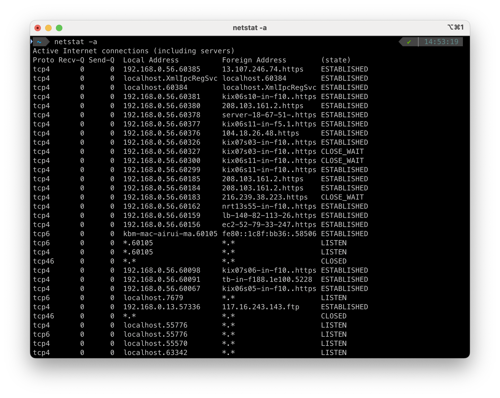

# 네트워크 성능 분석 명령어
## 1. ping

- **기능**: 네트워크 상의 **호스트와의 연결상태와 응답속도(지연시간, RTT)** 를 확인하는 명령어입니다.
- **원리**: ICMP Echo Request 패킷을 전송하고, 상대가 Echo Reply로 응답하는지 확인합니다.
- **출력 정보**
  - 패킷 전송/수신/손실 통계
  - 최소/평균/최대/표준편차 등 왕복 시간(RTT)

## 2. netstat

- **기능**: 현재 시스템의 **네트워크 연결 상태, 포트 사용 현황, 라우팅 테이블 네트워크 인터페이스 통계** 들을 보여줍니다.
- 주요 옵션
  - `netstat -a` : 모든 연결 및 리스닝 포트 표시
  - `netstat -o` : 각 연결에 대한 프로세스 ID(PID) 표시
  - `netstat -r` : 라우팅 테이블 표시
  - `netstat -e` : 네트워크 인터페이스의 통계 정보 표시

## 3. tracert (Windows) / traceroute (Linux)

- **기능**: 목적지까지 데이터가 거치는 **경로**(라우터, 게이트웨이 등)를 추적하여 **각 구간의 지연 시간과 경로**를 확인합니다.
- **원리**: **ICMP** 패킷의 TTL(Time To Live)을 1씩 증가시키며 전송, 각 홉(라우터)에서 TTL이 0이 되면 응답을 받아 경로를 파악합니다.

## 추가로 알아두면 좋은 명령어 모음.. (Linux 기준)

- `ifconfig` : 네트워크 인터페이스의 IP, 서브넷, 게이터웨이 정보 확인 및 설정
- `df -h` : 시스템 디스크 사용현황
- `du -h` : 현재 디렉토리 용량
- `free` : 메모리 사용량
- `nslookup` : DNS 질의 및 도메인 IP 변환
- `ufw` : 리눅스 방화벽 설정 도구, 포트 단위 접근 및 IP/서브넷/인터페이스 기반 포트 제어 가능
- `grep` : 내용 검색, 파이프 라인으로 검색 가능
- `find` : 파일 검색
- `tar/gzip` : 파일 압축 및 해제
  - `tar -czvf [압축파일명.tar.gz] [압축할_파일/디렉토리]` : 압축
  - `tar -xzvf backup.tar.gz` : 압축 해제
