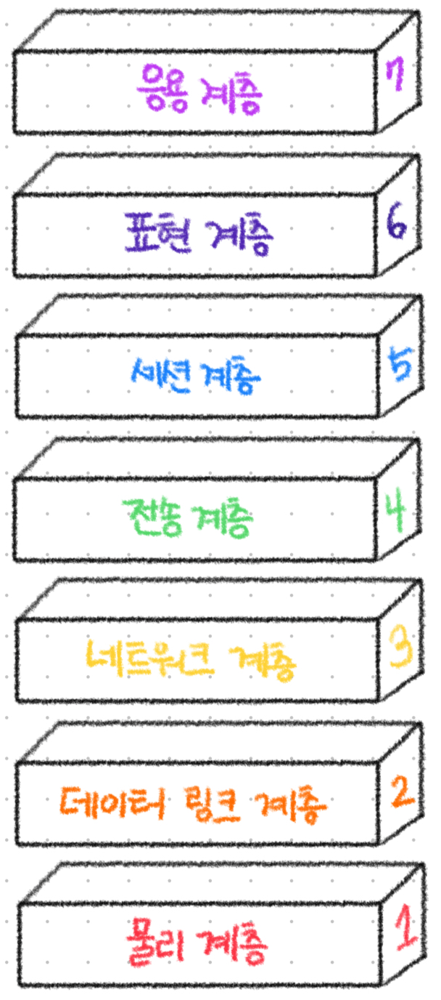

# OSI 7계층 모델

## OSI 모델이란?

**OSI 모델**은 **컴퓨터 네트워크 통신을 계층적으로 나눈 참조 모델**입니다.

국제표준화기구(ISO)에서 제안했으며, 서로 다른 시스템 간의 통신을 표준화하고 효율적으로 하기 위해 설계되었습니다.

OSI 모델은 컴퓨터 네트워킹의 범용 언어로 볼 수 있으며, 이 모델은 **통신 시스템을 7개의 추상적 계층으로** 나눕니다.

 

## OSI 모델이 중요한 이유

현대 인터넷은 OSI 모델을 엄격하게 따르지 않음에도 불구하고, **OSI 모델은 여전히 네트워크 문제를 해결하는 데 아주 유용**합니다.

흐름을 한눈에 알아보기 쉬우며, 7계층 중 특정한 곳에 이상이 발생할 경우 다른 단계의 장비 및 소프트웨어를 건들지 않고도 이상이 발생한 계층만 고칠 수 있습니다. 이를 통해 불필요한 많은 작업을 피할 수 있습니다.

예를 들어, PC방에서 게임을 하던 중 연결이 끊겼습니다. 어디에 문제가 발생했는지 아래와 같이 생각해볼 수 있습니다.

- 모든 PC에 문제가 있다면, 스위치 또는 라우터의 문제(2~3계층)거나, 통신 회선의 단선 또는 장애와 같은 물리적 문제(1계층)일 것이다.
- 한 PC만 문제가 있다면, 해당 PC의 네트워크 설정 문제(3~4계층), 방화벽 설정 등 OS 수준의 제한(5~6계층), 혹은 게임 프로그램 자체의 오류(7계층)일 것이다.

 

## OSI 7계층

  

<h3 style="background-color:#f94b58; color:black; padding: 6px;">물리 계층 (Physical Layer)</h3>

물리 계층에는 케이블, 허브 등 데이터 전송과 관련된 물리적 장비가 포함됩니다.

물리 계층은 **데이터를 0과 1의 문자열인 비트 스트림(전기적인 신호)으로 변환**합니다. 단지 데이터를 전기적인 신호로 변화해 주고받을 뿐, 해당 데이터가 무엇인지, 어떤 에러가 있는지에 대해서는 신경쓰지 않습니다.

- 전송단위: 비트(bit)

<h3 style="background-color:#fd720d; color:black; padding: 6px;">데이터 링크 계층 (Data Link Layer)</h3>

데이터 링크 계층은 **동일한 네트워크에 있는 두 장치 간의 데이터 전송을 담당**하며, MAC 주소를 기반으로 통신합니다.

**물리 계층을 통해 전송되는 비트들을 프레임 단위로 구성**하고, **오류 검출**, **흐름 제어**, **프레임 동기화** 등의 기능을 수행하여 신뢰성 있는 전송을 지원합니다.

일부 프로토콜에서는 **오류가 발생한 프레임에 대해 재전송을 요청**하거나 **프레임의 순서를 제어**하는 기능도 제공합니다.

- 전송단위: 프레임(Frame)

<h3 style="background-color:#fdd756; color:black; padding: 6px;">네트워크 계층 (Network Layer)</h3>

네트워크 계층은 서로 다른 두 네트워크 간 데이터 전송을 용이하게 하는 역할을 합니다.

**경로(Route)와 주소(IP)를 정하고 패킷을 전달하는 것**이 네트워크 계층의 역할이며, 서로 통신하는 두 장치가 동일한 네트워크에 있는 경우에는 네트워크 계층이 필요하지 않습니다.

네트워크 계층은 **데이터가 표적에 도달하기 위한 최상의 물리적 경로**를 찾아야 하는데, 이를 **라우팅**이라고 합니다.

- 전송단위: 패킷(Packet/Datagram)

<h3 style="background-color:#61da76; color:black; padding: 6px;">전송 계층 (Transport Layer)</h3>

전송 계층은 **종단 간(end-to-end) 통신에서 신뢰성 있고 효율적인 데이터 전송을 담당**합니다.

이 계층은 **오류 검출 및 복구**, **흐름 제어**, **순서 제어** 및 **중복 수신 방지**를 통해 안정적인 통신을 지원합니다.

흐름 제어는 송신자의 속도가 수신자의 처리 능력을 초과하지 않도록 하여 버퍼 오버플로우를 방지합니다.

또한, **포트 번호**를 사용해 동일 호스트 내의 여러 애플리케이션을 구분하며, 대표적인 전송 계층 프로토콜로 **TCP**와 **UDP**가 있습니다.

- 전송단위: 세그먼트(Segment)

<h3 style="background-color:#59a3fa; color:black; padding: 6px;">세션 계층 (Session Layer)</h3>

세션 계층은 **통신을 하는 두 개의 애플리케이션 간 세션을 시작하고 종료하는 일을 담당**하는 계층입니다. 통신이 시작될 때부터 종료될 때까지의 시간을 세션이라고 합니다.

세션 계층은 교환되고 있는 모든 데이터를 전송할 수 있도록 충분히 세션을 개방한 다음, 리소스를 낭비하지 않기 위해 세션을 즉시 닫을 수 있도록 보장합니다.

사용자의 로그인 상태를 유지하거나, 중단된 데이터 전송을 이어받을 수 있게 하는 등의 기능을 통해 **통신의 연속성과 효율성을 보장**합니다. 또한, **동기화 지점을 설정해 오류 발생 시 복구를 가능**하게 합니다.

<h3 style="background-color:#422799; color:black; padding: 6px;">표현 계층 (Presentation Layer)</h3>

표현 계층은 **데이터 형식의 변환, 암호화, 압축을 담당**하여 상위 계층인 응용 계층이 데이터를 이해할 수 있도록 준비하는 역할을 합니다.

- 서로 다른 시스템 간의 데이터 인코딩 방식 차이를 조정합니다.
- 암호화된 통신에서는 데이터를 암호화하거나 복호화하여 보안성을 확보합니다.
- 데이터 전송 전 압축을 수행하여 전송 효율을 높입니다.

즉, 표현 계층은 데이터를 읽을 수 있게, 작게, 그리고 안전하게 만듭니다.

<h3 style="background-color:#c248f2; color:black; padding: 6px;">응용 계층 (Application Layer)</h3>

응용 계층은 사용자와 가장 가까운 계층으로, **사용자의 데이터와 직접 상호 작용**하는 유일한 계층입니다.

애플리케이션 계층은 **소프트웨어가 사용자에게 의미 있는 데이터를 제공하기 위해 의존하는 프로토콜과 데이터를 조작하는 역할**을 합니다.

대표적으로 **HTTP, SMTP, FTP** 등의 프로토콜이 이에 해당합니다.

 
 

> 참고
>
> - https://www.cloudflare.com/ko-kr/learning/ddos/glossary/open-systems-interconnection-model-osi/
> - https://inpa.tistory.com/entry/WEB-%F0%9F%8C%90-OSI-7%EA%B3%84%EC%B8%B5-%EC%A0%95%EB%A6%AC
> - https://aws.amazon.com/ko/what-is/osi-model/
