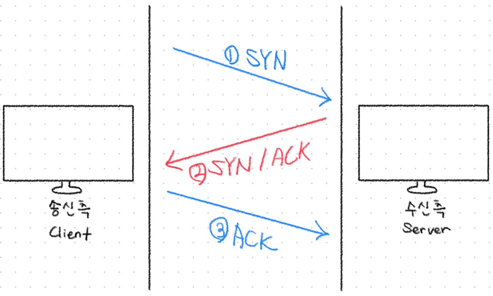
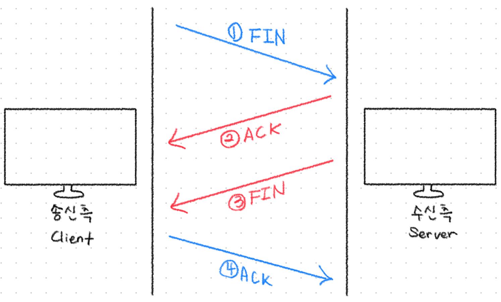

# TCP/IP 4계층 모델

## TCP와 UDP

### TCP (Transmission Control Protocol)

> 인터넷에서 데이터를 메시지 형태로 안정적으로 전송하기 위해 IP와 함께 사용되는 대표적인 전송 계층 프로토콜

TCP는 **IP가 데이터를 전달하는 역할**을 하는 동안, **전송된 패킷을 추적하고 정확하게 관리하는 기능**을 수행합니다.

**연결 지향 방식(Connection-Oriented)**을 사용하는 TCP는 **인터넷 환경에서 기본적으로 사용되는 신뢰성 높은 프로토콜**입니다.

IP보다 속도는 느릴 수 있지만, 수신된 데이터 조각의 손상 여부를 점검하고 누락된 패킷을 재요청하며, **정확한 순서로 데이터를 재구성**합니다.

### TCP의 주요 특징

- **연결 지향 프로토콜**이며, **패킷 교환 방식**을 사용합니다.
  - 연결 지향 방식이란 데이터를 전송하기 전에 송신자와 수신자 간에 논리적인 연결을 먼저 설정하는 통신 방식 → 신뢰성 Up
- **데이터의 신뢰성과 순서 보장**: 전송한 패킷이 **손상 없이, 보낸 순서대로** 도착하도록 합니다.
- **재전송 기능**: 손상되거나 누락된 패킷이 있을 경우 **재전송을 요청**하여 데이터의 완전성을 보장합니다.
- **3-way-handshake**를 통해 통신을 시작하며, **4-way-handshake**를 통해 연결을 종료합니다.
- **흐름 제어(Flow Control)**와 **혼잡 제어(Congestion Control)**를 통해 네트워크의 효율성과 안정성을 유지합니다.
  - **흐름 제어**: 송신자의 속도가 수신자의 처리 능력을 초과하지 않도록 하여 버퍼 오버플로우를 방지
  - **혼잡 제어**: 네트워크 내 패킷 수가 넘치게 증가하지 않도록 방지

---

### UDP (User Datagram Protocol)

> 사용자 데이터를 데이터그램 단위로 처리하는 전송 계층의 비연결형 프로토콜

UDP는 **비연결형 프로토콜**로, 데이터를 전송하기 위해 송수신 간의 연결을 설정하지 않습니다.

따라서 각 패킷은 **독립적으로 처리**되며, 서로 다른 경로로 전송될 수도 있습니다.

**TCP와 달리** 데이터 전송 시 **연결 설정 및 해제 과정이 없고**, **순서 보장이나 재전송 기능도 제공하지 않습니다.**

이로 인해 UDP는 기능은 단순하지만, **빠르고 지연이 적은 통신이 가능**합니다.

UDP는 IP 프로토콜을 기반으로 하되, 여기에 **포트 번호와 체크섬(Checksum)** 기능이 추가되어, 최소한의 오류 검출만 제공합니다.

**네트워크 부하가 적고 전송 속도가 빠르기 때문에**, 신뢰성보다는 연속성이 중요한 **실시간 스트리밍, 온라인 게임, 음성 통화** 등에 주로 사용됩니다.

### UDP의 주요 특징

- **비연결형 서비스**로, 데이터그램 방식 기반의 통신을 제공합니다.
- 데이터를 주고받기 위해 **연결 설정 절차를 거치지 않으며**, 전송 시 별도의 신호 교환이 없습니다.
- **오류 검출은 체크섬을 통해 최소한 수준으로만 수행**합니다. 오류 복구 기능은 없습니다.
- **패킷 순서 보장 및 재전송 기능이 없으므로 신뢰성은 낮지만**, TCP보다 **전송 속도가 빠릅니다**.
- **오버헤드가 적고 구현이 간단**하여, 실시간 처리가 중요한 서비스에 적합합니다.

 

## TCP 3-way-handshake & 4-way-handshake

### TCP 3-way-handshake

TCP신뢰성 있는 연결형 통신을 위해, **데이터 전송에 앞서 통신 양 끝단 간에 연결을 설정하는 과정인 3-way-handshake를 수행**합니다.

이 과정은 클라이언트와 서버 간 **논리적인 세션을 수립**하고, 양측이 **데이터 전송이 가능함을 상호 확인**하기 위한 절차입니다.

즉, 응용프로그램이 데이터를 전송하기 전에 정상적인 통신이 가능한 상태인지 사전에 합의하는 과정입니다.

  

**[Step 1] 클라이언트 → 서버 : SYN**

- 클라이언트는 서버에 연결을 요청하는 SYN 패킷을 보냅니다.
- 이 패킷에는 SYN(synchronize) 플래그가 설정되어 있으며, 초기 순서 번호(ISN, Initial Sequence Number)도 포함됩니다.

**[Step 2] 서버 → 클라이언트 : SYN + ACK**

- 서버는 클라이언트의 SYN 요청을 수신하고, 자신의 연결 수락 의사(ACK)와 함께 자신의 SYN 요청도 함께 포함하여 응답합니다.
- 이 패킷에는 SYN + ACK 플래그가 모두 설정되어 있습니다.
  - ACK: 클라이언트의 연결 요청을 수락함
  - SYN: 서버도 통신을 시작하고자 함
- 서버 또한 자신의 초기 순서 번호(ISN)을 포함합니다.

**[Step 3] 클라이언트 → 서버 : ACK**

- 클라이언트는 서버에게 SYN + ACK 패킷을 받고, 이에 대한 확인 응답(ACK)을 보내 연결이 성립됩니다.

---

### TCP 4-way-handshake

TCP 연결은 **데이터 송수신이 완료된 후**, 4단계에 걸친 절차(4-way-handshake)를 통해 **정상적으로 연결을 종료**합니다.

이는 통신 양측이 **독립적으로 연결 종료 의사를 표현하고, 이를 각각 수락하는 과정**으로 구성됩니다.

연결 종료는 **양방향(half-close)**이며, 송신자와 수신자가 각자 종료 요청(FIN)을 수행하고, 상대의 요청에 대해 수락(ACK)해야 완전히 종료됩니다.

  

**[Step 1] 클라이언트 → 서버 : FIN**

- 클라이언트가 더 이상 보낼 데이터가 없음을 알리기 위해 FIN 플래그를 설정한 패킷을 보냅니다.
- 이 단계는 "나는 이제 데이터 전송을 마쳤으니, 연결을 닫고 싶다"는 요청입니다.
- Half-close 상태로 진입하며, 클라이언트는 수신은 계속 가능하지만 송신은 중단됩니다.

**[Step 2] 서버 → 클라이언트 : ACK**

- 서버는 클라이언트의 FIN 요청을 수신한 뒤, ACK 플래그가 설정된 패킷으로 응답합니다.
- 이는 "네가 전송 종료한 것 확인했어. 하지만 나는 아직 데이터를 보낼 수 있어"라는 의미입니다.

**[Step 3] 서버 → 클라이언트 : FIN**

- 서버 역시 자신의 데이터 전송을 마친 뒤, FIN 플래그가 설정된 패킷을 클라이언트에게 보냅니다.
- 이로써 서버도 연결을 종료하고 싶다는 의사를 명확히 표현합니다.

**[Step 4] 클라이언트 → 서버 : ACK**

- 클라이언트는 서버의 FIN에 대한 확인 응답(ACK)을 보냅니다.
- 이 응답을 마지막으로, 양쪽 모두 데이터 송수신을 종료하게 되며 연결이 완전히 닫힙니다.

**연결 종료 이후**

- 클라이언트는 마지막 ACK를 보낸 후에도 일정 시간 동안 TIME-WAIT 상태로 대기하여 패킷 재전송에 대비합니다.
- 서버는 ACK를 수신하자마자 연결을 즉시 종료합니다.

 

## TCP/IP 4계층

  

<h3 style="background-color:#fd720d; color:black; padding: 6px;">네트워크 액세스 계층 (Network Access Layer)</h3>

네트워크 액세스 계층은 **OSI 7계층 중 물리 계층과 데이터 링크 계층의 역할을 통합**한 계층입니다.

주요 기능은 **같은 네트워크 내에서 노드 간 데이터 전송**을 담당하며, 데이터를 실제 물리 매체(케이블, 전파 등)를 통해 전달할 수 있도록 합니다.

이 계층은 다음 두 가지 역할을 수행합니다:

- **데이터 링크 기능**: 프레임 단위 전송, MAC 주소 기반의 주소 지정 및 오류 검출
- **물리 계층 기능**: 데이터를 전기적 신호나 전파로 인코딩하여 실제 매체로 전송

---

- **전송 단위**: 프레임 (Frame)
- **주소 체계**: MAC 주소
- **주요 프로토콜/기술**: Ethernet, Wi-Fi, ARP (하위 주소 변환 포함)

<h3 style="background-color:#fdd756; color:black; padding: 6px;">인터넷 계층 (Internet Layer)</h3>

인터넷 계층은 **OSI 7계층의 네트워크 계층에 해당**하며, **패킷을 목적지까지 전달하기 위한 경로 설정과 주소 지정** 기능을 담당합니다.

IP 주소를 기반으로 목적지까지의 경로를 결정하며, **라우팅, 분할(fragmentation), 패킷 포워딩** 등의 역할을 수행합니다.

중요한 특징은 이 계층이 신뢰성 없는 전송(unreliable)을 제공한다는 점으로, **데이터의 손실, 순서 변경, 중복 전송 가능성**이 존재합니다.

※ IP는 “최대한 빠르고 효율적으로 목적지에 도달”하도록 라우팅은 수행하지만, 전송 성공 여부를 보장하지는 않습니다.

---

- **전송 단위**: 패킷 (Packet)
- **주소 체계**: IP 주소
- **주요 프로토콜**: IP (IPv4, IPv6), ICMP, ARP, RARP

<h3 style="background-color:#61da76; color:black; padding: 6px;">전송 계층 (Transport Layer)</h3>

전송 계층은 **OSI의 전송 계층과 동일**하며, **종단 간(End-to-End) 통신의 신뢰성**을 담당합니다.

애플리케이션 간 데이터를 정확하게 전달하기 위해 **순서 보장, 오류 제어, 흐름 제어, 포트 기반 식별** 등의 기능을 수행합니다.

대표적인 프로토콜은 다음과 같습니다:

- **TCP**: 연결 기반, 신뢰성 보장, 순서 유지, 재전송 지원
- **UDP**: 비연결형, 빠르지만 신뢰성 없음

---

- **전송 단위**: 세그먼트 (Segment, TCP) / 데이터그램 (Datagram, UDP)
- **주소 체계**: 포트 번호 (Port)
  - 포트 번호는 하나의 호스트 내 여러 애플리케이션을 식별하기 위한 논리적 주소
- **주요 프로토콜**: TCP, UDP

<h3 style="background-color:#c248f2; color:black; padding: 6px;">애플리케이션 계층 (Application Layer)</h3>

애플리케이션 계층은 **OSI 7계층의 응용, 표현, 세션 계층이 통합된 계층**으로, **사용자와 가장 가까운 계층**입니다.

웹 브라우저, 이메일 클라이언트, 파일 전송 도구 등 **응용 프로그램이 사용하는 네트워크 인터페이스를 제공**합니다.

이 계층에서는 **응용 프로그램 간 데이터 교환이 이루어지며**, 사용자 경험을 위한 다양한 애플리케이션 프로토콜이 구현됩니다.

---

- **전송 단위**: 데이터(Data), 메시지(Message)
- **주요 프로토콜/예시**: HTTP, FTP, DNS, SMTP, POP3, Telnet

 

## TCP/IP 4계층과 OSI 7계층의 차이

OSI 7계층과 TCP/IP 4계층은 모두 **네트워크 통신을 계층적으로 설명하기 위한 모델**입니다.

그러나 두 모델은 **목적과 적용 범위, 구성 방식에서 차이**가 있습니다.

**OSI 7계층**

- 국제표준화기구(ISO)가 정의한 **이론적 참조 모델**입니다.
- 네트워크 통신에 필요한 기능을 **7단계로 세분화**하여 설명합니다.
- 실질적인 구현보다는 **기능과 역할의 구분**, **표준화 기준**, **학습 목적**에 중점을 둡니다.
- 실제 통신에는 직접 사용되지 않지만, **프로토콜 설계와 기술 분석에 있어 중요한 기준점**으로 활용됩니다.

---

**TCP/IP 4계층**

- 실제 **인터넷에서 사용되는 프로토콜 스택**입니다.
- OSI 7계층을 기반으로 **4단계로 기능을 단순화**하여 구성됩니다.
- **IP, TCP, UDP, HTTP 등 실무에서 쓰이는 프로토콜**이 여기에 포함됩니다.
- **실제 구현과 운용에 초점**을 둔 모델로, 운영체제와 네트워크 장비에 적용됩니다.

 
 

> 참고
>
> - https://inpa.tistory.com/329
> - https://velog.io/@dyunge_100/Network-TCPIP-4%EA%B3%84%EC%B8%B5%EC%97%90-%EB%8C%80%ED%95%98%EC%97%AC
> - https://mangkyu.tistory.com/15
> - https://mindnet.tistory.com/entry/%EB%84%A4%ED%8A%B8%EC%9B%8C%ED%81%AC-%EC%89%BD%EA%B2%8C-%EC%9D%B4%ED%95%B4%ED%95%98%EA%B8%B0-22%ED%8E%B8-TCP-3-WayHandshake-4-WayHandshake
> - https://velog.io/@moonblue/TCPIP-%EC%99%80-OSI-7%EA%B3%84%EC%B8%B5-%EA%B5%AC%EC%A1%B0-%EB%B9%84%EA%B5%90
> - https://velog.io/@dyunge_100/Network-TCPIP-4%EA%B3%84%EC%B8%B5%EC%97%90-%EB%8C%80%ED%95%98%EC%97%AC
