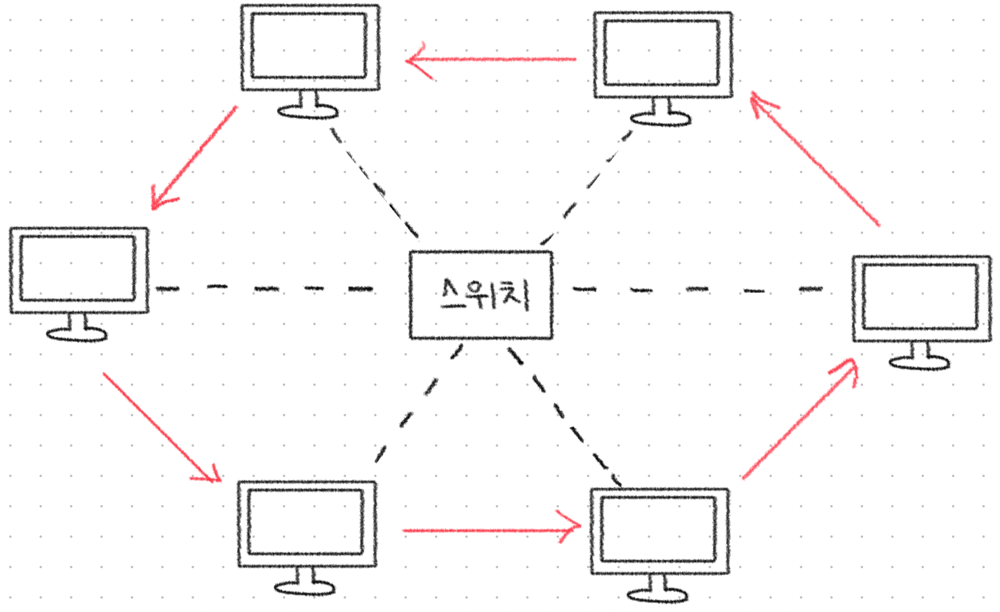
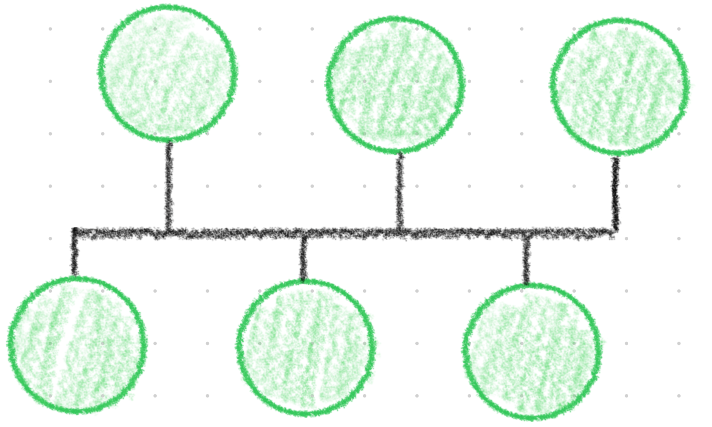
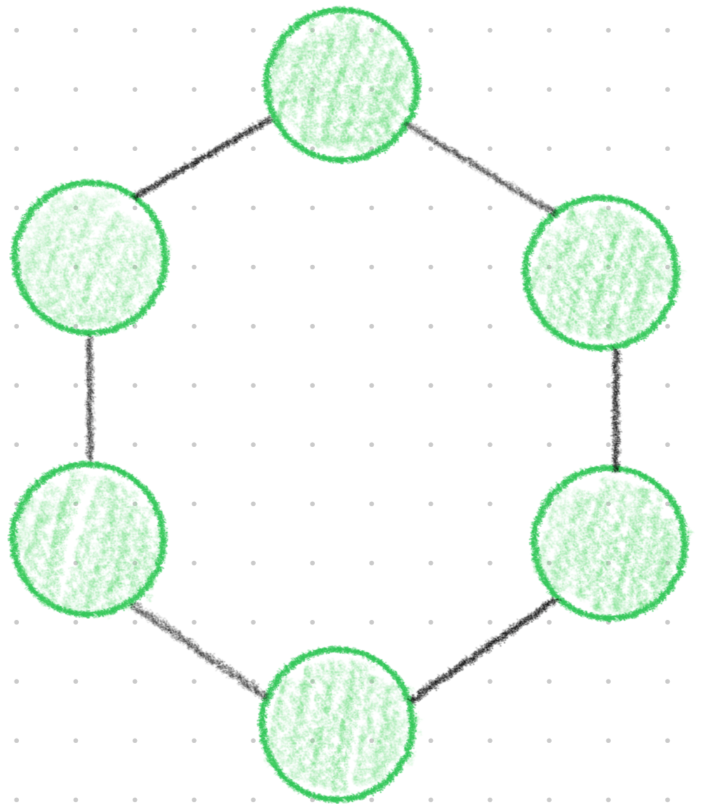
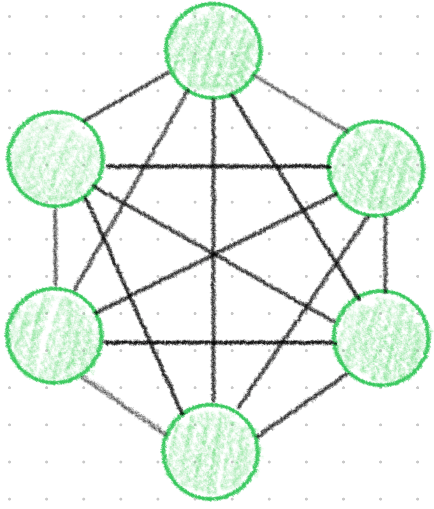
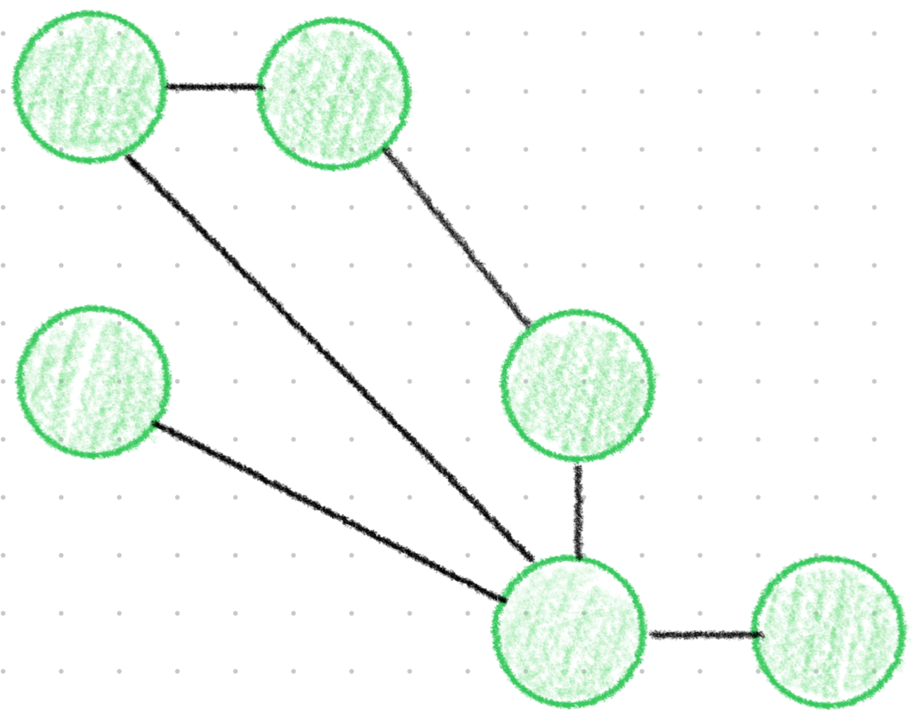
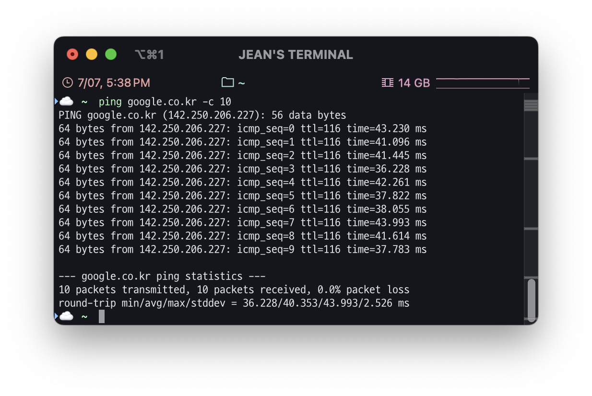
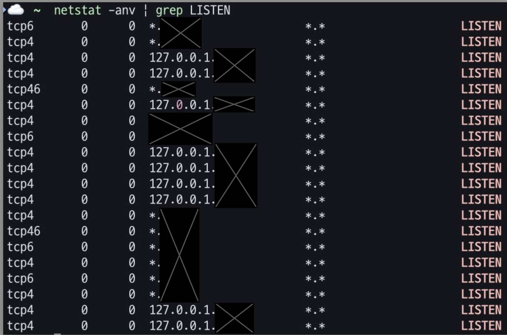
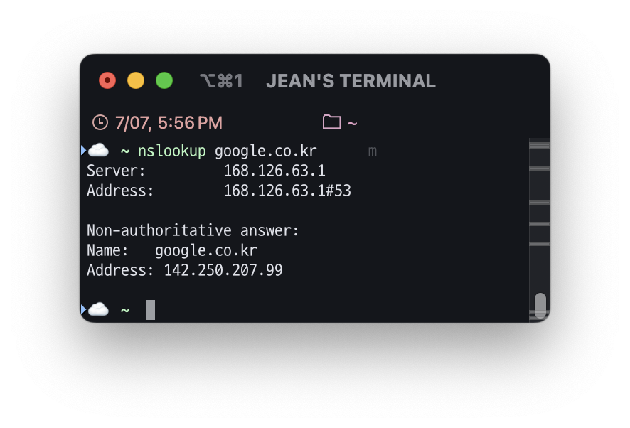
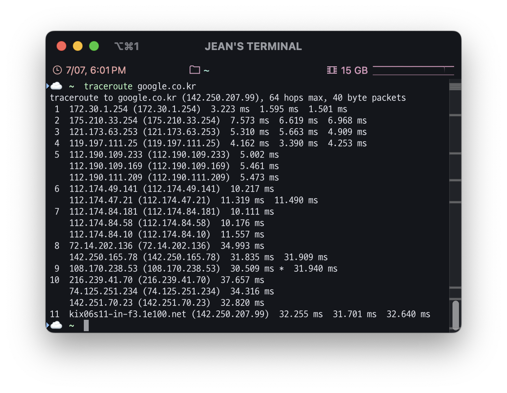

# 네트워크(Network)란?

## 네트워크란?

네트워크는 Net과 Work의 합성어로, 그물처럼 서로 긴밀하게 연결되어 있는 것을 뜻합니다.

보통 IT에서 사용되는 정의로 보자면 두 대 이상의 컴퓨터 또는 장치들이 연결되어 정보를 주고받을 수 있는 시스템을 말하며, 통신 과정 전체를 아우르는 개념이라 할 수 있습니다.

그렇다면 좋은 네트워크란 무엇일까요?

## 좋은 네트워크란?

좋은 네트워크란 신뢰성이 높고, 빠르며, 안전한 네트워크를 의미합니다.

처리량이 많고 지연 시간이 짧으며, 장애 발생 가능성이 적고, 보안이 잘 갖춰진 네트워크가 좋은 네트워크라고 할 수 있습니다.

 
 

# 처리량과 지연 시간

“처리량이 많고 지연 시간이 짧으며…”

지연 시간 및 처리량은 컴퓨터 네트워크의 성능을 측정하는 두 가지 지표로, 위에서 언급한 것처럼 좋은 네트워크가 되기 위해선 **처리량**과 **지연 시간**이 중요합니다.

## 지연 시간(Latency)

지연 시간은 요청이 처리되는 시간입니다. **네트워크를 통해 데이터를 전송하는 데 걸리는 시간**을 보여줍니다.

지연이나 랙이 길게 발생하는 네트워크는 지연 시간이 길고, 응답 시간이 빠른 네트워크는 지연 시간이 짧습니다.

### 측정 방법

지연 시간은 핑 시간을 측정하여 네트워크 지연 시간을 측정할 수 있습니다.

대부분의 운영 체제는 해당 작업을 수행하는 `ping` 명령어를 지원합니다.

왕복 시간은 **밀리초 단위**로 표시되며 네트워크에서 데이터를 전송하는 데 걸리는 시간을 알려줍니다.

## 처리량(Throughput)

처리량은 **특정 시간 동안 실제로 네트워크를 통과할 수 있는 평균 데이터 양**을 가리킵니다. 이는 목적지에 성공적으로 도착한 데이터 패킷의 수와 데이터 패킷 손실을 나타냅니다.

### 측정 방법

처리량은 네트워크 테스트 도구를 사용하거나 수동으로 처리량을 측정할 수 있습니다.

처리량을 수동으로 테스트하려면 파일을 전송하고 도착하는 데 걸리는 시간으로 파일 크기를 나누면 됩니다.

그러나 지연 시간과 대역폭이 처리량에 영향을 미치기 때문에, 대역폭 및 지연 시간과 같은 다른 요인과 함께 처리량을 보고하는 네트워크 테스트 도구를 주로 사용합니다.

원래는 네트워크 처리량을 **초당 비트 수(bps)**로 측정했으나 데이터 전송 기술이 발전함에 따라 훨씬 더 높은 가치를 달성할 수 있게 되었습니다.

따라서 **초당 킬로바이트(KBps)**, **초당 메가바이트(MBps)**, **심지어 초당 기가바이트(GBps)** 단위로 처리량을 측정할 수 있습니다.

## 대역폭, 지연 시간, 처리량 간의 관계

### 대역폭(Bandwidth)

대역폭은 **단위 시간 내 전달할 수 있는 최대 크기의 용량**을 의미합니다. 이는 주어진 시간 동안 네트워크를 통해서 흐를 수 있는 최대 비트 수를 나타냅니다.

대역폭이 높을수록 많은 데이터가 네트워크에 실려 전달될 수 있습니다. **초당 메가바이트(MBps) 단위**로 측정하며, **대역폭은 네트워크의 이론상 최대 처리량**이라고 생각하면 됩니다.

대역폭은 전송할 수 있는 데이터의 양이고, 처리량은 실제 네트워크 제한에 따라 특정 순간에 전송할 수 있는 실제 데이터 양입니다. **큰 대역폭은 속도나 우수한 네트워크 성능을 보장하지 않지만 대역폭이 클수록 처리량이 많아집니다.**

그렇다면, **왜 대역폭이 크다고 해서 속도나 성능이 보장되지 않을까요?**

1. 네트워크 지연 (latency)

   대역폭이 아무리 커도, 지연 시간이 길면 응답 속도는 느려짐.

2. 패킷 손실 (packet loss)

   네트워크 중간에서 데이터가 손실되면 재전송 발생

3. 혼잡 (Conjestion)

   여러 사용자가 동시에 같은 네트워크를 사용할 경우 병목 현상 발생

4. 네트워크 장비의 성능 제한

   서버, 라우터, 스위치 등이 처리할 수 있는 최대 속도보다 대역폭이 더 크다면 병목 발생

5. 프로토콜 오버헤드

   예: TCP는 패킷 순서 확인, 오류 확인 등을 하기 때문에 실제 전송 가능한 양은 줄어듦

결론적으로 **대역폭은 가능성**이고, **처리량은 현실**입니다.

물이 흐르는 파이프로 비유했을 때, 대역폭은 파이프의 지름에 해당하고 처리량은 파이프를 통해 실제 흘러간 물의 양이 됩니다.

파이프의 지름이 크다고 해도 그 안에 물이 충분히 흐르지 않거나, 물이 흐르는 속도가 느리거나, 중간에 물이 새면 실제 흐르는 물의 양은 줄어듭니다.

 
 

# 네트워크 토폴로지와 병목 현상

## 네트워크 토폴로지

네트워크는 그물처럼 서로 긴밀하게 연결되어 있는 것이라고 설명하였습니다.

이러한 네트워크에는 **노드와 링크가 어떻게 배치되어 있는지에 대한 방식이자 연결 형태를 뜻하는 토폴로지**가 존재합니다.

네트워크 토폴로지에는 물리적 토폴로지와 논리적 토폴로지가 존재합니다. **물리적 토폴로지는 노트, 링크와 같은 네트워크를 구성하는 요소들의 배치에 의해 결정**되고 **논리적 토폴로지는 노드들 사이의 데이터 흐름에 따라 결정**됩니다.

예를 들어 위 그림과 같이 네트워크가 물리적으로 연결되어 있고, 붉은색 화살표와 같이 데이터가 순차적으로 흐른다고 합시다.

이때 **물리적 토폴로지는 성형(Star)**이고, **논리적 토폴로지는 링형(Ring)**입니다.

### 토폴로지 종류

1. **성형(Star)**

각 노드는 중앙에 위치한 주 노드를 통하여 다른 노드들과 통신을 할 수 있는 형태입니다.

👍 장애 발견이 쉽고, 관리가 용이합니다.

👎 주 노드에 장애가 발생하면 전체 네트워크 사용이 불가능합니다.

1. **버스형(Bus)**

버스라는 공통 배선에 각 노드가 연결된 형태로, 노드의 신호가 테이블 전체에 전달됩니다.

👍 노드의 추가 및 삭제가 용이하고, 특정 노드의 장애가 다른 노드에 영향을 주지 않습니다.

👎 공통 배선의 대역폭을 공유하기 때문에, 노드 수가 증가하면 배선의 트래픽이 증가하여 네트워크 성능이 저하됩니다.

1. **링형(Ring)**

각 노드의 좌우의 인접한 노드와 연결되어 원형을 이루고 있는 형태입니다.

👍 단 방향 통신으로 신호 증폭이 가능하여 거리 제약이 적습니다.

👎 노드의 추가 및 삭제가 어렵습니다.

1. **망형(Mesh)**

모든 노드가 서로 일대일로 연결된 그물망 형태로 다수의 노드 쌍이 동시에 통신할 수 있습니다.

- 완전 연결형: 스위칭 또는 브로드캐스팅은 필요 없으나 노드가 추가될 때마다 연결 수가 급격하게 증가

- 부분 연결형

👍 특정 노드의 장애가 다른 노드에 영향을 주지 않고, 회선 장애에 유연한 대처가 가능합니다.

👎 회선 구축 비용이 많이 들며, 새로운 노드 추가 시 비용 부담이 발생합니다.

## 병목 현상

네트워크 병목 현상이란 **데이터 흐름이 특정 구간에서 좁아져 전체 성능을 저해하는 현상**입니다.

이전에 대역폭에서 설명한 물이 흐르는 파이프의 예시를 다시 사용하자면, 물리적으로는 파이프의 한 구간이 좁아져서 물 흐름이 줄어드는 것과 같습니다.

이는 네트워크에서 **어느 한 구간의 네트워크 장비, 서버, 회선 등이 처리할 수 있는 용량보다 많은 데이터가 몰리면 전체 처리량이 감소**함을 의미합니다.

### 주요 원인

네트워크 병목 현상에는 다양한 원인이 존재합니다.

1. **링크 용량 부족**: 특정 구간의 대역폭이 다른 구간보다 현저히 낮을 때
2. **장비 처리 능력 부족**: 라우터, 스위치, 서버 등 네트워크 장비의 CPU 또는 포트 처리 능력 초과
3. **트래픽 집중**: 여러 노드가 동시에 특정 노드에 데이터를 전송할 때
4. **네트워크 충돌 또는 재전송**: 충돌이 많은 환경에서 패킷이 자주 손실되고 재전송됨
5. **잘못된 라우팅 또는 구성 오류**: 비효율적인 경로로 인해 불필요한 홉(Hop)을 거치는 경우
6. **QoS 미적용 또는 정책 부재**: 중요 트래픽이 저우선순위 트래픽과 동일하게 처리됨

### 해결 방법

병목 현상은 네트워크 토폴로지를 적절하게 활용함으로써 해결할 수 있습니다.

1. **중앙 집중형(Star Topology)의 확장**

   기존에는 모든 노드가 단일 스위치에 연결된 형태로 구성되어 있어, 중앙 스위치가 병목 지점이 되는 문제가 발생할 수 있습니다.

   이를 해결하기 위해 고성능의 코어 스위치로 장비를 교체하거나, 중간 분기용 스위치를 추가하여 트래픽을 분산시키는 방식이 효과적입니다.

   특히, 계층형 토폴로지(Three-tier Architecture)를 적용하면, 네트워크 트래픽이 상위 계층에서 효율적으로 분산되어 병목 현상을 완화할 수 있습니다.

2. **링(Ring) 토폴로지를 메시(Mesh) 토폴로지로 변경**

   단방향 링 구조에서는 특정 링크에 문제가 생기거나 부하가 집중되면, 전체 네트워크 성능에 큰 영향을 줄 수 있습니다.

   이를 개선하기 위해 이중 링 구조를 적용하거나, 각 노드가 여러 경로로 연결되는 완전 연결형 또는 부분 연결형 구조로 전환할 수 있습니다. 경로 다양성을 확보하여, 병목이 발생해도 우회 경로를 통해 안정적인 통신이 가능합니다.

3. **스패닝 트리 포로토콜(Spanning Tree Protocol, STP)과 링크 집계(Ling Aggregation)의 병행 적용**

   스위치 간에 여러 경로를 확보하면 루프가 생길 수 있는데, 이때 STP를 통해 루프를 방지하면서도 복수 경로를 유지할 수 있습니다.

   여기에 LACP(Link Aggregation Control Protocol)을 사용해 병목 현상이 발생하는 구간에 여러 링크를 묶어 병렬로 처리하면, 전송 대역폭을 확장하고 특정 회선에 트래픽이 집중되는 문제를 완화할 수 있습니다.

4. **부하 분산 토폴로지(Load-Balanced Topology)**

   네트워크의 특정 노드에 트래픽이 집중되면 병목이 발생할 수 있습니다. 이를 해결하기 위해 로드 밸런서(Load Balancer)를 서버 앞단에 배치하면, 사용자 요청을 다수의 서버로 분산시켜 병목 현상을 줄일 수 있습니다.

   이는 단순히 서버 부하만 분산시키는 것이 아니라, 네트워크 링크 자체의 부하도 함께 분산시킬 수 있어 네트워크 전체 성능 향상에 효과적입니다.

 
 

# 네트워크 분류

보통 네트워크라고 하면 가상으로 연결된 것처럼 생각하기 쉽지만 사실은 서로 통신하기 위해 다양한 회선이 연결되어 있고, 전기 신호를 데이터로 변경해 주는 장치 등 다양한 매체를 통하고 있습니다.

이러한 네트워크를 규모 기반으로 분류하면 LAN, MAN, WAN 등이 존재합니다.

## LAN (Local Area Network)

LAN은 **근거리 영역 네트워크**를 뜻합니다.

쉽게 설명하자면 우리가 집이나 학교, 회사에서 사용하는 공유기를 중심으로 컴퓨터나 노트북 등 기기들을 사용하는 것이 LAN의 한 형태입니다. 지리적으로 가까운 기기들이 서로 연결된 소규모의 네트워크인 것이죠.

비교적 간단하게 구현할 수 있으며, 통신에 필요한 선이 짧으므로 **데이터를 주고받는 데에 오류가 적고 속도가 빠릅니다.**

## MAN (Metropolitan Area Network)

MAN은 **대도시 지역 네트워크**를 의미합니다. 한 도시 정도의 규모를 가지게 되죠.

전송 속도는 평균이며 LAN보다는 혼잡합니다.

## WAN (Wide Area Network)

WAN은 **지역이나 국가와 같이 넓은 영역을 연결하는 광역 네트워크**입니다.

주로 여러 곳에 흩어진 소규모 네트워크, 즉 LAN을 연결한 것을 WAN이라고 부르기도 합니다.

WAN은 구조도 복잡하며 여러 물리적 상황과 환경에 영향을 많이 받기 때문에, **속도도 느리고 오류가 발생할 확률도 높습니다.**

 

# 네트워크 성능 분석 명령어

네트워크에 문제가 발생했을 경우, 네트워크 병목 현상일 가능성이 존재합니다.

네트워크 관련 테스트와 네트워크와 무관한 테스트를 통해 현재 문제가 ‘네트워크로부터 발생한 문제점’인지 확인 후 네트워크 성능 분석을 실시해야 합니다.

이러한 네트워크 성능 분석을 위한 몇 가지 명령어를 살펴보겠습니다.

## ping

- `ping` `[IP 또는 도메인]` `[옵션]`

`ping` (Packet Internet Groper)은 네트워크 상태를 확인하려는 대상 노드를 향해 일정 크기의 패킷을 전송하는 명령어입니다.

이를 통해 해당 노드의 패킷 수신 상태와 도달하기까지의 시간 등을 알 수 있으며, 해당 노드까지 잘 연결되어 있는 지 또한 확인 가능합니다.

| 항목                  | 내용                                                                      |
| --------------------- | ------------------------------------------------------------------------- |
| 명령어                | `ping google.co.kr -c 10`                                                 |
| 목적                  | 10회 동안 google.co.kr에 ICMP 패킷을 보내 응답 시간 및 네트워크 상태 점검 |
| 대상 IP               | `142.250.206.227` (google.co.kr 도메인에 대한 IP 주소)                    |
| 패킷 크기             | 64 bytes                                                                  |
| TTL 값                | 116                                                                       |
| 패킷 수신률           | 100% (10개 전송, 10개 수신)                                               |
| 평균 응답 시간        | **40.353 ms**                                                             |
| 최소 / 최대 응답 시간 | 36.228 ms / 43.993 ms                                                     |
| 표준편차 (편차 정도)  | 2.526 ms                                                                  |

## netstat

- `netstat` `[옵션]` `[| grep 포트 번호 or 서비스 명]`

`netstat` 명령어는 접속되어 있는 서비스들의 네트워크 상태를 표시하는 데 사용되며 네트워크 접속, 라우팅 테이블, 네트워크 포로토콜 등 리스트를 보여줍니다.

주로 서비스의 포트가 열려 있는 지 확인할 때 사용합니다.

- `netstat`: 네트워크 연결, 라우팅 테이블, 인터페이스 상태 등 표시
- `a`: 모든 연결 보기 (LISTEN 포함)
- `n`: 호스트명, 포트명 대신 숫자(IP, 포트번호)로 출력
- `v`: 상세 정보
- `grep LISTEN`: **현재 연결을 기다리고 있는 (수신 대기 중인)** 포트만 필터링

## nslookup

- `nslookup` `[도메인 이름 또는 IP 주소]`

`nslookup` 은 DNS에 관련된 내용을 확인하기 위해 사용됩니다.

특정 도메인에 매핑된 IP를 확인할 수 있습니다.

| 항목                  | 값                                     |
| --------------------- | -------------------------------------- |
| **질의한 도메인**     | `google.co.kr`                         |
| **사용된 DNS 서버**   | `168.126.63.1`                         |
| **DNS 서버 포트**     | 기본 DNS 포트 `53번` 사용              |
| **응답 유형**         | Non-authoritative answer (비권한 응답) |
| **응답 받은 IP 주소** | `142.250.207.99`                       |

## tracert

- `tracert` `[도메인 이름 또는 IP 주소]`

`tracert` 은 목적지까지의 네트워크 경로와 연결 상태를 파악해 주는 진단 명령어입니다.

윈도우에서는 `tracert`로, 리눅스와 맥에서는 `traceroute`로 사용합니다.

| 항목                 | 값                  |
| -------------------- | ------------------- |
| 대상 도메인          | `google.co.kr`      |
| 대상 IP 주소         | `142.250.207.99`    |
| 총 홉 수             | 11개 홉을 거쳐 도달 |
| 최대 허용 홉 수      | 64 (기본 설정값)    |
| 패킷 크기            | 40 byte             |
| 평균 RTT (마지막 홉) | 약 32ms대           |

 
 

# 네트워크 프로토콜 표준화

## 네트워크 프로토콜이란?

네트워크 프로토콜은 **다른 장치들끼리 데이터를 주고받기 위해 설정된 공통된 인터페이스**를 의미합니다.

이러한 프로토콜은 기업이나 개인이 정하는 것이 아닌, IEEE 또는 IETF라는 표준화 단체가 결정합니다.

이때 **프로토콜이란, 컴퓨터 또는 전자기기 간의 원활한 통신을 위해 만든 규약**입니다.

### 프로토콜 표준화의 필요성

모든 송신자와 모든 수신자가 표준화된 프로토콜을 지키기만 한다면 서로 통신이 가능합니다.

하지만 프로토콜이 표준화되어 있지 않다면, 특정 송신자는 자신의 프로토콜과 일치한 특정 수신자에게만 데이터를 송신할 수 있게 됩니다.

## 대표적인 네트워크 프로토콜 표준 예시

### TCP/IP 계열

IP, TCP, UDP, ICMP, HTTP, SMTP, DNS 등이 있습니다.

### IEEE 802 시리즈

- 802.3: 유선 이더넷 (Ethernet)
- 802.11: 무선 LAN (Wi-Fi)
  - IEEE 802.3은 유선 이더넷의 물리 계층과 데이터 링크 계층의 매체 접근 제어(MAC)를 정의하는 IEEE 표준 작업 그룹입니다.
    즉, 이더넷 네트워크에서 사용되는 통신 방식을 구체적으로 명시한 규격이라고 할 수 있습니다.
- 802.1: LAN 브리지, VLAN 등

## 표준화의 효과

1. 상호 운용성 확보: 제조사, 플랫폼에 관계없이 장치 간 원활한 통신을 보장합니다.
2. 비용 절감 및 시장 확대: 대량 생산에 따른 단가가 하락하고, 다양한 벤더 제품 선택이 가능합니다.
3. 혁신 촉진: 표준 위에서 다양한 응용·서비스 개발이 용이합니다.
4. 보안 및 안전성 강화: 공통 사양에 기반한 취약점 분석·패치 관리가 체계화됩니다.

 
 

> 참고
>
> - https://aws.amazon.com/ko/compare/the-difference-between-throughput-and-latency/
> - https://whatap.io/bbs/board.php?bo_table=blog&wr_id=166&page=4
> - https://katfun.tistory.com/207
> - https://velog.io/@xabxabit/%EA%B0%9C%EB%85%90-%EB%84%A4%ED%8A%B8%EC%9B%8C%ED%81%AC-%EC%B2%98%EB%A6%AC%EB%9F%89%EA%B3%BC-%EC%A7%80%EC%97%B0%EC%8B%9C%EA%B0%84-%EC%9D%B4%ED%95%B4%ED%95%98%EA%B8%B0
> - https://blog.naver.com/brickbot/220418950837
> - https://velog.io/@ohyuchan123/%EB%84%A4%ED%8A%B8%EC%9B%8C%ED%81%AC-%EA%B8%B0%EC%B4%88-%EB%84%A4%ED%8A%B8%EC%9B%8C%ED%81%AC-%EC%84%B1%EB%8A%A5-%EB%B6%84%EC%84%9D-%EB%AA%85%EB%A0%B9%EC%96%B4
> - https://samso.tistory.com/entry/%EB%84%A4%ED%8A%B8%EC%9B%8C%ED%81%AC-%EA%B2%BD%EB%A1%9C-%EC%B6%94%EC%A0%81-tracert-traceroute
> - https://velog.io/@slr-09/%EB%84%A4%ED%8A%B8%EC%9B%8C%ED%81%AC-%ED%94%84%EB%A1%9C%ED%86%A0%EC%BD%9C-%ED%91%9C%EC%A4%80%ED%99%94
> - https://hoonsb.tistory.com/69
