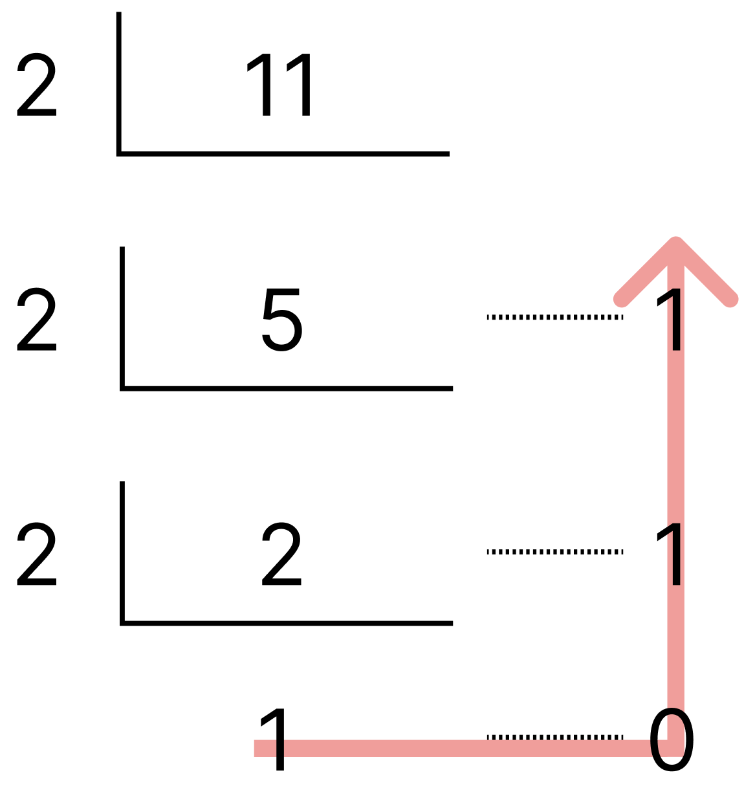
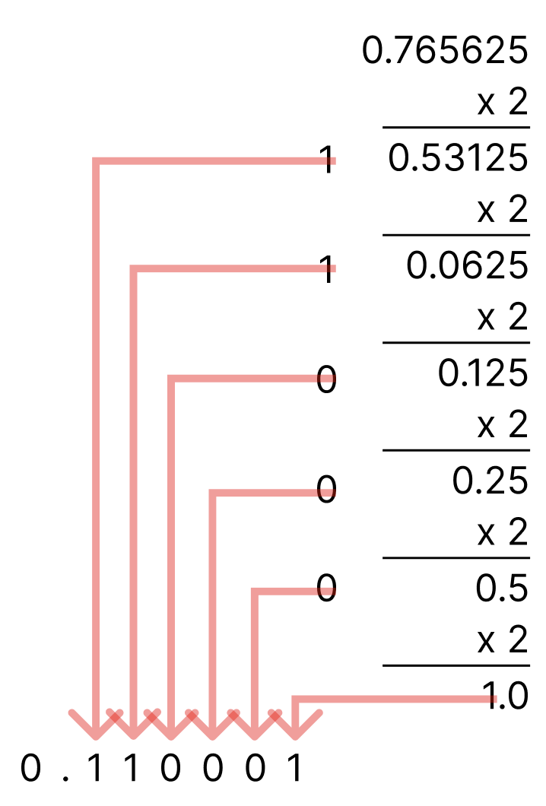
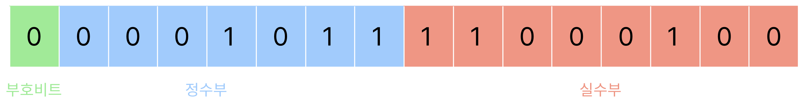

# 고정 소수점 & 부동 소수점

## 실수의 2진수 표현

컴퓨터는 0과 1로 이루어진 기계어를 사용합니다. 인간은 10진법으로 수를 표현하지만, 컴퓨터는 2진법으로 저장합니다.

따라서 **10진수를 2진수로 바꾸는 방법**에 대한 이해가 필요합니다.

예를 들어 10진수 11.765625를 2진수 소수로 변환하려면, 우선 정수부 11과 소수부 0.765로 나눕니다.

### 정수부 2진수 변환

정수의 경우 2진수로 변환하면 0, 1, 10, 11, 100, 101, 110… 와 같이 1보다 큰 수에 대해 자리 올림을 하는 형식입니다.

10진수에서는 10^n에 해당하는 수가 될 때마다 자릿수가 올라가듯이 **2진수에서는 2^n에 해당하는 수가 될 때마다 자릿수가 올라가는 식**입니다.

<p align="center">
  
</p>

일반적으로 **정수는 1이 될 때까지 계속 2로 나누며 나머지를 구하고, 밑에서부터 읽습니다.**

11의 경우 1011이 되는 것이죠.

### 실수부 2진수 변환

<p align="center">
  
</p>

실수부는 정수 변환과 반대로, **2를 곱해가며 0과 1을 가져옵니다.**

0.765625는 0.110001이 됩니다.

이를 통해 11.765625라는 수는 1011.110001이 됨을 확인할 수 있습니다.

이때, 소수점 뒤의 각 자릿수를 하나씩 2진수로 변환하면 안될까? 라고 생각할 수도 있습니다.

하지만 이러한 경우에 서로 다른 10진수 수가 2진수로 변환되었을 때 중복되는 문제가 발생합니다.

1.9 → 1.1001 | 1.41 → 1.100 1 처럼 말이죠.

<br/>

## 실수의 메모리 표현

이처럼 **2진수로 변환한 실수를 컴퓨터에서 표현하는 방식**으로는 대표적인 2가지 방법이 있습니다.

바로 **고정 소수점 방식(Fixed-Point Number Representation)**과 **부동 소수점 방식(Floating-Point Number Representation)**입니다.

### 고정 소수점 방식

고정 소수점 방식은 메모리를 **정수부와 소수부로 나누어 고정된 자리의 소수**를 나타냅니다.

<p align="center">
  
</p>

16비트 체계라고 가정했을 때, 앞서 11.765625를 2진수로 변환했던 1011.110001은 위와 같이 표현됩니다.

**맨 앞 1자리는 부호 비트(Sign Bit)로 양수일 경우에 0, 음수일 경우에 1**입니다.

**나머지 비트들은 소수점을 기준으로 정수부랑 소수부를 표현하는 비트로 각각 나누게 되는데**, 소수점의 위치는 미리 정해둡니다.

소수부의 경우 앞에서부터 채우며 남는 뒷자리를 0으로 채웁니다.

이러한 고정소수점 방식은 구현하기 편하지만, **표현 가능한 범위가 매우 적다는 치명적인 단점**이 있습니다.

위 16비트 체계의 경우 정수부는 최대 2^7 - 1인 127까지 나타낼 수 있습니다.

<br/>

이 밖에도 **낭비되는 공간이 많다**는 단점 또한 존재합니다.

정수부가 큰 실수(32001.1)이 있는가 하면, 소수부가 큰 실수(2.1008101) 또한 존재합니다.

전체 비트 자원은 한정적이므로, 특정 부분(정수부 또는 소수부)에 과도하게 할당하면 다른 부분이 제대로 쓰이지 못해 결국 시스템 전체의 표현 효율이 떨어집니다.

이처럼 고정소수점은 구현이 간단하고 속도가 빠르지만, **표현하고자 하는 값의 특성에 맞춰 비트 분할을 미리 정해야 하기 때문에 비효율(낭비)이 불가피**합니다.

### 부동 소수점 방식

그렇다면 부동 소수점 방식은 어떨까요?

부동소수점 방식에서는 우선, **정규화(Normalization)**를 거칩니다.

정규화는 2진수를 **1.xxxx … \* 2^n** 의 형식으로 변환하는 것을 의미합니다.

정수부에 1만 남을 때까지 소수점을 왼쪽으로 이동시키고, 이동한 칸 수만큼 n에 넣으면 됩니다.

예를 들어, 앞서 사용했던 1011.110001은 1.011110001 \* 2^3이 됩니다.

IEEE 표준에 따르면 부동소수점 방식으로 실수를 저장하는 데는 32비트 또는 64비트가 사용되며, 32비트는 아래과 같은 구조를 가집니다.

<p align="center">
  
</p>

부호 비트는 고정수점 방식과 마찬가지로 0이면 양수, 1이면 음수를 나타냅니다.

23자리 가수부에는 정규화 결과 소수점 오른쪽에 있는 숫자들을 왼쪽부터 채우면 되고, 남는 자리는 0으로 채웁니다.

이때 소수점 왼쪽은 정규화 결과 항상 1이기 때문에 표현하지 않는데, 이 1을 hidden bit라고 표현하기도 합니다.

이때 8비트의 지수부는 1.xxxx … 2^n에서 n에 해당하는 수가 들어가게 되는데, 단순히 n으로 2진수로 변환한 값이 들어가진 않습니다.

<br/>

여기서 **bias**가 등장합니다.

**IEEE 표준에서 32비트를 사용하는 경우 bias는 127**이라고 규정하고 있습니다. **n값에 bias를 더한 후 2진수로 변환한 값이 지수부에 들어가게 됩니다.**

1.011110001 \* 2^3의 경우 3 + 127 = 130을 2진수로 변환한 **10000010**이 들어갑니다.

<br/>

그렇다면 bias라는 값은 왜 쓰는 걸까요?

bias는 **음수 지수를 양수 값으로도 저장할 수 있도록 만든 일종의 ‘자리 이동값’** 입니다.

8비트의 지수부에서 음수와 양수 지수를 모두 표현하려면, **가운데 값 기준으로 “음수 ↔ 0 ↔ 양수”를 정렬**해야 하므로 bias = 2^(n-1) - 1 = 2^7 - 1 = 127이 됩니다.

즉, 지수가 0이면 127이 저장되고, 지수가 -2면 125가 저장되는 식입니다.

8비트 지수는 0~255까지 저장할 수 있기 때문에, **실제 지수는 -126 ~ +127까지 저장**할 수 있습니다.

지수부가 255일 경우, 이는 무한대(Infinity) 또는 NaN(Not a Number) 등을 표현할 때 사용됩니다.

따라서 저장 가능한 실제 값의 한계를 넘는 경우(overflow), 즉 연산 결과 지수부가 255를 넘으면 **+∞, -∞, NaN** 같은 특수 값으로 자동 처리됩니다.

<br/>

## 부동소수점 연산 오차

모든 10진수 실수가 깔끔하게 2진수로 변환되진 않습니다.

0.1의 경우 2진수로 변환하게 되면 값이 나누어 떨어지지 않고 0.0001100110011... 로 무한으로 반복되는 현상이 나타납니다.

이를 **무한 소수**라고 부릅니다.

이러한 무한 소수는 IEEE 754 32비트/64비트 표준에서는 정해진 비트 수만큼 가수부에 근사치만 저장되어 실제 내부 값과 차이가 발생합니다.

```tsx
console.log(0.1 + 0.2); // 0.30000000000000004
console.log(0.1 + 0.2 === 0.3); // false

console.log(0.3 - 0.1); // 0.19999999999999998
console.log(0.3 - 0.1 === 0.2); // false

// 비교 예시: 똑같이 보여도 정확히 같지 않음
console.log(0.1 + 0.7); // 0.7999999999999999
console.log(0.1 + 0.7 === 0.8); // false

// 큰 수 연산보다 소수점 아래 작은 수들이 누적되면서 오차 발생
let sum = 0;
for (let i = 0; i < 10; i++) {
  sum += 0.1;
}
console.log(sum); // 0.9999999999999999
console.log(sum === 1.0); // false
```

자바스크립트로 실수 계산 시에 오차가 발생함을 확인할 수 있습니다.

이를 해결하기 위해서는 어떻게 해야 할까요?

### 부동소수점 연산 오차 대응 방법

- 소수점 계산이 정확해야 하는 경우, 정수로 변환해서 계산(예: 금액 100원 = 100, 단위 맞춘 후 연산)하거나,
- 정밀도 조정 라이브러리(decimal.js, big.js 등)을 사용해서 정확한 소수 계산을 수행,
- 또는 **`toFixed()`**, **`toPrecision()`** 같은 메서드로 표시할 때 반올림 처리해 결과를 맞추는 방식을 사용합니다.

고정 소수점과 부동 소수점의 차이, 그리고 컴퓨터가 실수를 2진수로 표현하는 방식과 그 한계점들을 이해하는 것은 프로그래밍과 시스템 설계에서 매우 중요한 기본 지식입니다.

특히 부동소수점 연산에서 발생하는 미세한 오차는 실제 개발 시 의도치 않은 버그나 문제로 이어질 수 있으니, 정확한 수치 계산이 필요한 경우에는 적절한 대응 방법을 적용하는 것이 필수적입니다.
