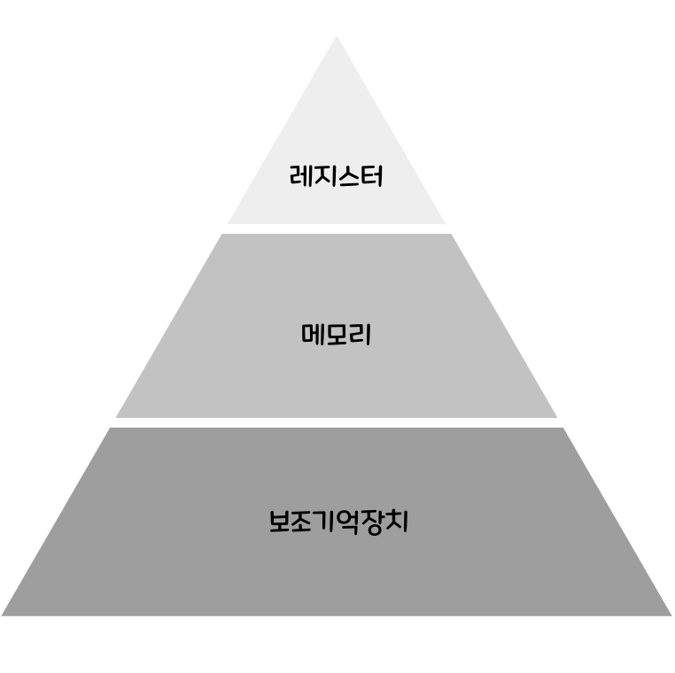
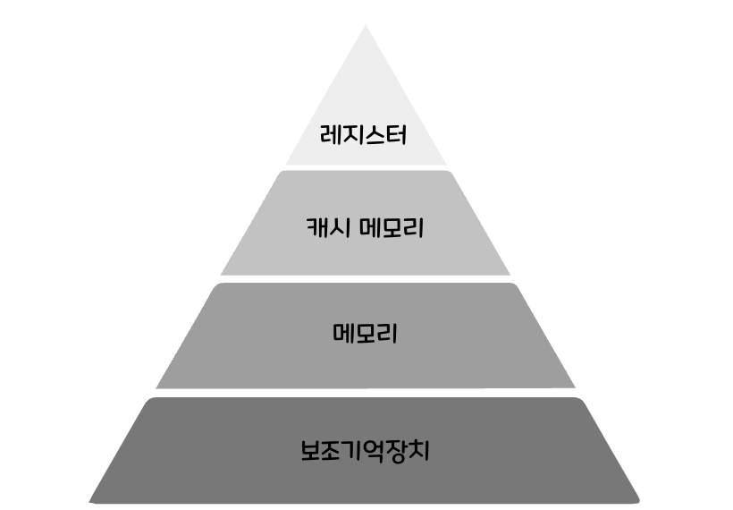

# 캐시 메모리

## 캐시 메모리(Cache Memory)란?

캐시 메모리는 빠른 응답 시간을 위해 자주 액세스하는 정보를 저장하는 데 사용되는 데이터 저장소 유형입니다.

일반적으로 CPU의 연산 속도보다 CPU가 메모리에 접근하는데 더 오랜 시간이 걸리기 때문에, 메모리 접근 시간을 줄이기 위해 사용됩니다.

### 저장 장치 계층 구조 **(Memory Hierarchy)**

캐시 메모리를 이해하기에 앞서 저장 장치 계층 구조에 대해 살펴보겠습니다.

- CPU와 가까운 저장 장치는 빠르고, 멀리 있는 저장 장치는 느리다.
- 속도가 빠른 저장 장치는 저장 용량이 작고 가격이 비싸다.

이 두 가지 이유로 빠르며, 동시에 용량이 큰 저장 장치는 존재하기 어렵습니다.

이 때문에 우리는 다양한 저장 장치르 사용하는데, 이러한 저장 장치들이 **CPU에 얼마나 가까운지를 기준으로 계층적으로 나타낸 것**을 저장 장치 계층 구조라고 합니다.

  

위에 위치할수록 빠르며 용량이 작고 비쌉니다. 아래에 위치할수록 느리고 용량이 크며 가격이 저렴합니다.

### 캐시 메모리

이때 캐시 메모리는 CPU와 메모리 사이에 위치하며, 레지스터보다 용량이 크고, 메모리보다 빠릅니다.

캐시 메모리는 CPU의 연산 속도와 메모리 접근 속도의 차이를 줄이기 위해 사용하며, 메모리에서 CPU가 사용할 일부 데이터를 미리 캐시 메모리로 가지고 와 활용합니다.

캐시 메모리를 반영한 저장 장치 계층 구조는 다음과 같습니다.

  

 

## 캐시의 작동

캐시는 다음 두 가지 사실을 활용하여 성능을 크게 향상시킵니다.

1. **자주 재사용되는 데이터**

   메인 메모리에 저장된 데이터 중 일부는 프로그램 실행 중 반복해서 참조되는 경향이 있습니다.

2. **반복되는 작업**

   연산 과정에서 동일한 명령이나 데이터 블록이 여러 차례 사용되는 패턴이 존재합니다.

이 두 특성을 기반으로, **캐싱**은 자주 접근되는 데이터나 명령어를 메인 메모리보다 훨씬 빠른 액세스 메모리(캐시)에 저장하여, 다시 필요할 때 대기 시간을 최소화합니다.

## 캐시 메모리 수준

캐시 메모리는 **L1, L2, L3** 세 가지 계층(level)으로 구성되며, 계층이 내려갈수록 용량은 커지지만 접근 속도는 느려집니다.

1. **L1 캐시 (Level 1 Cache)**
   - **내장 위치**: 프로세서 코어 내부에 가장 가까운 위치에 내장되어 있습니다.
   - **역할**: 실행 중인 명령어와 데이터를 가장 먼저 확인하는 최우선 캐시로, 재요청 가능성이 가장 높은 소량의 정보를 저장합니다.
2. **L2 캐시 (Level 2 Cache)**
   - **내장 위치**: 각 코어별로 독립 또는 코어 그룹별로 공유되며, L1보다 다소 떨어진 위치에 내장됩니다.
   - **역할**: L1 캐시에 없는 요청을 처리하기 위한 중간 저장소로, 더 많은 양의 명령어와 데이터를 보관합니다.
3. **L3 캐시 (Level 3 Cache)**
   - **내장 위치**: 다수의 코어가 공유하는 형태로 프로세서 칩 내부 또는 칩 외부(모듈)에도 존재할 수 있습니다.
   - **역할**: L1/L2 캐시에 모두 미스가 발생했을 때 마지막 보루 역할을 하며, 여러 코어 간 데이터 공유와 코히어런시(coherency)를 유지합니다.

 

## 캐시 적중율(Cache Hit Ratio)

CPU 캐시는 전체 데이터를 저장할 수 없기 때문에, 앞으로 사용할 가능성이 높은 데이터나 명령어를 미리 선택하여 저장합니다.

- **캐시 히트(Cache Hit)**
  예측하여 캐시에 올려둔 데이터가 실제로 CPU에서 요청될 때를 말합니다.
- **캐시 미스(Cache Miss)**
  CPU가 요청한 데이터를 캐시에서 찾지 못했을 때 발생합니다. 이 경우 메인 메모리에서 데이터를 가져와야 하므로, 캐시 히트보다 처리 지연이 크게 늘어납니다.

**캐시 적중율**은 전체 요청 중 캐시 히트가 발생한 비율로, 다음과 같이 계산합니다.

> 캐시 적중율 = 캐시 히트 횟수 ÷ (캐시 히트 횟수 + 캐시 미스 횟수)

일반적인 데스크톱·서버 시스템에서 L1/L2 캐시의 적중율은 85%~95% 수준을 보입니다.

그렇다면 컴퓨터는 어떻게 CPU가 사용할 데이터를 예측할까요?

### 캐시 데이터 예측 및 저장 방식

캐시가 어떤 데이터를 저장할지 결정하는 핵심 기법은 다음과 같습니다.

1. **지역 참조성(Locality of Reference)**
   - **시간적 지역성(Temporal Locality)**
     한 번 참조된 데이터나 명령어는 가까운 시점에 다시 사용될 가능성이 높습니다.
   - **공간적 지역성(Spatial Locality)**
     특정 주소를 참조하면, 인접한 주소들도 곧 참조될 가능성이 높습니다.
2. **캐시 매핑 방식(Cache Mapping)**
   - **직접 매핑(Direct-Mapped Cache)**
     각 메모리 블록이 캐시 내 특정 한 위치에만 저장됩니다. 단순하지만 충돌(conflict) 발생 시 교체 비용이 큽니다.
   - **완전 연관 매핑(Fully Associative Cache)**
     메모리 블록이 캐시의 어느 위치든 저장될 수 있어 충돌이 적지만, 검색 비용이 증가합니다.
   - **N-방 연관 매핑(N‑Way Set-Associative Cache)**
     직접 매핑과 완전 연관 매핑의 절충안으로, 캐시를 여러 개의 집합(set)으로 나누어 각 집합 내에서 연관 매핑을 사용합니다.
3. **교체 알고리즘(Replacement Policy)**

   캐시가 가득 찼을 때 어떤 블록을 내보낼지 결정합니다.

   - **최적 교체(Optimal)**: 미래 참조를 모두 알 때 이상적으로 교체할 블록을 선택(이론적).
   - **LRU(Least Recently Used)**: 가장 오랫동안 사용되지 않은 블록을 교체합니다.
   - **FIFO(First-In First-Out)**: 먼저 들어온 블록부터 교체합니다.
   - **LFU(Least Frequently Used)**: 참조 횟수가 가장 적은 블록을 교체합니다.

4. **프리패칭(Prefetching)**

   과거 접근 패턴을 분석하여, 앞으로 필요할 것으로 예측되는 데이터를 미리 캐시에 로드합니다.

   - 순차 접근이 예상되면 인접 블록을 미리 가져오고,
   - 분기 예측 결과에 따라 해당 분기 경로의 명령어를 미리 캐싱하기도 합니다.

 

## 캐시 메모리의 장점

- **대기 시간(Latency) 단축**
  캐시 메모리는 CPU와 가장 가까운 위치에 배치되어 있어, 메인 메모리 접근 대비 훨씬 짧은 지연 시간으로 데이터를 제공합니다.
  - 자주 사용되는 데이터나 명령어가 캐시에 저장되어 있으면, 반복 접근 시 메인 메모리까지 왕복하지 않아도 되어 응답 속도가 비약적으로 빨라집니다.
- **처리량(Throughput) 향상**
  캐시 히트율이 높아질수록 CPU가 연속해서 데이터를 공급받아 연산을 수행할 수 있으므로, 초당 처리할 수 있는 명령어 수가 증가합니다.
  - 파이프라이닝 및 슈퍼스칼라 구조와 결합하면, 여러 명령어를 병렬·동시 실행할 때 병목 현상이 줄어들어 시스템 전체 처리량이 높아집니다.
- **전력 소비(Power Consumption) 절감**
  캐시는 메인 메모리보다 작은 용량과 낮은 동작 전압으로 설계되므로, 동일한 데이터 접근 시 메인 메모리를 사용하는 것보다 전력 소모가 적습니다.
  - 모바일 기기나 배터리로 작동하는 IoT 디바이스에서는 전력 효율이 곧 배터리 수명 연장으로 이어져, 실사용 시간을 늘리는 데 크게 기여합니다.
- **안정성(Reliability) 및 QoS 향상**
  캐시를 통해 메모리 접근이 국부적으로 일어나면, 메인 메모리나 외부 저장장치의 부하가 감소하여 전체 시스템의 안정성이 높아집니다.
  - 일시적인 메모리 대역폭 과부하나 트래픽 급증 상황에서도 캐시가 연산을 보조함으로써, 서비스 품질(QoS)을 일정 수준 이상으로 유지할 수 있습니다.
- **확장성(Scalability) 지원**
  다계층 캐시 구조(L1→L2→L3)는 코어 수나 코어 클럭이 증가해도 병목 없이 확장될 수 있도록 설계됩니다.
  - 추가 캐시 레벨을 도입하거나 캐시 용량을 늘리는 방식으로, 코어 수 확장과 함께 성능을 직선적으로 높일 수 있어 대규모 서버나 데이터센터 환경에서 유리합니다.

 
 

> 출처
>
> - https://www.lenovo.com/kr/ko/glossary/what-is-cache-memory/?orgRef=https%253A%252F%252Fwww.google.com%252F&srsltid=AfmBOoojA-Yl3GsKj1eNcaIxbyvGUeaKPevLmukvKB7VE3UQqFTRZjbW
> - https://rahites.tistory.com/295
