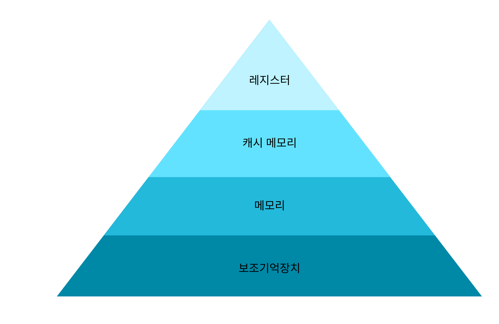

# 메모리

## 메모리란?

**메모리**란 컴퓨터 시스템에서 프로그램과 데이터가 일시적으로 저장되고 처리되는 공간을 의미합니다.

운영체제는 한정된 메모리를 여러 프로그램이 동시에 효율적으로 사용할 수 있도록 **메모리 관리**(할당, 해제, 보호, 가상메모리 지원 등)를 담당합니다.

이를 통해 각 프로세스가 자신의 메모리 공간을 안전하게 사용하면서도, 시스템 전체의 자원을 최대한 활용할 수 있게 합니다.

 

## 메모리의 특징

- **한정된 자원**: 메모리는 CPU, I/O 장치와 함께 시스템의 한정된 자원으로, 여러 프로그램이 효율적으로 공유하여 사용해야 합니다.
- **보호와 독립성**: 각 프로세스는 고유한 메모리 공간을 가지며, 운영체제는 한 프로세스가 다른 프로세스의 메모리 영역을 침범하지 못하도록 보호합니다.
- **효율적 관리**: 운영체제는 메모리 할당, 해제, 단편화(내부/외부), 가상메모리, 스와핑 등의 기법을 통해 메모리를 효율적으로 관리합니다.
- **가상 메모리 지원**: 실제 메모리보다 큰 프로세스도 실행할 수 있도록, 보조 기억장치(디스크)를 결합한 가상 메모리 기법을 활용합니다.
- **계층 구조**: 메모리는 CPU 레지스터, 캐시, 메인 메모리 등 여러 계층으로 이루어져 있고, 각 계층마다 속도‧용량‧비용 등이 상이합니다.
- **주소 변환**: CPU가 사용하는 논리 주소와 실제 메모리의 물리 주소가 다르며, MMU(Memory Management Unit)가 논리 주소를 물리 주소로 변환합니다.

 

# 메모리 계층

컴퓨터 시스템의 **메모리 계층 구조**는 속도, 용량, 비용의 관점에서 여러 단계를 가지고 있습니다.

이런 계층 구조의 핵심 중 하나가 **캐시 메모리(Cache Memory)** 입니다.

  

 

## 캐시

### 메모리 계층 구조 내에서 캐시의 위치와 역할

- **위치:** 캐시는 CPU와 메인 메모리(RAM) 사이에 위치하며, 계층적으로 L1(가장 빠르고 작음), L2, L3(여러 코어가 공유, 좀 더 느리고 큼) 등으로 분류됩니다.
- **메모리 계층 비교:**
  - 레지스터 > L1 > L2 > L3 > 메인 메모리 > 보조 저장장치(HDD/SSD) 순으로 갈수록 접근 속도는 느려지지만 용량은 커집니다.
- **속도와 용량:** 상위 계층(예: L1 캐시)은 소수의 데이터만 보관하지만 매우 고속으로 동작합니다. 하위 계층(예: RAM, SSD)은 대용량이나 상대적으로 느립니다.

### 캐시의 개념과 동작 원리

- **주요 목적:** 캐시는 자주 사용될 가능성이 높은 데이터를 상위 계층에 임시 저장해, CPU가 메모리에 직접 접근하는 데 드는 대기시간(latency)을 최소화합니다.
- **지역성(Locality of Reference):**
  - 시간적 지역성(Temporal Locality): 최근 사용한 데이터가 곧 다시 사용될 가능성이 큽니다.
  - 공간적 지역성(Spatial Locality): 접근된 데이터의 주변 데이터 역시 곧 접근될 가능성이 있습니다.
- **캐시 동작:** CPU가 데이터를 요청할 때 먼저 캐시에 조회(히트)하며, 없으면 하위 계층(메인 메모리 등)에서 데이터를 가져와 캐시에 저장합니다(미스).

### 계층 구조와 캐시 관리의 중요성

- **적중율(히트율) 향상:** 캐시 계층이 잘 설계되면 상위 계층에서의 적중율이 크게 높아져 전체 시스템 성능이 향상됩니다.
- **운영체제와의 협력:** 운영체제는 프로세스의 메모리 접근 패턴을 최적화하여 캐시 계층의 효과를 극대화합니다. 하드웨어는 지역성 예측 등 고성능 캐시 정책(매핑, 교체 알고리즘)을 적용합니다.

 
 

> 참고
>
> - [https://techblog-history-younghunjo1.tistory.com](https://techblog-history-younghunjo1.tistory.com/)
> - https://hotechstory.tistory.com/59
> - https://velog.io/@mingming_eee/os-Day4
> - https://dapsu-startup.tistory.com/entry/%EC%9A%B4%EC%98%81%EC%B2%B4%EC%A0%9COperating-System-%EB%A9%94%EB%AA%A8%EB%A6%ACMemory
> - https://velog.io/@passion_man/%EC%9A%B4%EC%98%81%EC%B2%B4%EC%A0%9C-8.-%EB%A9%94%EB%AA%A8%EB%A6%AC-%EA%B4%80%EB%A6%AC
> - https://1chanhue1.tistory.com/entry/%EC%9A%B4%EC%98%81%EC%B2%B4%EC%A0%9C-%EC%9A%B4%EC%98%81%EC%B2%B4%EC%A0%9C%EC%9D%98-%EB%A9%94%EB%AA%A8%EB%A6%AC%EB%A5%BC-%EA%B4%80%EB%A6%AC-%EC%A0%84%EB%9E%B5
> - https://rebro.kr/178
> - https://www.lenovo.com/kr/ko/glossary/what-is-cache-memory/
