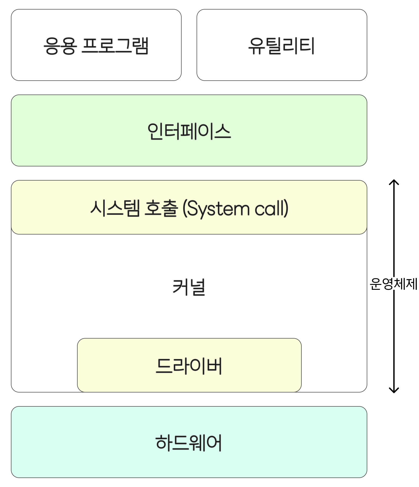

# 운영체제의 역할과 구조

## 운영체제(OS, Operating System)란?

운영체제는 사용자를 위한 프로그램이 아니라 **사용자가 실행하는 응용 프로그램을 실행·동작시키기 위한 중간 관리자**입니다.

응용 프로그램이 하드웨어 자원을 직접 제어하지 못하게 보호하면서도 필요한 자원을 적절하게 제공하고, 프로그램들이 효율적이고 안정적으로 동작하도록 조정하는 역할을 수행합니다.

운영체제의 목적은 다음과 같습니다.

- **효율성**: 여러 응용 프로그램이 하드웨어 자원을 서로 방해하지 않고 최대한 활용하도록 관리합니다.
- **안정성**: 응용 프로그램이 자원에 무분별하게 접근해 시스템 전체를 불안정하게 만들지 못하도록 보호합니다.
- **확장성**: 다양한 하드웨어 환경에서도 일관된 방식으로 사용할 수 있도록 하드웨어 인터페이스를 제공합니다.
- **편리성**: 사용자가 복잡한 하드웨어나 시스템 동작을 직접 다루지 않아도 되도록 소프트웨어 인터페이스(예: GUI, CLI)를 제공합니다.

 

## 운영체제의 역할

1. **자원 관리**

   CPU, 메모리, 저장장치, 입출력 장치 등 시스템 자원을 여러 응용 프로그램이 공존하면서도 공정하고 효율적으로 사용할 수 있도록 배분하고 회수합니다.

2. **자원 보호**

   응용 프로그램이 하드웨어 자원에 직접 접근하는 것을 차단하여, 하나의 프로그램 오류가 시스템 전체에 영향을 주지 않도록 합니다.

3. **메모리 관리**

   각 프로세스에 필요한 메모리 공간을 할당하고 해제하며, 실제 물리 메모리보다 큰 가상 메모리 공간을 제공하여 프로세스가 안정적으로 실행되도록 합니다.

4. **프로세스 관리**

   실행 중인 응용 프로그램을 프로세스 단위로 관리하고, 생성·스케줄링·일시 정지·종료 등을 제어하며, 프로세스 간 자원 공유와 협력(통신)을 지원합니다.

5. **디스크 및 파일 시스템 관리**

   영구 저장을 위한 데이터의 생성, 삭제, 읽기, 쓰기 등 파일 입출력을 관리하고 접근 인터페이스를 제공합니다.

6. **입출력 관리**

   키보드, 마우스, 디스플레이, 프린터 등 입출력 장치와의 통신을 추상화하고 성능을 조정하여 응용 프로그램이 장치들을 안정적으로 사용할 수 있도록 합니다.

7. **사용자 인터페이스 제공**

   GUI(그래픽 기반)나 CLI(명령 기반) 같은 사용자 친화적인 인터페이스를 통해 사용자가 시스템과 상호작용할 수 있도록 합니다. 이는 커널과 분리된 서비스이며, 동일한 커널 위에서도 다양한 인터페이스가 가능합니다.

8. **네트워킹**

   컴퓨터 간 통신을 위한 네트워크 프로토콜을 지원하고, 데이터 전송, 연결 관리, 기본적인 네트워크 보안 등을 처리합니다.

9. **오류 처리 및 예외 관리**

   프로세스 비정상 종료, 메모리 문제, 입출력 실패 등을 감지하고 대비하여 시스템의 신뢰성과 지속성을 유지합니다.

10. **시스템 보안**

    접근 제어, 사용자 인증, 권한 분리 등을 통해 불법 접근과 데이터 유출로부터 시스템과 자원을 보호합니다.

 

## 운영체제의 구조

  

운영체제는 크게 **커널(Kernel)** 과 **인터페이스** 두 부분으로 나눌 수 있습니다.

### 커널

커널은 운영체제의 핵심 구성 요소로, 프로세스 관리, 메모리 관리, 파일 시스템, 입출력, 프로세스 간 통신 등의 핵심 기능을 수행합니다.

### 시스템 호출

응용 프로그램이 운영체제(커널)의 서비스를 요청할 때 사용하는 표준화된 인터페이스입니다. 커널은 직접적인 자원 접근을 막고, 응용 프로그램이 시스템 호출을 통해 커널 모드로 전환되어 필요한 작업을 수행하게 됩니다. 이 요청은 소프트웨어 인터럽트 형태로 구현되며, 현재 상태를 저장한 뒤 커널 내의 처리 루틴으로 진입하고, 처리가 끝나면 다시 사용자 모드로 복귀합니다.

### 드라이버

하드웨어 장치와 커널 사이의 통신을 담당하는 소프트웨어입니다. 드라이버는 장치의 특성에 맞춰 커널이 표준화된 방식으로 입출력을 수행할 수 있도록 하며, 별도의 디바이스 드라이버가 특정 하드웨어를 제어하도록 추가될 수 있습니다.

구조도 상에서 시스템 호출은 커널 전체의 서비스 접근 경로를 감싸는 형태로, 드라이버는 특정 하드웨어 인터페이스를 감싸는 형태로 표현됩니다. 이는 시스템 호출이 모든 커널 기능으로의 접근을 매개하고, 드라이버는 특정 장치 제어 역할을 하기 때문입니다.

### 커널 구조 유형

- **단일형 커널 (Monolithic Kernel)**
  기능들이 하나의 거대한 모듈로 통합된 구조입니다. 모듈 간 통신 오버헤드가 적어 성능이 좋지만, 결함이 전체에 영향을 줄 수 있고 유지보수 측면에서 복잡합니다.
- **계층형 커널 (Layered Kernel)**
  기능을 계층으로 분리하여 각 계층이 독립적으로 동작하도록 설계합니다. 문제 발생 시 해당 계층만 수정하면 되어 디버깅이 용이합니다.
- **마이크로 커널 (Microkernel)**
  최소한의 핵심 기능만 커널에 두고 나머지 서비스를 사용자 공간에서 실행합니다. 모듈 간 통신은 IPC로 이루어지며, 커널 자체가 작고 독립적이어서 하나의 실패가 전체에 미치는 영향을 줄입니다.
- **하이브리드 커널 (Hybrid Kernel)**
  모놀리식과 마이크로 커널의 절충형입니다. 성능과 모듈성 사이의 균형을 취하여 핵심 일부는 커널에 두고, 그 외 기능을 분리하는 방식입니다.

### 인터페이스

운영체제는 커널 외에 사용자와의 상호작용을 위한 **사용자 인터페이스**를 제공합니다. 대표적으로 다음과 같습니다:

- **GUI (Graphical User Interface)**: 그래픽 요소 기반으로 사용자 친화적인 조작을 가능하게 하는 환경 (예: 윈도우 데스크탑, 스마트폰 UI)
- **CLI (Command Line Interface)**: 텍스트 명령 기반으로 시스템을 제어하는 환경

같은 커널 위에서도 서로 다른 인터페이스가 작동할 수 있으며, UI는 시스템과의 통로일 뿐 커널의 일부는 아닙니다.

 

## 이중 모드와 시스템 호출

운영체제는 응용 프로그램이 하드웨어 자원에 **직접 접근하지 못하도록 보호**하면서도 필요한 서비스를 제공해야 합니다. 이를 위해 CPU는 두 가지 실행 모드, 즉 이중 모드를 지원합니다.

### 이중 모드

- **사용자 모드 (User Mode)**: 일반 응용 프로그램이 실행되는 제한된 권한의 모드입니다. 하드웨어 접근 명령이나 커널 영역의 코드 실행이 불가능합니다.
- **커널 모드 (Kernel Mode)**: 운영체제가 동작하는 고권한 모드로, 모든 명령어와 하드웨어 자원 접근이 허용됩니다.

CPU는 상태 플래그(예: 슈퍼바이저 플래그)를 통해 현재 모드를 구분하며, 응용 프로그램이 시스템 서비스를 필요로 할 때 시스템 호출을 통해 커널 모드로 전환됩니다.

### 시스템 호출

사용자 모드에서 실행 중인 프로그램이 자원을 이용하거나 시스템 서비스를 받기 위해 커널에 요청을 보내는 것이 시스템 호출입니다. 이 요청은 소프트웨어 인터럽트 형식으로 처리되며, CPU는 현재 상태를 저장한 뒤 커널 내의 인터럽트 서비스 루틴을 실행하여 해당 요청을 처리하고, 완료되면 다시 사용자 모드로 복귀합니다.

 

## 정리

운영체제는 **효율성, 안정성, 확장성, 편리성**이라는 목적을 가지고 사용자와 하드웨어 사이에 위치해 자원을 관리·보호하며, 인터페이스를 제공하는 핵심 시스템 소프트웨어입니다.

커널은 시스템 호출과 드라이버를 통해 응용 프로그램과 하드웨어 사이의 중재자 역할을 하고, 사용자 인터페이스는 그 위에서 사용자가 시스템을 제어할 수 있는 통로를 제공합니다.

 
 

> 참고
>
> - [https://hongong.hanbit.co.kr/운영체제란-커널의-개념-응지-프로그램-실행을-위한/](https://hongong.hanbit.co.kr/%ec%9a%b4%ec%98%81%ec%b2%b4%ec%a0%9c%eb%9e%80-%ec%bb%a4%eb%84%90%ec%9d%98-%ea%b0%9c%eb%85%90-%ec%9d%91%ec%a7%80-%ed%94%84%eb%a1%9c%ea%b7%b8%eb%9e%a8-%ec%8b%a4%ed%96%89%ec%9d%84-%ec%9c%84%ed%95%9c/)
> - https://jerryjerryjerry.tistory.com/171
> - [https://velog.io/@dddooo9/운영체제-운영체제란-정의-역할-구조](https://velog.io/@dddooo9/%EC%9A%B4%EC%98%81%EC%B2%B4%EC%A0%9C-%EC%9A%B4%EC%98%81%EC%B2%B4%EC%A0%9C%EB%9E%80-%EC%A0%95%EC%9D%98-%EC%97%AD%ED%95%A0-%EA%B5%AC%EC%A1%B0)
> - https://jkcb.tistory.com/58
