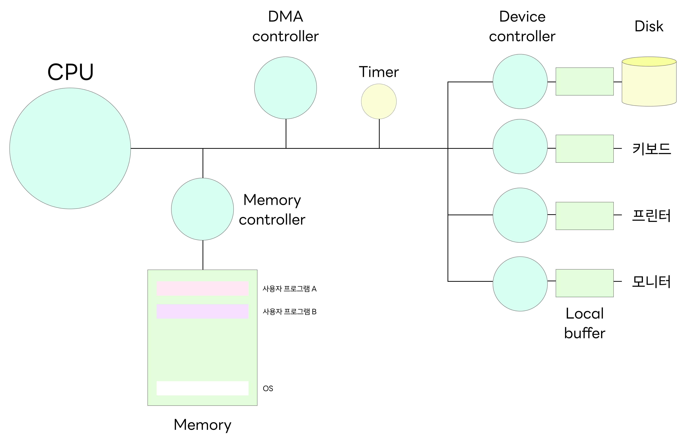

# 컴퓨터의 요소

  

## CPU

**CPU는 컴퓨터의 두뇌**입니다. CPU는 **메모리에 저장된 명령어를 읽어 들이고, 읽어 들인 명령어를 해석하고, 실행**하는 부품입니다.
이때 간단한 계산부터 복잡한 데이터 처리까지 모든 연산 작업을 담당하게 됩니다.
이러한 CPU의 역할과 작동 원리는 구체적으로 이해하기 위해서는 CPU 내부 구성 요소를 알 필요가 있습니다.

- **ALU (Arithmetic Logic Unit): 산술 논리 연산 장치**
  쉽게 말해 계산기입니다. 계산만을 위해 존재하는 부품으로, CPU 내에서 실제 연산을 수행하게 됩니다.
  덧셈, 뺄셈 같은 두 숫자의 산술 연산과 배타적 논리합, 논리곱 같은 논리연산을 계산합니다.
  ALU의 성능은 컴퓨터의 연산 속도와 호율성에 직접적인 영향을 미칩니다.
- **레지스터 (Register)**
  레지스터는 CPU 내부의 작은 임시 저장 장치입니다. 프로그램을 실행하는 데 필요한 값들을 임시로 저장합니다.
  레지스터는 여러 개의 플립플롭으로 구성되어 여러 비트의 정보를 저장할 수 있고, 용도에 따라 전용 레지스터와 범용 레지스터로 나뉩니다.

      저장되는 정보의 종류에 따라서는 데이터 레지스터와 주소 레지스터, 상태 레지스터로 나뉩니다.

      CPU 안에는 여러 개의 레지스터가 존재하고 각기 다른 이름과 역할을 가지고 있습니다.

- **제어 장치 (Control Unit, CU)**
  제어 장치는 제어 신호(control signal)라는 전기 신호를 내보내고 명령어를 해석하는 장치입니다.
  이때 제어 신호란 컴퓨터 부품들을 관리하고 작동시키기 위한 일종의 전기 신호로, 이를 통해 명령어 사이클이 적절히 수행되도록 모든 동작을 제어합니다.

 

## 인터럽트

### 개념

**인터럽트**란 CPU가 어떤 작업(프로세스)을 수행 중일 때, 예기치 않은 사건이 발생하면 현재 작업을 일시 중단하고 그 사건을 우선 처리한 뒤 원래 작업으로 복귀하는 메커니즘입니다.

- 본질적으로 “다른 일을 처리하라는 신호”입니다.
- 인터럽트가 오면 CPU는 현재 상태를 저장하고, 운영체제 커널 쪽의 처리 루틴으로 전환합니다.

### 인터럽트의 종류

**외부 인터럽트 (하드웨어 인터럽트):** 하드웨어(입출력 장치 등)에서 발생하며, 대표적으로 다음이 있습니다.

1. **타이머 인터럽트**
   - CPU가 특정 프로세스에 할당된 시간이 끝났음을 알리는 신호입니다.
   - 주기적으로 인터럽트를 발생시켜 문맥 교환을 유도함으로써 여러 프로세스를 공정하게 실행하게 합니다. (예: 10ms마다
2. **I/O 인터럽트**
   - 키보드, 마우스, 프린터, 디스크 등 입출력 장치가 작업 완료나 이벤트 발생을 알리기 위해 보내는 인터럽트입니다.
   - 장치 컨트롤러가 작업 완료를 CPU가 계속 폴링하는 대신 인터럽트 신호로 알려 처리 효율을 높입니다.
   - 예: 마우스 움직임 → Mouse ISR 호출하여 커서 위치 업데이트, 더블 클릭 → 프로그램 실행 등.
3. **전원 이상 인터럽트**
   - 전원 공급에 이상이 생겼을 때 발생하여, 현재 실행 중이던 프로세스 상태를 보호하거나 긴급 대피 루틴을 실행하게 합니다.

**내부 인터럽트 (소프트웨어 인터럽트):** CPU 내부나 소프트웨어에 의해 자기 자신한테 걸리는 인터럽트입니다.

1. **Exception 인터럽트 (Trap)**
   - 실행 중인 명령이 처리할 수 없는 예외 상황(예: 0으로 나누기, 권한 없는 메모리 접근 등)을 만났을 때 발생합니다.
   - CPU가 자기 자신에게 인터럽트를 걸어 커널의 예외 처리 루틴으로 제어를 넘깁니다.
2. **SVC 인터럽트 (Supervisor Call)**
   - 운영체제 서비스를 요청하기 위한 인터럽트로, 사용자 프로그램이 시스템 콜을 호출할 때 발생합니다.
   - 예: `open("a.txt")` 같은 요청이 들어오면 커널 모드로 전환되어 정의된 서비스를 수행합니다.

### 인터럽트 처리 흐름

1. **인터럽트 발생**
   - 외부 장치의 컨트롤러가 작업 완료 등을 감지하고 CPU의 인터럽트 라인으로 신호를 보냅니다. 내부 조건(예외, 시스템 콜)도 소프트웨어적으로 인터럽트를 발생시킵니다.
2. **현재 상태 저장**
   - CPU는 지금 수행 중이던 프로세스의 상태를 PCB(Process Control Block) 등에 저장합니다.
3. **인터럽트 벡터 참조**
   - 운영체제는 **인터럽트 벡터**라는 자료구조를 통해 인터럽트 종류별로 대응하는 처리 루틴(ISR: Interrupt Service Routine 또는 핸들러)의 위치를 찾습니다.
4. **인터럽트 서비스 루틴 실행**
   - 해당 인터럽트를 처리하는 코드(ISR)가 커널 영역에서 실행됩니다.
5. **복귀**
   - 처리가 끝나면 저장해둔 이전 프로세스 상태로 복원하고, 원래 하던 작업으로 돌아갑니다.

### 관련 구성 요소

- **컨트롤러**: 각 하드웨어 장치에는 자체적인 제어용 소형 프로세서(컨트롤러)가 있으며, 로컬 버퍼 등을 관리하면서 완료를 감지하고 인터럽트를 발생시킵니다.
- **로컬 버퍼**: 장치 컨트롤러가 데이터를 임시 저장하는 작은 메모리로, 작업 완료 후 CPU에 알릴 때 인터럽트를 활용합니다.
- **인터럽트 라인**: 하드웨어가 CPU에게 인터럽트 신호를 전달하는 물리적/논리적 경로입니다.

 

## DMA 컨트롤러

### 배경: PIO vs Interrupt I/O vs DMA

- **PIO (Programmed I/O)**
  CPU가 직접 입출력을 관리하며 주변 장치 상태를 폴링하므로 CPU 사이클이 많이 낭비되고 비효율적입니다.
- **Interrupt Initiated I/O**
  장치가 준비되었을 때 인터럽트를 발생시켜 CPU가 그때만 처리하므로 PIO보다 효율적이지만, I/O가 자주 발생하면 인터럽트 처리 부담이 남습니다.
- **DMA (Direct Memory Access)**
  CPU 개입 없이 주변 장치와 메인 메모리 간 데이터를 직접 전송합니다. 이로 인해 CPU는 다른 작업을 병행할 수 있어 전체 시스템 효율이 높아집니다.

### 개념

- **DMA 컨트롤러**는 주변 장치와 메인 메모리 사이의 데이터 전송을 CPU 개입 없이 직접 처리하는 전용 하드웨어입니다.
- CPU가 시스템 버스를 지속적으로 점유하지 않아도 데이터가 이동하므로 CPU 부담이 줄어듭니다.
- 전송 대상 메모리 영역은 사전에 예약되어야 하며, 시스템 설계에 따라 접근 가능한 메모리 범위 제한이 있을 수 있습니다.

### 동작 개요

1. **버스 접근 요청 및 할당**

   DMA 컨트롤러가 데이터를 전송하기 위해 시스템 버스를 획득합니다. 경우에 따라 CPU로부터 권한을 얻거나 CPU가 사용하지 않는 틈을 활용합니다.

2. **직접 메모리 접근**

   DMA 컨트롤러가 주변 장치와 메인 메모리 사이를 직접 읽고 쓰며 데이터 블록을 전송합니다.

3. **전송 완료 통보**

   전송이 완료되면 DMA가 CPU에 신호를 보내 알리거나 다음 작업을 준비합니다.

### 전송 모드 비교

- **Burst Mode**: DMA가 버스를 독점해 한 번에 전체 데이터를 빠르게 전송합니다.
  - 가장 빠른 전송 속도를 가지지만 전송 중 CPU가 버스를 사용할 수 없어 일지 정지가 발생합니다.
- Cycle-Stealing Mode: DMA가 작은 단위로 데이터를 전송하면서 CPU와 번갈아가며 버스를 사용합니다.
  - CPU 작업과 병행 가능하며 정지 시간이 감소하지만 전체 전송 속도는 느립니다.
- Transparent Mode: CPU가 버스를 사용하지 않는 시간에만 DMA가 전송을 수행합니다.
  - CPU는 영향을 최소화로 받고 전체 시스템 효율은 우수하지만 가장 느린 전송 속도를 가집니다.

 

## 메모리

### 종류

메모리는 용도와 특성에 따라 여러 종류로 구분됩니다.

각 계층의 목적과 성능 특성이 다르며, 다음 항목들을 기반으로 전체 시스템 성능에 영향을 줍니다.

- **레지스터**: CPU 내부에 존재하는 가장 빠른 저장소로, 명령어 실행 시 즉시 필요한 데이터나 주소를 임시 보관합니다.
- **휘발성 메모리 (예: RAM)**: 전원이 유지되는 동안만 데이터를 보존하는 주기억장치입니다. 일반적으로 DRAM이 사용되며 상대적으로 크고 가격 대비 용량이 큽니다.
- **비휘발성 메모리 (예: ROM, 플래시)**: 전원이 꺼져도 데이터를 유지하는 저장장치로, 부팅 코드나 고정된 데이터 저장에 사용됩니다.
- **SRAM vs DRAM**: SRAM은 빠르고 비선형 접근이 가능하지만 비용과 전력 소모가 높으며 캐시에 주로 쓰입니다. DRAM은 상대적으로 느리지만 밀도 높고 저렴해 메인 메모리로 사용됩니다.
- **휘발성과 비휘발성의 구분**: 시스템 설계 시 어떤 데이터가 유지되어야 하는지에 따라 메모리 계층에 배치됩니다.

### 물리적 구성과 인터페이스

메모리는 단순히 저장 공간이 아니라 성능과 병렬성, 접근성을 고려한 물리적 구성과 제어를 필요로 합니다.

- **메모리 모듈 및 채널 구조**: DIMM과 같은 메모리 모듈은 다중 채널 구성을 통해 병렬 접근을 허용하여 대역폭을 증가시킵니다. 인터리빙은 메모리 접근을 분산시켜 대기 시간을 줄입니다.
- **메모리 컨트롤러**: CPU와 메모리 사이에서 접근 요청을 스케줄링하고 타이밍을 조절하는 하드웨어입니다. 주소/명령을 해석하고 물리적 접근을 수행하며, DRAM의 요구사항에 맞춰 refresh, 트랜잭션 관리를 합니다.
- **주소 지정 방식**: 물리 주소와 논리(또는 가상) 주소가 구분되며, 메모리 액세스 시 어떤 주소 체계를 사용할지를 결정합니다. 이 장에서는 기본 개념만 소개하고 실제 변환은 별도 장에서 다룹니다.
- **버스와 타이밍**: 메모리 접근에는 **지연(latency)**과 **대역폭(bandwidth)**이라는 두 가지 핵심 지표가 있습니다. 지연은 개별 접근의 응답 시간이고, 대역폭은 단위 시간당 처리 가능한 데이터량입니다. 이들 사이의 균형이 전체 성능을 결정합니다.
- **메모리 맵핑 / 메모리-맵드 I/O**: 메모리 주소 공간의 일부를 입출력 장치가 공유하여, CPU가 장치 제어를 메모리 읽기/쓰기로 수행할 수 있게 합니다. 이를 통해 입출력 장치와의 통합된 접근이 가능해집니다.

### CPU와의 상호작용

메모리는 CPU 명령 흐름과 데이터 흐름에 직접 영향을 미칩니다.

- **읽기/쓰기 프로토콜**: CPU는 메모리 컨트롤러에 읽기 또는 쓰기 요청을 보내고, 컨트롤러는 필요한 타이밍 규약에 따라 수행합니다.
- **버스트 전송**: 연속된 다수의 데이터를 하나의 트랜잭션으로 묶어 전송함으로써 오버헤드를 줄이고 효율을 높입니다.
- **메모리 보호의 기본 개념**: CPU가 잘못된 주소에 접근했을 때 하드웨어 수준에서 이를 감지하여 시스템 안정성을 확보하는 장치(예: 접근 권한 체크, 범위 검사)가 존재합니다. 구체적인 보호 정책이나 주소 변환은 메모리 관리 장에서 다룹니다.

### 신뢰성과 오류 처리

메모리는 오류가 발생할 수 있는 하드웨어이므로 신뢰성을 보장하는 기능이 필요합니다.

- **ECC (Error-Correcting Code)**: 단일 비트 오류를 감지 및 교정하고, 다중 비트 오류는 탐지하는 방식으로 데이터 무결성을 확보합니다.
- **파리티 비트**: 간단한 오류 검출 방식으로 한 비트의 패리티를 추가해 오류 존재 여부만 확인합니다. ECC보다 기능이 제한적입니다.
- **자기 진단 및 검사**: 부팅 시 메모리 검사를 수행하거나 런타임에 오류를 감지하는 메커니즘을 통해 잠재적 고장을 조기 탐지합니다.성능 고려사항

메모리는 전체 시스템 성능의 병목이 될 수 있어 다음을 고려해야 합니다.

- **캐시와의 관계 (개념적 연결)**: CPU와 메인 메모리 사이에 캐시가 존재하는 이유는 접근 지연 차이를 줄이기 위함입니다. 캐시 히트/미스 비율은 메모리 접근 비용에 직접적인 영향을 줍니다.
- **메모리 병목**: CPU가 처리할 데이터를 기다리는 시간(메모리 대기 시간)이 증가하면 전체 처리량이 떨어집니다.
- **동시성 및 대역폭 활용**: 다중 요청이 동시에 발생할 때 메모리 컨트롤러가 스케줄링을 잘못하면 대기열이 길어지고 실효 대역폭이 감소합니다.

 

## 타이머

타이머는 운영체제에서 **CPU 시간 분배와 선점(preemption)**을 구현하기 위한 핵심 하드웨어 장치로, 주기적으로 인터럽트를 발생시켜 커널이 실행 중인 프로세스를 점검하고 필요시 문맥 교환을 수행하도록 합니다.

이로써 다중 태스킹 환경에서 여러 프로세스가 공정하게 실행되며, 응답성을 유지할 수 있습니다.

### 핵심 역할

- **시스템 틱(System Tick)**: 정의된 주기마다 타이머 인터럽트를 발생시켜 시스템 시간을 갱신하고, 각 프로세스의 할당 시간(시간 슬라이스)을 관리합니다.
- **선점형 스케줄링 지원**: 타이머 인터럽트가 발생하면 커널은 현재 실행 중인 프로세스의 남은 할당 시간을 확인하고, 필요시 문맥을 저장한 뒤 다른 프로세스로 전환합니다.
- **시간 기반 이벤트 관리**: 타임아웃, 지연, 예약된 작업 등을 구현하기 위해 커널이 타이머를 사용하여 정확한 시간 기준을 확보합니다.

### 동작 흐름

1. **타이머 설정**: 운영체제는 사용자에게 제어를 넘기기 전에 타이머를 설정합니다. 이 설정은 특권 명령으로 처리되며, 사용자 모드에서는 수행할 수 없고 커널 모드에서만 허용됩니다.
2. **주기적 인터럽트 발생**: 설정된 주기(예: 시스템 틱)마다 타이머가 인터럽트를 발생시킵니다.
3. **모드 전환 및 상태 저장**: CPU는 사용자 모드에서 커널 모드로 전환하고, 현재 실행 중인 프로세스의 상태를 저장합니다.
4. **스케줄러 실행**: 커널이 현재 프로세스의 시간 할당을 점검하고, 선점이 필요한 경우 다른 프로세스를 선택하여 문맥 교환을 수행합니다.
5. **복귀**: 선택된 프로세스로 복귀하며, 사용자 모드로 돌아가 실행을 이어갑니다.

### 관련 개념

- **특권 명령과 모드 비트**: 타이머를 설정하거나 조작하는 동작은 특권 명령으로 취급되며, 사용자 프로그램이 직접 수행할 수 없습니다. 이를 보장하기 위해 하드웨어는 모드 비트를 사용해 현재 실행 중인 권한을 구분합니다. 사용자 모드에서 타이머 관련 특권 작업을 시도하면 트랩이 발생하여 커널이 제어를 가져옵니다.
- **선점(preemption)**: 타이머 인터럽트는 운영체제가 자발적으로 실행 중인 프로세스를 중단하고 다른 프로세스에게 CPU를 넘기게 하는 핵심 메커니즘입니다.
- **다중 프로그래밍/다중 태스킹과의 연결**: 타이머 기반의 인터럽트 없이는 하나의 프로세스가 CPU를 독점하거나 무한 루프에 빠져 전체 시스템 응답성이 떨어지므로, 정기적인 타이머 인터럽트가 다중 작업을 효과적으로 운영하는 기반이 됩니다.

 

## 디바이스 컨트롤러

디바이스 컨트롤러는 느린 I/O 장치와 빠른 CPU/메모리 사이의 중재자 역할을 하며, 장치와 직접 통신하여 데이터를 버퍼링하고 상태를 관리한 뒤, 작업 완료를 운영체제에 알리는 하드웨어입니다.

이를 통해 CPU가 입출력 완료를 기다리느라 멈추지 않고 다른 작업을 수행할 수 있도록 합니다.

### 구성 요소

- **데이터 레지스터**: 입출력 장치와 주고받는 실제 데이터를 임시로 저장하는 버퍼입니다.
- **상태 레지스터**: 장치의 준비 상태, 완료 여부, 오류 발생 등을 표시합니다.
- **제어 레지스터**: 수행할 동작이나 모드 설정을 위해 CPU가 값을 써넣는 곳으로, 컨트롤러의 동작을 지시합니다.

### 입출력 방식

1. **프로그램 I/O (Programmed I/O)**

   CPU가 컨트롤러의 상태를 주기적으로 확인(polling)하면서 직접 데이터를 주고받는 방식입니다.

   CPU가 계속 확인해야 하므로 비효율적이고 자원을 많이 소모합니다.

2. **인터럽트 기반 I/O**

   컨트롤러가 작업이 완료되면 인터럽트를 발생시켜 CPU에 알립니다.

   CPU는 인터럽트를 받은 시점에만 처리 루틴(ISR)을 실행하므로 폴링보다 효율적입니다.

3. **DMA (Direct Memory Access)**

   대량 데이터를 전송할 때 DMA 컨트롤러와 협력하여 CPU 개입 없이 메모리와 장치 간에 직접 전송합니다.

   디바이스 컨트롤러는 DMA에게 데이터를 주거나 받는 역할을 하고, 전송 완료를 한 번의 인터럽트로 알릴 수 있습니다.

### 주소 접근 방식

- **메모리 맵 I/O (Memory-Mapped I/O)**
  입출력 장치를 메모리 주소 공간에 포함시켜 일반 메모리 접근 명령(load/store)으로 제어합니다.
  CPU 입장에서는 메모리와 동일하게 다루지만, 캐시되지 않도록 하거나 접근 시 주의를 기울여야 합니다.
- **고립형 I/O (Isolated I/O / Port-Mapped I/O)**
  메모리 주소 공간과 분리된 별도의 I/O 공간을 사용하며, 전용 명령어로 접근합니다.
  I/O 접근인지 메모리 접근인지를 구분할 수 있어서 구조적으로 분리된 제어가 가능합니다.

### 역할 요약 및 연계

- 디바이스 컨트롤러는 I/O 장치의 상태를 추적하고 데이터를 임시 저장하여 CPU와 장치 간 속도 차이를 흡수합니다.
- 작업 완료 시 인터럽트를 발생시켜 운영체제가 적절히 처리 흐름을 이어가도록 합니다.
- 대량 전송 시에는 DMA와 협력하여 CPU 부담을 최소화합니다.
- 이중 모드 환경에서 인터럽트와 결합되어 선점형 스케줄링이나 비동기적 I/O 처리가 효율적으로 이루어지도록 보조합니다.

## 상호작용 흐름

1. CPU가 메모리에서 명령과 데이터를 가져와 실행한다.
2. 타이머가 인터럽트를 발생시켜 필요하면 문맥 교환(선점)을 한다.
3. I/O 요청은 디바이스 컨롤러를 통해 처리되고, 완료 시 인터럽트로 알린다.
4. 대용량 데이터는 DMA가 CPU 개입 없이 메모리와 장치 간에 직접 전송한다.
5. 인터럽트가 오면 CPU는 상태를 저장하고 커널 모드로 전환해 핸들러를 실행한 뒤 복귀한다.
6. 주소 변환과 보호 기구가 메모리 접근의 일관성과 안전을 보장한다.
7. 사용자 프로그램이 운영체제 서비스를 원하면 시스템 호출로 커널에 요청한다.

 
 

> 참고
>
> - https://baebalja.tistory.com/354
> - https://code-lab1.tistory.com/424
> - https://devhc.tistory.com/13
> - https://hasumang.tistory.com/95
> - https://velog.io/@ken1204/%EC%9A%B4%EC%98%81%EC%B2%B4%EC%A0%9C-1%EA%B0%95-%EC%8B%9C%EC%8A%A4%ED%85%9C%EA%B5%AC%EC%A1%B0
> - https://jaeseo0519.tistory.com/273
