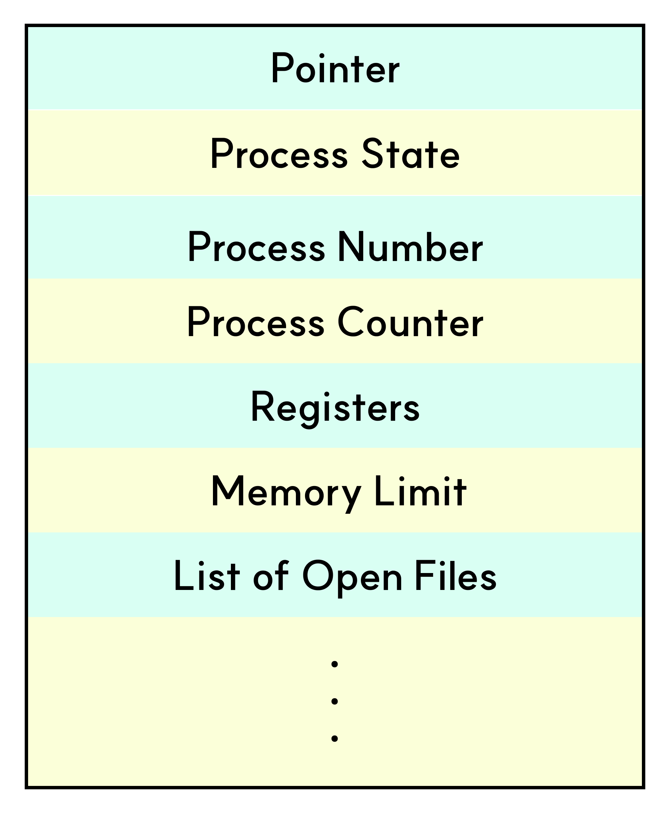

# PCB(**Process Control Block)**

PCB는 운영체제에서 프로세스를 관리하기 위해 사용되는 데이터 구조로, 각 프로세스마다 할당되어 해당 프로세스의 상태와 관련된 정보를 저장하고 관리합니다.

PCB는 프로세스의 중요한 정보를 포함하고 있기 때문에, 일반 사용자가 접근하지 못하도록 보호된 메모리 영역에 저장됩니다.

 

## PCB의 구조

  

- 포인터(Pointer): 프로세스가 한 상태에서 다른 상태로 전환될 때, 현재 프로세스의 위치를 유지하기 위해 저장해야 하는 스택 포인터를 의미합니다.
- 프로세스 상태(Process State): 해당 프로세스의 현재 상태를 저장합니다.
- 프로세스 번호(Process Number): 모든 프로세스에는 프로세스 식별자(Process ID, PID)라고 불리는 고유한 ID가 부여되며, 이를 저장합니다.
- 프로그램 카운터(Program Counter): 다음에 실행할 명령어의 주소를 담고 있는 카운터를 저장합니다.
- 레지스터(Register): PCB에 있는 레지스터는 하나의 데이터 구조입니다. 프로세스가 실행 중일 때 타임 슬라이스가 만료되면, 해당 프로세스 전용 레지스터의 현재 값이 PCB에 저장되고 프로세스는 스왑 아웃됩니다. 이후 해당 프로세스가 다시 실행될 때 PCB에서 레지스터 값을 읽어 CPU 레지스터에 복원합니다. PCB의 레지스터 항목은 주로 이러한 역할을 수행합니다.
- 메모리 한계(Memory Limit): 운영체제가 사용하는 메모리 관리 시스템과 관련된 정보를 포함합니다. 여기에는 페이지 테이블, 세그먼트 테이블 등이 포함될 수 있습니다.
- 열린 파일 목록(List of Open Files): 프로세스가 열고 있는 파일들의 목록 정보를 포함합니다.

### 포인터

입출력 작업이 완료되기를 기다리는 프로세스는 **대기 상태**에 머무르게 됩니다.

그런데 이 대기 상태의 프로세스들을 모두 한 곳에 모아두면, 특정 입출력 장치에서 인터럽트가 발생했을 때 해당 프로세스를 찾기 위해 전체를 뒤져봐야 하므로 관리가 어렵습니다.

이러한 이유로, 대기 상태의 프로세스들은 **요구한 입출력 종류별로** 묶어 관리합니다.

이를 위해 **링크드 리스트(linked list)** 나 **큐(queue)** 와 같은 자료구조를 사용하여, 같은 입출력을 기다리는 프로세스들끼리 모아놓습니다.

이렇게 하면 인터럽트 발생 시 해당 장치를 기다리는 프로세스 집합만 빠르게 찾아 처리할 수 있습니다.

  

 

## Context Switching (문맥 교환)

CPU에서는 프로세스의 상태에 따라 주기적으로 프로세스를 교체하는 작업이 필요한데, 이를 **문맥 교환(Context Switching)** 이라고 합니다.

문맥 교환이 발생하면, 현재 CPU에서 실행 중이던 프로세스의 상태(문맥)를 자신의 PCB(Process Control Block)에 저장합니다.

이후 CPU를 새롭게 할당받는 프로세스는 PCB에 저장되어 있던 이전 상태를 복원하여, 중단했던 지점부터 실행을 이어갈 수 있습니다.

따라서 PCB는 문맥 교환 과정에서 **프로세스의 정보·상태·문맥을 저장하고 복원하는 핵심적인 역할**을 수행합니다.

 

문맥 교환은 운영체제가 여러 프로세스를 동시에 실행하는 것처럼 보이게 하기 위해, CPU 제어권을 한 프로세스에서 다른 프로세스로 이양하는 과정입니다.

이 과정에서 실행 중이던 프로세스의 레지스터 값, 프로그램 카운터(PC), 스택 포인터(SP) 등의 실행 문맥(Context)을 PCB에 저장하고, 전환 대상 프로세스의 PCB로부터 해당 정보를 읽어 CPU를 설정합니다.

 

문맥 교환은 다음과 같은 상황에서 발생합니다.

- 프로세스가 할당된 시간(time slice, quantum)을 모두 사용했을 때
- 입출력 요청(IO 작업)과 같은 시스템 콜이 발생했을 때
- 자식 프로세스 생성, 특정 자원 대기 등으로 인해 프로세스가 대기 상태로 전환될 때

단, 다른 리소스를 기다릴 필요가 없는 인터럽트나 단순 시스템 콜의 경우에는 **유저 모드에서 커널 모드로의 전환만 발생하며**, 프로세스 간 전환(문맥 교환)은 일어나지 않습니다.

멀티태스킹 환경에서 문맥 교환은 필수적이지만, **짧은 시간 할당으로 인한 잦은 문맥 교환은 오버헤드**를 발생시켜 성능 저하의 원인이 될 수 있습니다.

그러므로 운영체제는 PCB와 문맥 교환을 효율적으로 관리하여, 성능과 응답성 간의 균형을 유지합니다.

 
 

> 참고
>
> - https://www.geeksforgeeks.org/operating-systems/process-table-and-process-control-block-pcb/
> - https://jiwon.oopy.io/c3c408ab-cf4d-4421-8b22-af7cac11fcbd
> - https://zu-techlog.tistory.com/123
