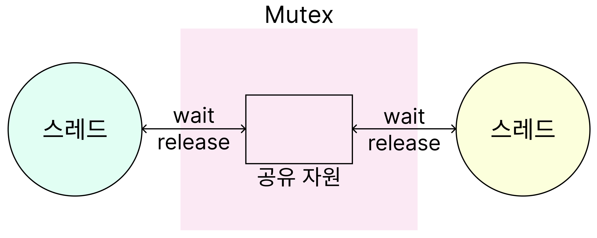
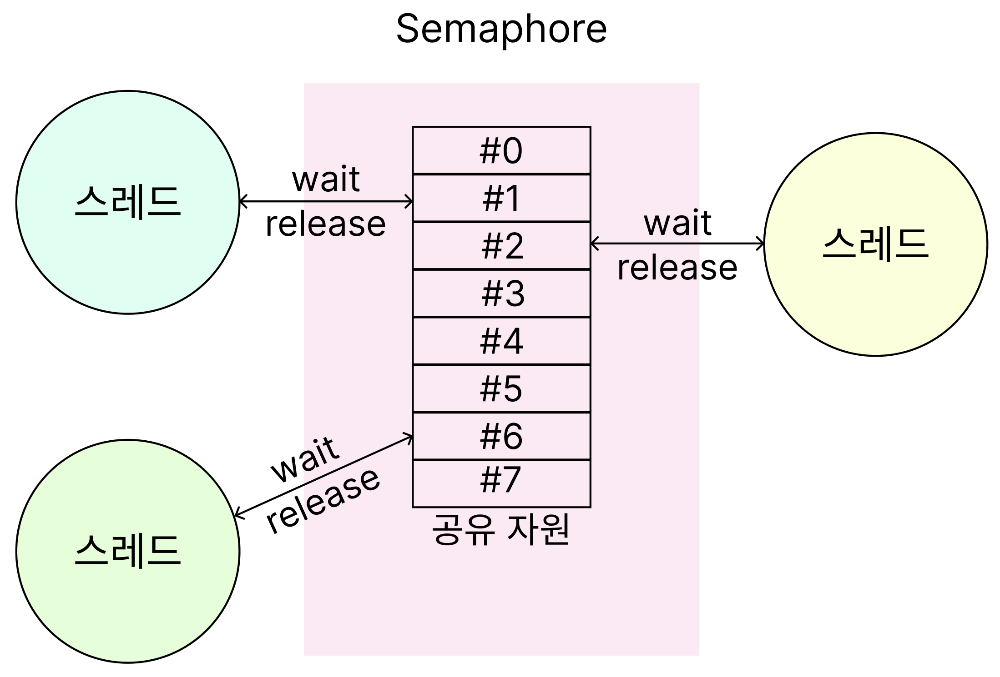

# 세마포어와 뮤텍스

- 뮤텍스는 항상 조건변수와 함께 쓰인다.
- 세마포어는 조건변수를 사용하지 않는다?

프로세스 간 메시지를 전송하거나, 공유메모리를 통해 공유된 자원에 여러 개의 프로세스가 동시에 접근할 경우 임계 영역 문제가 발생할 수 있습니다.

이를 해결하기 위해 공유자원을 한 번에 하나의 프로세스만 접근할 수 있도록 제한을 두는 동기화(synchronization) 방식을 취해야 합니다.

즉, 상호배제를 달성하는 방식의 대표적인 도구가 뮤텍스(Mutex)와 세마포어(Semaphore)입니다.

 

## 뮤텍스(Mutex)

> 동시성 프로그래밍에서 공유 불가능한 자원의 동시 사용을 피하기 위해 사용하는 알고리즘

뮤텍스는 임계 구역을 가진 스레드들의 실행 시간(Running time)이 서로 겹치지 않고 각각 단독으로 실행(상호 배제)되도록 하는 기술입니다.

한 프로세스에 의해 소유될 수 있는 “Key”를 기반으로 한 상호배제 기법인데, 식당 화장실의 예시로 해당 내용을 이해할 수 있습니다.

  

- 뮤텍스는 화장실이 하나 뿐인 식당과 같습니다.

- 화장실을 가기 위해서는 카운터에서 열쇠를 받아가야 합니다.

- 이때, 카운터에 열쇠가 있다면 화장실에 사람이 없다는 뜻이고, 당신은 그 열쇠를 이용해 화장실을 갈 수 있습니다.

- 당신이 화장실을 간 사이 다른 사람이 화장실을 가고 싶더라도 열쇠가 없기 때문에 이 사람은 당신이 나올 때까지 카운터에서 기다릴 수밖에 없습니다.

- 곧이어 또다른 사람이 화장실에 가고 싶어지면, 이 사람 또한 카운터에서 대기하게 됩니다.

- 이제 당신이 화장실에서 나와 카운터에 열쇠를 돌려놓으면 기다리던 사람들 중 맨 앞의 사람이 열쇠를 받고, 화장실에 갈 수 있습니다.

  

이처럼 뮤텍스는 Key에 해당하는 어떤 객체(Object)가 있으며, 이 객체를 소유한 스레드/프로세스만이 공유자원에 접근할 수 있습니다.

 

## 세마포어 (Semaphore)

> 멀티 프로그래밍 환경에서 공유된 자원에 대한 접근을 제한하는 방법

세마포어는 공유 자원의 상태를 나타내는 **카운터**로 생각할 수 있습니다.

여러 프로세스가 동시에 자원에 접근하지 않도록, 이 값을 조정하여 상호 배제(Mutual Exclusion)를 보장합니다.

  

- 공유 자원에 접근할 수 있는 프로세스의 **최대 허용치**만큼만 동시에 접근할 수 있습니다.
- 프로세스가 자원을 사용하지 않게 되면, 대기 중이던 다른 프로세스가 자원을 사용할 수 있습니다.
- 만약 자원이 이미 사용 중이라면, 다른 프로세스는 자원이 해제될 때까지 대기(wait)하게 됩니다.

또한, 세마포어는 **0과 1의 값만 가지는 이진 세마포어(Binary Semaphore)** 와, **여러 개의 값을 가질 수 있는 카운팅 세마포어(Counting Semaphore)** 로 나눌 수 있습니다.

- 이진 세마포어
  값이 0/1인 게이트로, 한 번에 하나만 통과시키므로 뮤텍스처럼 상호 배제를 달성하지만 소유권(락을 건 스레드만 해제) 개념이 없어 다른 스레드가 `V()`로 풀 수 있습니다.
  따라서 이진 세마포어는 상호 배제 + 이벤트 신호(signaling) 모두에 쓰일 수 있고, 뮤텍스는 순수 상호 배제와 소유권 보장을 중시합니다.
- 카운팅 세마포어
  N개의 퍼밋을 가진 일반화된 형태로, 동일 자원 N개 풀을 관리합니다.
  `P()`로 감소하며 없으면 대기, `V()`로 증가하며 대기자를 깨웁니다.
  뮤텍스는 단일 소유/해제 보장에 강점이 있고, 카운팅 세마포어는 용량 제어에 강점이 있으나 소유권 보장은 없습니다.

 

뮤텍스에서 설명한 화장실 예시를 적용하자면 세마포어는 여러 칸이 존재하고, 화장실의 빈 칸 개수를 확인할 수 있는 전광판이 존재하는 화장실과 같습니다.

  

- 칸에 사람이 들어갈 때마다 남은 칸 수는 1개씩 줄어들며, 사람이 나올 때마다 다시 1개씩 늘어납니다.

- 모든 칸에 사람이 들어갔을 경우 빈 칸의 개수는 0이 되며 이때 화장실에 들어가고자 하는 사람이 있다면 빈 칸의 개수가 1로 바뀔 때까지 기다려야 합니다.

 
 

> 참고
>
> - https://chelseashin.tistory.com/40
> - https://worthpreading.tistory.com/90
>   아이콘
> - https://www.flaticon.com/free-icon/person_15623692?term=person&page=1&position=64&origin=search&related_id=15623692
> - https://www.flaticon.com/free-icon/man_657674?term=person&page=1&position=61&origin=search&related_id=657674
> - https://www.flaticon.com/free-icon/key_807241?term=key&page=1&position=1&origin=search&related_id=807241
> - https://www.flaticon.com/free-icon/counter_3410199?term=counter&page=1&position=5&origin=search&related_id=3410199
> - https://www.flaticon.com/free-icon/door_2607178?term=door&page=1&position=21&origin=search&related_id=2607178
> - https://www.flaticon.com/free-icon/occupied_4753257?term=occupied&page=1&position=33&origin=search&related_id=4753257
> - https://www.flaticon.com/free-icon/toilet_8064840?term=toilet&page=1&position=14&origin=search&related_id=8064840
