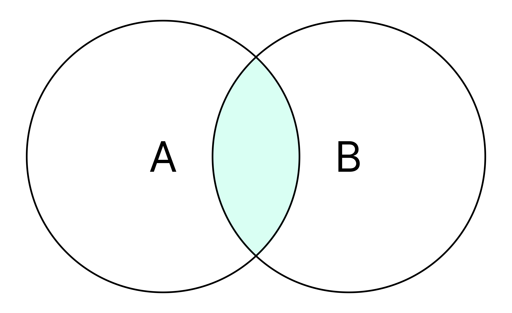
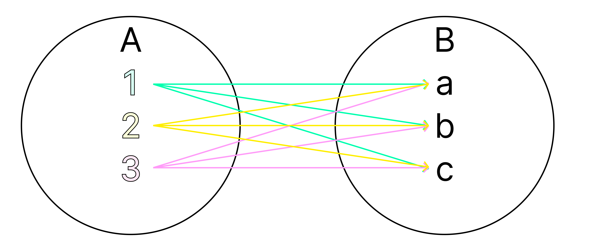
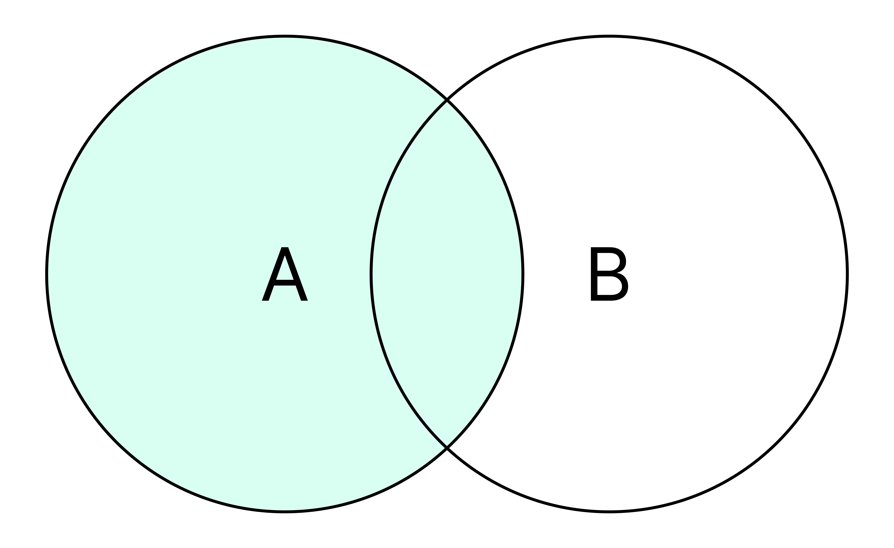
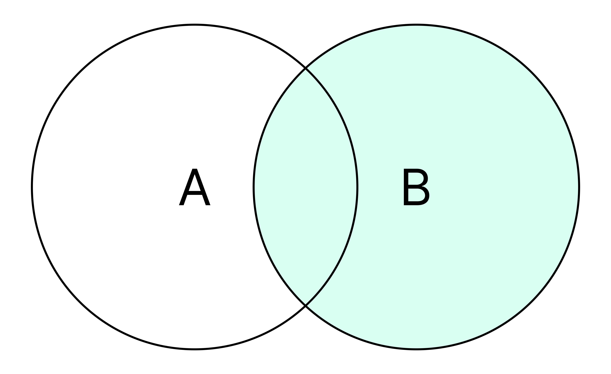
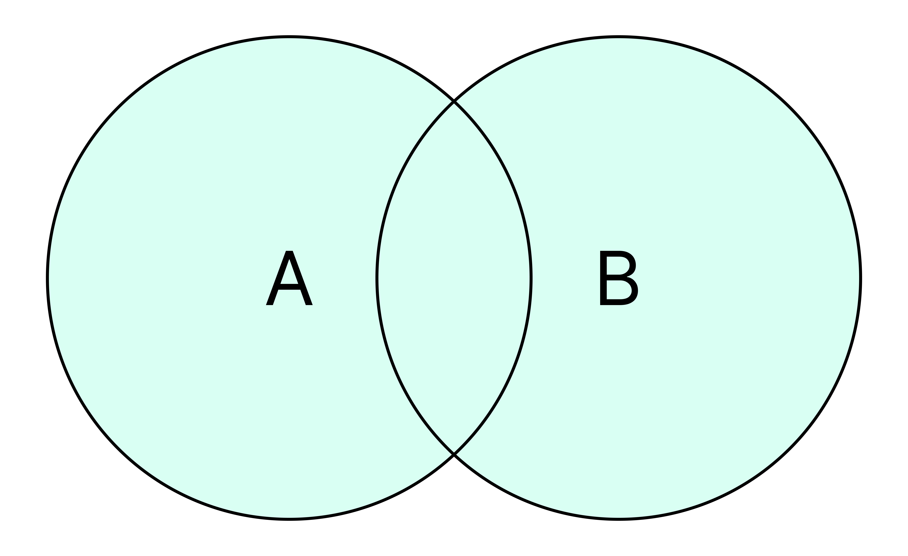

# 조인의 종류

조인이란 두 개 이상의 테이블을 결합하여 데이터를 검색하는 방법을 의미합니다.

관계형 데이터베이스에서 `JOIN` 연산자는 관련 있는 컬럼을 기준으로 행을 합쳐주는 연산입니다.

이러한 조인은 내부조인(INNER JOIN)과 외부 조인(OUTER JOIN)으로 구분됩니다.

<br/>

## 내부 조인 (INNER JOIN)

<p align="center">
    
</p>

조인이라고 하면, 보통 내부 조인을 의미합니다.

내부 조인은 조건을 만족하는 행만 교집합으로 결합합니다.

<br/>

### 등가 조인 (EQUI JOIN), 비등가 조인 (NON-EQUI JOIN)

등가 조인은 동등비교(=)를 사용하는 조인으로 INNER JOIN과 동일합니다.

비등가 조인은 동등비교를 사용하지 않는 조인으로, 조건문인 >, < 등과 같은 비교를 사용하는 조인입니다.

```sql
-- 등가 조인
SELECT e.id, e.name, d.name AS dept_name
FROM employees AS e
JOIN departments AS d
  ON e.dept_id = d.id;

-- 비등가 조인
SELECT e.id, e.name, e.salary, g.grade
FROM employees AS e
JOIN salary_grades AS g
  ON e.salary BETWEEN g.min_salary AND g.max_salary;
```

<br/>

### 자연 조인 (NATURAL JOIN)

자연 조인은 등가 조인의 결과에서 중복되는 속성을 제거한 결과입니다.

```sql
SELECT * FROM a NATURAL INNER JOIN b;
```

<br/>

### 자기 조인 (SELF JOIN)

같은 테이블을 두 번 참조해 행끼리 연결합니다.

```sql
SELECT c1.id, c2.id AS parent_id
FROM categories c1
INNER JOIN categories c2 ON c1.parent_id = c2.id;
```

<br/>

### 교차 조인 (CROSS JOIN)

<p align="center">
    
</p>

교차 조인은 두 테이블의 곱집합(Caresian Product)을 진행한 결과입니다.

사실상 조건 없는 INNER JOIN과 같은 결과를 내는 별도 조인 유형입니다.

```sql
SELECT * FROM A CROSS JOIN B;
```

<br/>

## 외부 조인 (OUTER JOIN)

내부 조인은 두 테이블에 모두 데이터가 있어야만 결과가 나오지만, 외부 조인은 한쪽에만 데이터가 있어도 결과가 나옵니다.

<br/>

### 왼쪽 외부 조인 (LEFT OUTER JOIN)

왼쪽 외부 조인은 테이블 A에 대한 모든 데이터와 테이블 B와 매칭되는 레코드를 포함하는 조인입니다.

<p align="center">
    
</p>

```sql
SELECT e.id, e.name, d.name AS dept_name
FROM employees e
LEFT JOIN departments d
  ON e.dept_id = d.id;   -- 부서가 없어도 직원은 남고, d.*는 NULL
```

<br/>

### 오른쪽 외부 조인 (RIGHT OUTER JOIN)

오른쪽 외부 조인은 테이블 B의 모든 데이터와 테이블 A에 매칭되는 레코드를 포함하는 조인입니다.

<p align="center">
    
</p>

```sql
SELECT e.id, e.name, d.name AS dept_name
FROM employees e
RIGHT JOIN departments d
  ON e.dept_id = d.id;   -- 직원이 없어도 부서는 남고, e.*는 NULL
```

<br/>

## 합집합 조인

### 완전 외부 조인 (FULL OUTER JOIN)

완전 외부 조인은 한마디로 왼쪽 외부 조인과 오른쪽 외부 조인을 합친 결과입니다.

<p align="center">
    
</p>

```sql
SELECT e.id, e.name, d.name AS dept_name
FROM employees e
FULL OUTER JOIN departments d
  ON e.dept_id = d.id;
```

<br/>
<br/>

> 참고
>
> - https://velog.io/@newdana01/Database-%ED%85%8C%EC%9D%B4%EB%B8%94-%EC%A1%B0%EC%9D%B8-%EC%9D%B4%ED%95%B4%ED%95%98%EA%B8%B0
> - https://hongong.hanbit.co.kr/sql-%EA%B8%B0%EB%B3%B8-%EB%AC%B8%EB%B2%95-joininner-outer-cross-self-join/
> - https://hyejin.tistory.com/172
