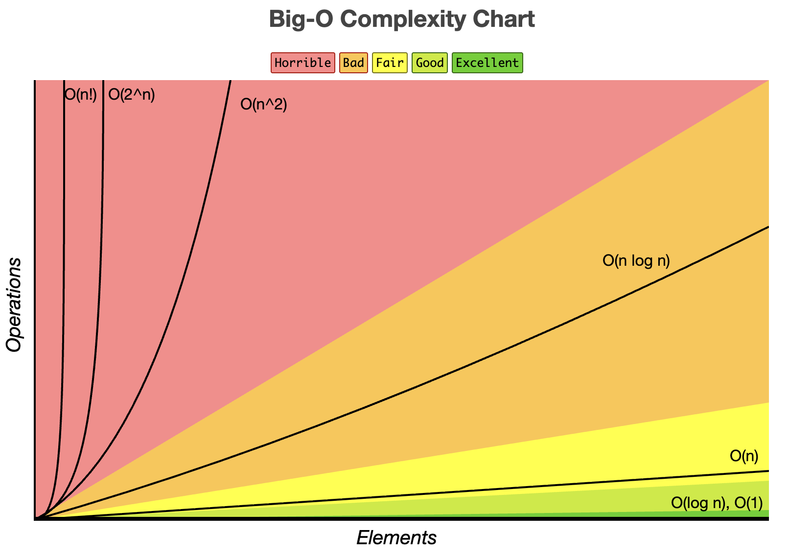

# 복잡도

## 시간 복잡도와 공간 복잡도

### 시간 복잡도

시간 복잡도는 어떤 크기의 입력을 넣었을 때, 그 문제를 풀기 위해 필요한 연산의 “개수”가 대략 얼마나 늘어나는지를 말합니다.

환경마다 실행 시간이 들쭉날쭉하기 때문에 이름은 시간 복잡도지만 실행 시간이 아닌 연산 횟수를 셉니다.

이때 우리는 입력 크기 n을 아주 크게 키워볼 때의 증가 추세에 관심을 두고, 그 증가 속도를 상징적으로 적습니다.

이게 바로 빅-오 표기법입니다.

현실의 알고리즘 평가는 보통 세 가지 경우를 생각합니다.

- 최선의 경우 (Best Case)
  최적의 입력을 한 상태에서, 작업을 완료하는 데 가장 연산 횟수가 적은 경우
- 최악의 경우 (Worst Case)
  최악의 입력을 한 상태에서, 작업을 완료하는 데 가장 연산 횟수가 많은 경우
- 평균의 경우 (Average Case)
  여러 경우의 수를 고려하여, 총 연산 횟수를 계산하고 시행 횟수로 나눈 경우

실제로는 평균을 정확히 정의하려면 입력이 어떤 확률로 들어오는지를 가정해야 해서 만만치 않습니다.

그래서 복잡한 문제일수록 평균 대신 ‘최악일 때도 이 정도면 버틴다’라는 최악의 경우를 주로 사용합니다.

예를 들어 정렬 알고리즘을 고를 때, 평소엔 빨라도 특정 입력에서 폭발하는 방법보다는, 항상 안정적으로 동작하는 방법을 선호하는 식입니다.

 

### 공간 복잡도

공간 복잡도는 알고리즘을 돌릴 때 추가로 필요한 메모리가 얼마인지를 다룹니다.

프로그램 자체가 차지하는 고정 공간은 일단 제쳐 두고, 입력 크기에 따라 늘어나는 부분만 주로 봅니다.

예를 들어, 재귀 호출은 호출 깊이만큼 호출 스택을 더 쓰고, 보조 배열을 만드는 정렬은 배열 크기만큼 추가 공간을 씁니다.

 

### 빅-오(Big-O) 표기법

    

Big-O는 “입력이 커질수록 연산 횟수가 어떤 속도로 증가하느냐”를 한 글자로 요약하는 약속입니다.

상수배와 낮은 차수 항은 버리고, 가장 빨리 커지는 항만 남깁니다.

예를 들어 연산 횟수가 5n³ + 3n이라면, n이 커질수록 n³ 항이 지배하니 O(n³)라고 씁니다.

여기서 5나 +3n 같은 건 결국 n³의 성장에 묻혀 의미가 약해지므로 무시합니다.

 
 

> 참고
>
> - https://ko.wikipedia.org/wiki/%EC%8B%9C%EA%B0%84_%EB%B3%B5%EC%9E%A1%EB%8F%84
> - https://velog.io/@welloff_jj/Complexity-and-Big-O-notation
> - 이미지: https://www.bigocheatsheet.com/
