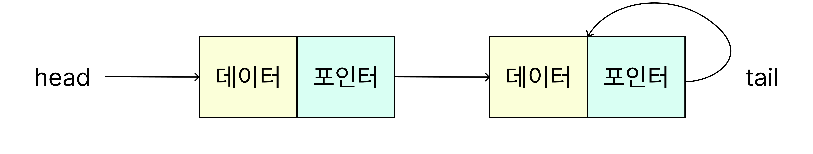
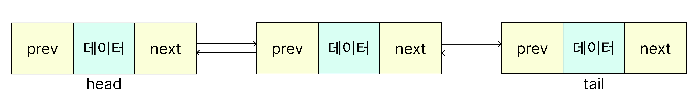

# 선형 자료 구조

## 연결 리스트

### 연결 리스트란?

> **각각 데이터와 포인터를 가지고 있는 노드를 연결시킨 자료구조**

    

- **노드:** 연결 리스트에서 데이터를 저장하는 기본 단위
- 각 노드는 다음 노드를 가리키는 **포인터**를 포함
- 포인터는 다음 노드의 메모리 주소를 값으로 가짐

 

### 장단점

- 장점
  - **가변적인 리스트 길이**
    노드 추가만으로 적은 비용으로 리스트 크기를 조정할 수 있음
  - **데이터 추가와 삭제가 용이함**
    노드 간 링크만 변경하면 됨
  - **메모리 효율성 우수**
- 단점
  - **탐색의 비효율성**
    원하는 원소를 찾기 위해 처음부터 순차적으로 노드를 탐색해야 하므로 시간이 많이 소요됨
  - **구현의 복잡성**

 

### 양방향 연결리스트란?

> **각 노드가 앞 노드와 뒤 노드의 정보를 모두 저장하고 있는 연결 리스트**

    

단일 연결 리스트와 달리 **머리(Head)**와 **꼬리(Tail)**를 모두 가진다.

이 특성으로 인해 리스트의 앞이나 뒤에서부터 모두 접근이 가능하다.

 

## 배열

### 배열이란?

> 동일한 타입(또는 의미가 같은 값들)의 데이터를 메모리에 연속적으로 배치해, 인덱스로 직접 접근하는 선형 자료구조

각 요소는 0부터 시작하는 **인덱스**로 식별되고, 요소들이 **연속된 메모리**에 저장되기 때문에 임의 접근(Random Access)이 가능하다.

 

### 장단점

- 장점
  - 배열은 **인덱스 기반의 즉시 접근**이 가능
  - **캐시 지역성(cache locality)**이 좋아 순차 접근 성능 우수
  - 구조가 단순해 구현과 이해가 쉬움
  - 정렬·이진 탐색 등 **인덱스/순차성에 최적화된 알고리즘**을 그대로 적용하기 좋음
- 단점
  - **크기 변경이 비싸다**
  - 고정 크기 배열은 새로 크게 만들고 복사해야 하고, 동적 배열도 내부적으로 **재할당·복사** 필요
  - **중간 삽입/삭제는 O(n)**이며, 매우 큰 배열은 **연속된 메모리 확보가 어려울 수 있다**

 

### 언제 배열을 쓰나?

- 데이터 크기가 대략 고정이거나, **인덱스 즉시 접근**이 핵심일 때
- **순차 처리·스캔**이 많을 때 (캐시 친화적)
- **정렬·이진 탐색**처럼 배열 전제가 있는 알고리즘을 쓸 때
- **행렬·벡터 연산** 등 연속 메모리에서의 수치 처리

 

## 벡터

### 벡터란?

> 보통 “동적 배열(dynamic array)”을 가리키며, 연속된 메모리 블록 위에서 인덱스로 즉시 접근하고, 공간이 꽉 차면 더 큰 버퍼로 재할당·복사하여 자동 확장되는 선형 자료구조

각 요소는 0부터 시작하는 **인덱스**로 식별되고, 벡터는 내부 **용량(capacity)**과 **길이(size)**를 구분해 관리한다.

용량이 가득 찰 때 보통 **두 배 성장 정책**으로 더 큰 배열을 만들고 기존 데이터를 복사한다.

 

### 장단점

- 장점
  - **인덱스 기반 임의 접근 O(1)**이 가능
  - **끝에 추가/제거(push/pop)**가 **평균 O(1)**
  - 두 배 성장으로 **재할당 횟수 최소화**, 총 삽입 n회 비용은 O(n)
  - 연속 메모리 기반이라 **캐시 지역성**이 좋아 **순차 접근**·**배치 처리**에 유리
- 단점
  - **중간 삽입/삭제는 O(n)** (뒤 요소를 한 칸씩 밀거나 당겨야 함)
  - **재할당 시 전체 복사 비용**이 발생
  - 매우 큰 벡터는 **연속된 큰 메모리 확보가 어려울 수 있음**

 

### 언제 벡터를 쓰나?

- **끝 추가/제거가 많고**, **인덱스 즉시 접근**이 중요한 컬렉션이 필요할 때
- **순차 스캔·배치 연산**이 잦아 **캐시 친화성**을 살리고 싶을 때
- **정렬, 이진 탐색** 등 **배열 전제 알고리즘**을 그대로 활용하고 싶을 때

 

---

 

### 자바스크립트에서의 벡터

> JS 표준에는 “Vector” 타입이 없고, 일반 Array가 동적 배열 역할을 한다.

다만 언어 차원에서 연속 메모리를 보장하지는 않으며, 엔진이 밀집(dense)·동형(homogeneous) 패턴일 때 내부적으로 동적 배열처럼 최적화한다.

- `Array`
  - **가변 길이**이며 인덱스 접근이 평균적으로 O(1)에 가깝도록 엔진이 최적화
  - **push/pop** 평균 O(1), **shift/unshift** 는 O(n)
  - **희소(sparse) 인덱스**·**혼합 타입**·**프로퍼티 추가**가 많아지면 **밀집 최적화가 깨져** 성능 특성이 **객체 해시맵형**으로 바뀔 수 있음
  - 성능을 원하면 다음을 지킵니다:
    - 인덱스를 **연속적으로** 사용하고, **타입을 일관**되게 유지
    - 길이를 예측 가능하게 관리(과도한 희소 인덱스·delete 지양)
- `TypedArray` (`Uint8Array`, `Float64Array` 등)
  - **ArrayBuffer 위의 고정 길이 숫자 배열**, **연속 메모리 보장**, 인덱스 접근 O(1)
  - **길이가 고정**이라 자동 확장 없음 → 더 큰 버퍼를 직접 만들고 **복사**해야 함
  - **수치 연산·바이너리 I/O**·**WebGL/WebGPU** 등에서 필수적

 

## 스택

### 스택이란?

> 후입선출(LIFO) 규칙으로 동작하는 선형 자료구조.
> 맨 위(top)에서만 삽입(push)과 삭제(pop)가 일어나며, 임의 접근은 허용하지 않고 가장 최근 요소에만 즉시 접근한다.

스택은 배열 기반(연속 메모리) 또는 연결 리스트 기반(비연속)으로 구현될 수 있고, 핵심 연산은 `push`, `pop`, `peek/top`, `isEmpty`, `size`

 

### 장단점

- 장점
  - **push/pop/peek 모두 O(1)** 로 매우 단순하고 빠름
  - 제약이 명확해 **불변식(invariant) 유지가 쉬움** (top만 조작)
  - **함수 호출 스택**, **백트래킹**, **undo/redo** 등 LIFO 패턴에 완벽히 부합
- 단점
  - **임의 위치 접근 불가**(인덱스 검색/중간 삭제 부적합)
  - 크기 상한(capacity)이 있거나, **스택 오버플로/언더플로** 가능
  - 연결 리스트 기반은 **캐시 지역성**이 떨어져 순차 성능이 약해질 수 있음

 

### 언제 스택을 쓰나?

- **중첩 구조 처리**: 괄호 검증, 파싱, DFS, 백트래킹
- **상태 되돌리기**: 에디터 **undo/redo**, 웹 브라우저 히스토리
- **계산 모델**: 후위 표기법 계산기, VM 인터프리터의 오퍼랜드 스택
- **재귀 대체**: 재귀 한계를 피할 때 **명시적 스택** 사용

 

## 큐

### 큐란?

> 선입선출(FIFO) 규칙으로 동작하는 선형 자료구조.
> 뒤(rear) 에서 삽입(enqueue)하고 앞(front) 에서 삭제(dequeue)하며, 맨 앞 요소에 즉시 접근한다.

큐는 **배열 기반 원형 버퍼(링 버퍼)**, **연결 리스트**, **두 스택 조합** 등으로 구현된다.

핵심 연산은 `enqueue`, `dequeue`, `front/peek`, `isEmpty`, `size`

 

### 장단점

- 장점
  - **enqueue/dequeue/peek 모두 O(1)** 구현이 가능(적절한 내부 구조 전제)
  - **작업 스케줄링**, **버퍼링**, **스트리밍** 등 FIFO 패턴에 자연스럽게 부합
  - 원형 버퍼는 **연속 메모리 + 캐시 지역성**을 살리면서도 **앞 삭제 O(1)** 달성
- 단점
  - **중간 접근/삭제 불가**, 임의 검색에 부적합
  - 배열에서 앞 요소를 실제로 당기면 **O(n)**
  - 연결 리스트 기반은 **포인터 오버헤드**와 **캐시 비우호성**

 

### 언제 큐를 쓰나?

- **프로듀서—컨슈머** 패턴, **비동기 작업 대기열**
- **BFS(너비 우선 탐색)**, **최단 경로** 등 레벨별 처리
- **I/O 버퍼링**, **이벤트 디스패치**, **스케줄러/쓰레드 런큐**
- **레이트 리미팅/디바운스** 같은 시간 기반 윈도우 처리(슬라이딩 큐 조합)
