# 비선형 자료구조

## 트라이 (Trie)

### 트라이란?

> **문자열을 저장하고 효율적으로 탐색하기 위한 트리 형태의 자료구조**

<p align="center">
    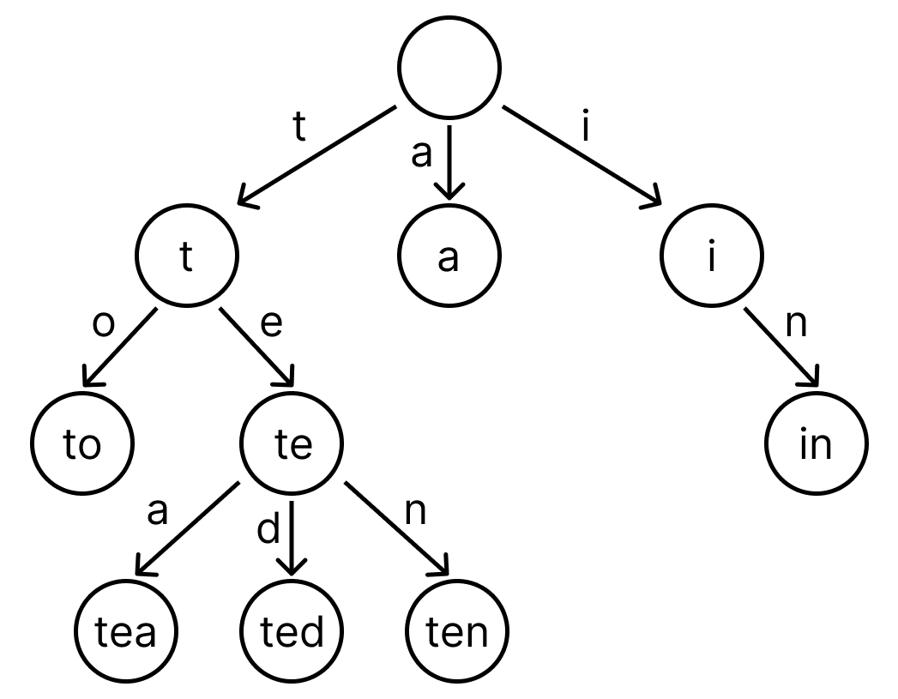
</p>

트라이는 트리 자료구조에서 파생된 문자열 검색 전용 자료구조입니다.

검색 시 볼 수 있는 **자동완성 기능**이나 **사전 검색** 등 문자열 탐색에 특화되어 있습니다.

<br/>

### 구조 및 원리

영어사전에서 'cancel'을 찾을 때를 생각해보면 먼저 'c'의 색인을 찾고, 그다음 'a', 'n' 순서로 찾아갑니다.

이러한 논리를 컴퓨터에 적용한 구조가 바로 트라이입니다.

예를 들어 'tea'가 입력되면 't', 'e', 'a' 순서로 등록됩니다.

문자열을 모두 찾으면 해당 위치에 "문자열이 여기 있다"고 표시합니다.

Array를 통해 다음과 같이 구현할 수 있습니다.

1. `trie`에 등록할 문자열 `p`가 있다고 가정합니다. 편의상 이 문자열은 알파벳 소문자로만 구성되어 있습니다.
2. `trie`의 루트는 언제나 0입니다. 0부터 시작하여 `p[i]-'a'`에 대해 다음 노드로 이동 가능한지 판단합니다.
3. 이동할 수 있다면 이동하고, 없다면 `triesize`에 1을 추가하여 새로운 노드를 만든 뒤 그곳을 가리키게 합니다.
4. 동적 할당을 활용할 수 있다면 할당 후 가리키게 하면 됩니다.
5. 이를 반복합니다.

```jsx
const ALPHABET = 26;
let trie = [Array(ALPHABET).fill(0)];
let check = [false];
let triesize = 0;

function insert(p) {
  let node = 0;
  for (let i = 0; i &lt; p.length; i++) {
    const c = p.charCodeAt(i) - 97; // 'a'~'z'
    if (trie[node][c] === 0) {
      trie.push(Array(ALPHABET).fill(0));
      check.push(false);
      trie[node][c] = ++triesize;
    }
    node = trie[node][c];
  }
  check[node] = true;
}
```

<br/>

### 장단점

- 트라이(Trie)는 문자열 검색이 빠릅니다.
- 문자열을 하나씩 전부 비교하며 탐색하는 것보다 시간 복잡도 측면에서 훨씬 효율적입니다.
- 각 노드가 자식들에 대한 포인터를 배열로 저장하기 때문에 메모리 사용량이 큰 단점이 있습니다.

<br/>
<br/>

- 참고
  - https://velog.io/@kimdukbae/%EC%9E%90%EB%A3%8C%EA%B5%AC%EC%A1%B0-%ED%8A%B8%EB%9D%BC%EC%9D%B4-Trie
  - https://namu.wiki/w/%ED%8A%B8%EB%9D%BC%EC%9D%B4

<br/>

## AVL Tree

### AVL Tree란?

> **트리의 높이를 항상 일정하게 유지**하여 **탐색, 삽입, 삭**제 연산에서 **O(log n)**의 성능을 보장하는 자료구조

<p align="center">
    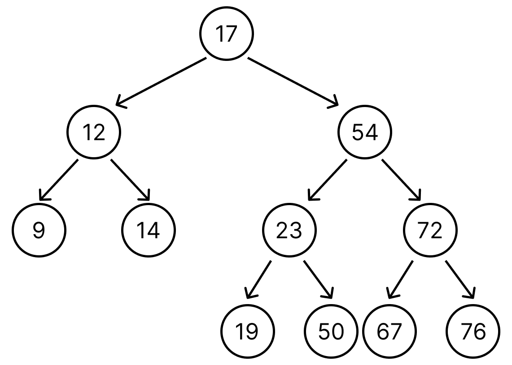
</p>

AVL Tree는 균형 이진 탐색 트리(Self-balancing Binary Search Tree)의 일종입니다.

이진 탐색 트리의 시간 복잡도는 트리의 높이 h에 비례하여 O(h)이며, 한쪽으로 치우친 편향 이진트리는 높이가 높아져 성능이 저하됩니다.

AVL 트리는 이를 방지하기 위해 두 자식 서브트리의 높이는 항상 최대 1만큼 차이나도록 **회전(Rotation) 연산을 통해** 높이 균형을 유지합니다.

이러한 균형 유지 덕분에 **비균형 트리로 인한 성능 저하를 방지**할 수 있습니다.

<br/>

### 균형 인수 (Balance Factor)

> Balance Factor (k) = height (left(k)) - height(right(k))

AVL 트리에서는 각 노드에 대해 **왼쪽 서브트리와 오른쪽 서브트리의 높이 차이**를 **균형 인수**라고 합니다.

균형 인수는 `-1`, `0`, `1` 중 하나를 유지해야 합니다.

- `0`: 왼쪽과 오른쪽 서브트리의 높이가 같음
- `1`: 왼쪽 서브트리의 높이가 오른쪽보다 1 큼
- `-1`: 오른쪽 서브트리의 높이가 왼쪽보다 1 큼

삽입 또는 삭제 시 특정 노드에서 균형 인수가 2 이상이 되면 트리의 균형이 깨집니다.

이때 회전 연산을 통해 균형을 다시 맞춥니다.

<br/>

### 회전 연산 (Rotation)

노드 삽입이나 삭제 시 트리의 균형이 깨지는 경우는 4가지입니다.

1. **LL 케이스 (Left-Left)**: 트리의 **왼쪽 자식 노드**가 다시 **왼쪽 자식 노드**를 가지는 경우
   - 왼쪽 자식의 **BF가 0**이어도 **LL 케이스**에 해당합니다.
   - 즉, **왼쪽 자식의 BF가 0 이상인 경우**입니다.
2. **RR 케이스 (Right-Right)**: 트리의 **오른쪽 자식 노드**가 다시 **오른쪽 자식 노드**를 가지는 경우
   - 오른쪽 자식의 **BF가 0**이어도 **RR 케이스**에 해당합니다.
   - 즉, **오른쪽 자식의 BF가 0 이하인 경우**입니다.
3. **LR 케이스 (Left-Right)**: 트리의 **왼쪽 자식 노드**가 **오른쪽 자식 노드**를 가지는 경우
   - 즉, **왼쪽 자식의 BF가 0보다 작은 경우**입니다.
4. **RL 케이스 (Right-Left)**: 트리의 **오른쪽 자식 노드**가 **왼쪽 자식 노드**를 가지는 경우
   - 즉, **오른쪽 자식의 BF가 0보다 큰 경우**입니다.

- 단순 회전 (Single Rotation): 트리가 한쪽 방향으로만 치우친 경우 사용

    <p align="center">
      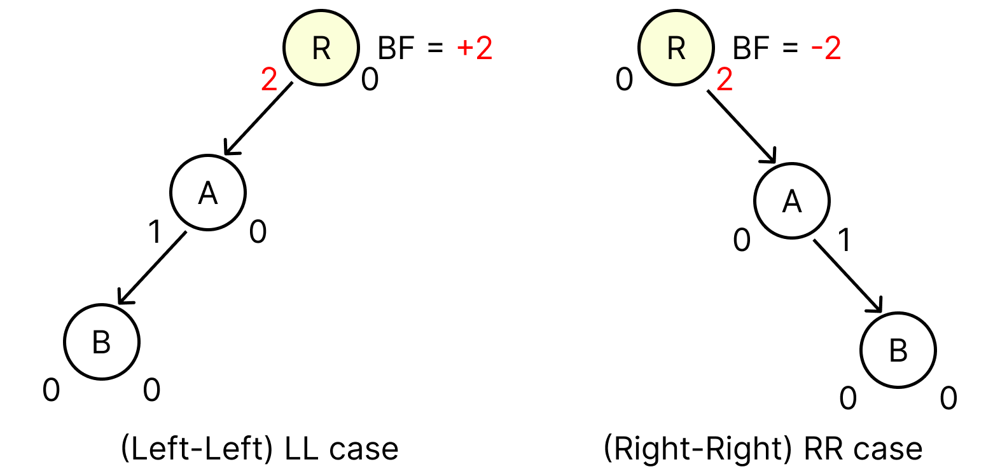
    </p>
    
    - LL (Left-Left) 회전
        <p align="center">
          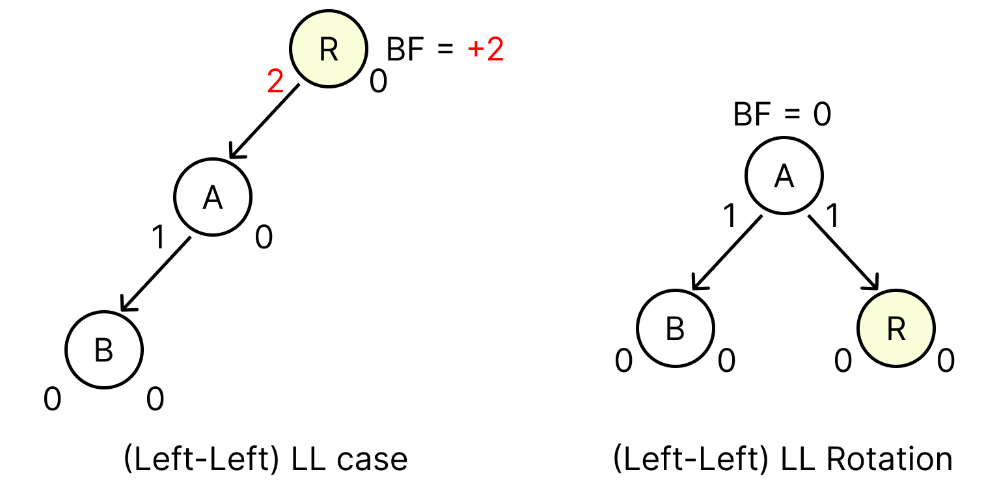
        </p>
        
        - **왼쪽** 자식이 **왼쪽** 서브트리를 가지는 경우입니다.
        - **왼쪽 자식 노드가 새로운 루트**가 되고, **기존 루트 노드는 왼쪽 자식 노드의 오른쪽 자식**이 됩니다.
    - RR (Right-Right) 회전
        
        <p align="center">
          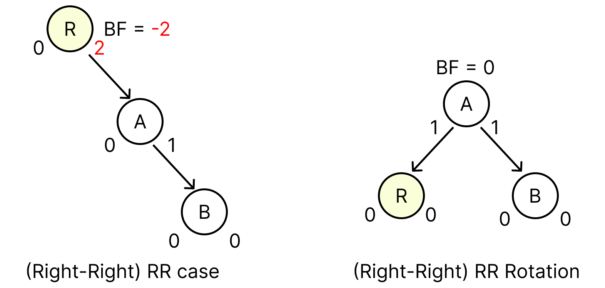
        </p>
        
        - **오른쪽** 자식이 **오른쪽** 서브트리를 가지는 경우입니다.
        - **오른쪽 자식 노드가 새로운 루트**가 되고, **기존 루트 노드는 오른쪽 자식 노드의 왼쪽 자식**이 됩니다.

- 이중 회전 (Double Rotation): 두 방향으로 치우친 경우 사용
    <p align="center">
          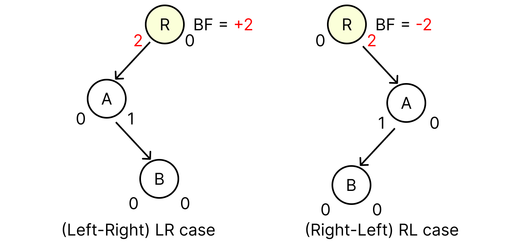
        </p>
    
    - LR (Left-Right) 회전
        <p align="center">
          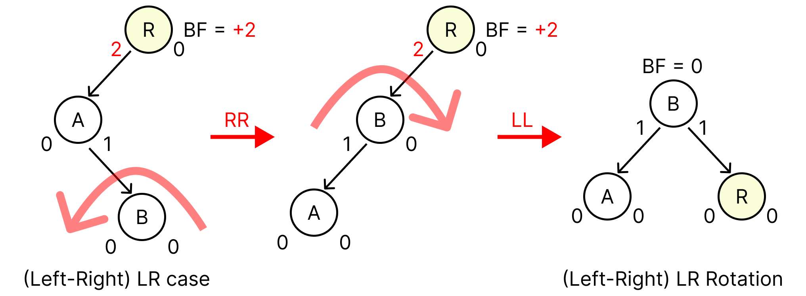
        </p>
        
        - **왼쪽** 자식이 **오른쪽** 서브트리를 가지는 경우입니다.
        - 먼저 **왼쪽 자식의 오른쪽 서브트리**에 대해 **RR 회전**을 수행한 후, **LL 회전**을 적용합니다.
    - RL (Right-Left) 회전
        <p align="center">
          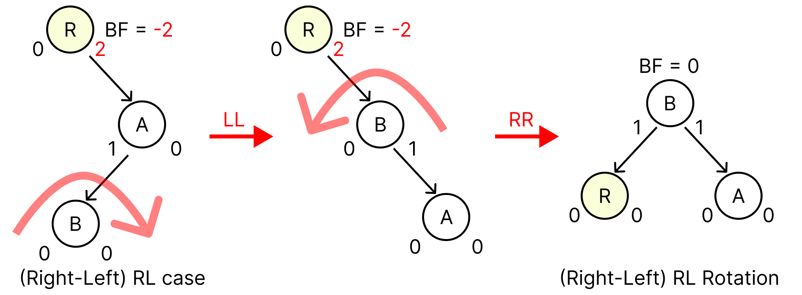
        </p>
        
        - **오른쪽** 자식이 **왼쪽** 서브트리를 가지는 경우입니다.
        - 먼저 **오른쪽 자식의 왼쪽 서브트리**에 대해 **LL 회전**을 수행한 후, **RR 회전**을 적용합니다.

### 장단점

- 균형을 유지하기 때문에 최악의 경우에도 **탐색, 삽입, 삭제** 연산이 항상 **O(log n)**에 이루어집니다.
- 트리의 균형 유지를 통해 비균형 상태로 인해 성능이 저하되는 상황을 방지할 수 있습니다.
- 균형을 맞추기 위한 **회전 연산**이 추가되면서 삽입과 삭제 시 일반적인 이진 탐색 트리보다 **연산량이 늘어납니다**.

<br/>
<br/>

- 참고
  - https://ko.wikipedia.org/wiki/AVL_%ED%8A%B8%EB%A6%AC
  - https://velog.io/@dankj1991/Tree-AVL-Tree#12-avl-tree%EC%9D%98-%EC%9E%A5%EB%8B%A8%EC%A0%90%EA%B3%BC-%EC%A3%BC%EC%9A%94-%EC%9A%A9%EB%8F%84
  - https://yoongrammer.tistory.com/72

<br/>

## Red-Black Tree

### 레드-블랙 트리란?

> **자가 균형 이진 탐색 트리(self-balancing binary search tree)로서, 대표적으로는 연관 배열 등을 구현하는 데 쓰이는 자료구조**

<p align="center">
  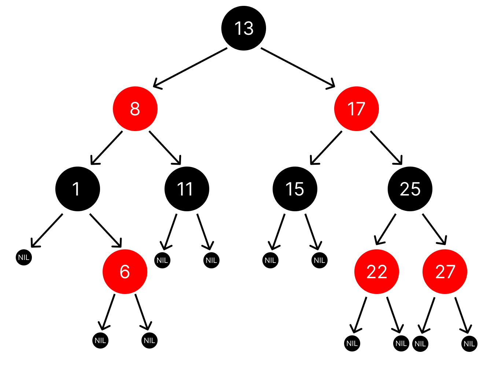
</p>

레드블랙트리(Red-Black Tree)는 각 노드에 빨강/검정 색 속성을 부여해 트리의 높이를 강제로 억제하는 **자가 균형 이진 탐색 트리**입니다.

핵심은 특정 불변식을 지켜서 루트에서 잎까지의 최장 경로 길이가 최단 경로의 두 배를 넘지 않도록 만들기 때문에, **삽입·삭제·탐색이 최악의 경우에도 O(log n)** 으로 동작한다는 점입니다.

이는 실시간 처리와 같은 실행시간이 중요한 경우에 유용하게 쓰일 뿐만 아니라, 일정한 실행 시간을 보장하는 또 다른 자료구조를 만드는 데에도 쓸모가 있습니다.

<br/>

### 특징

이진 탐색 트리가 가지고 있는 일반적인 조건에 다음과 같은 추가적인 조건을 만족해야 유효한(valid) 레드-블랙 트리가 됩니다.

1. 노드는 레드 혹은 블랙 중의 하나이다.
2. 루트 노드는 블랙이다.
3. 모든 리프 노드들(NIL)은 블랙이다.
4. 레드 노드의 자식노드 양쪽은 언제나 모두 블랙이다. (즉, 레드 노드는 연달아 나타날 수 없으며, 블랙 노드만이 레드 노드의 부모 노드가 될 수 있다)
5. 어떤 노드로부터 시작되어 그에 속한 하위 리프 노드에 도달하는 모든 경로에는 리프 노드를 제외하면 모두 같은 개수의 블랙 노드가 있다.

위 조건들을 만족하게 되면, 레드-블랙 트리는 가장 중요한 특성 — 루트 노드부터 가장 먼 잎노드 경로까지의 거리가, 가장 가까운 잎노드 경로까지의 거리의 두 배 보다 항상 작다는 특성을 나타냅니다.

다시 말해서 레드-블랙 트리는 개략적(roughly)으로 균형이 잡혀 있습니다(balanced).

따라서, 삽입, 삭제, 검색시 최악의 경우(worst-case)에서의 시간복잡도가 트리의 높이(또는 깊이)에 따라 결정되기 때문에 보통의 이진 탐색 트리에 비해 효율적이라고 할 수 있습니다.

<br/>

### 삽입 과정

예시를 통해 이해해보겠습니다.

레드-블랙 트리에 새로운 노드를 삽입할 때 새로운 노드는 항상 빨간색으로 삽입합니다.

이렇게 되면 4번 조건이 위배되는 상황, 즉 빨간색 노드가 연속으로 2번 나타날 수 있습니다.

레드 블랙 트리는 이러한 Double Red 문제를 해결하기 위해 아래와 같은 2가지 전략을 사용합니다.

<p align="center">
  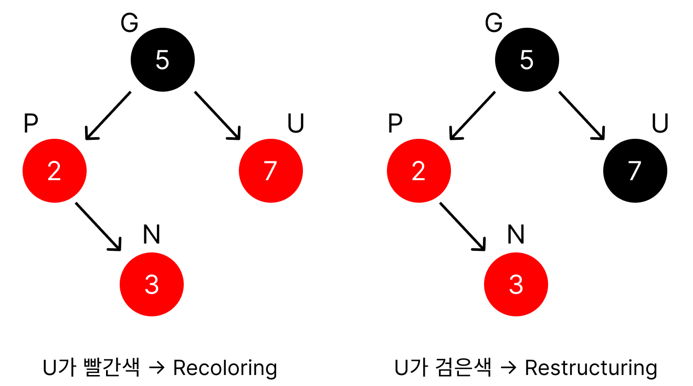
</p>

앞으로 새로 삽입할 노드는 N(New), 부모 노드는 P(Parent), 조상 노드는 G(Grand Parent), 삼촌 노드는U(Uncle)라고 하겠습니다.

삼촌 노드는 말 그대로 부모의 형제라고 생각하면 됩니다.

- 삼촌 노드가 빨간색이라면 → Recoloring 수행
- 삼촌 노드가 검은색이라면 → Restructuring 수행

<br/>

**Recoloring**

1. 새로운 노드(N)의 부모(P)와 삼촌(U)을 검은색으로 바꾸고 조상(G)을 빨간색으로 바꾼다.
   <p align="center">
     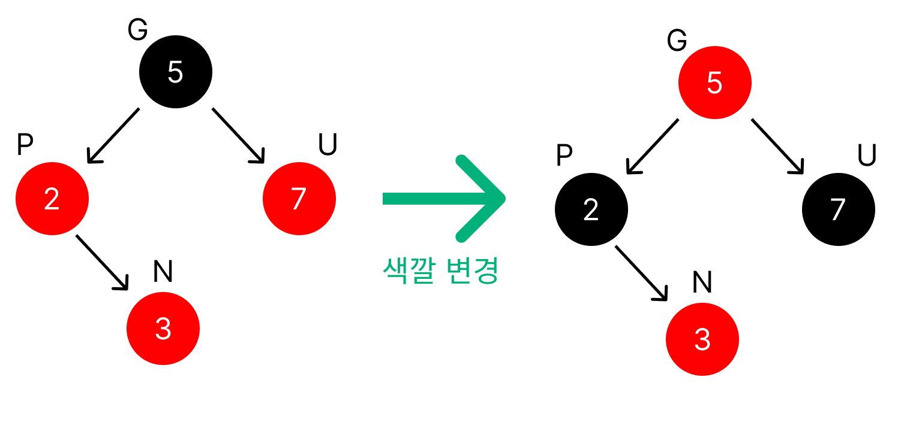
   </p>

   1-1. 조상(G)이 루트 노드라면 검은색으로 바꾼다.

   <p align="center">
     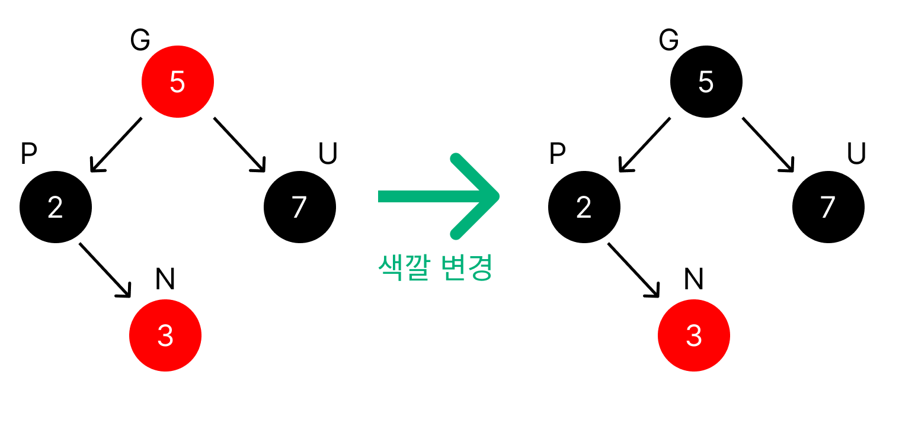
   </p>

   (검은색 노드는 연속 2번 나와도 된다.)

   1-2. 조상(G)을 빨간색으로 바꿨을 때 또다시 Double Red가 발생한다면 또다시 Restructuring 혹은 Recoloring을 진행해서 Double Red 문제가 발생하지 않을 때까지 반복한다.

<br/>

**Restructuring**

1. 새로운 노드(N), 부모 노드(P), 조상 노드(G)를 오름차순으로 정렬한다.

<p align="center">
  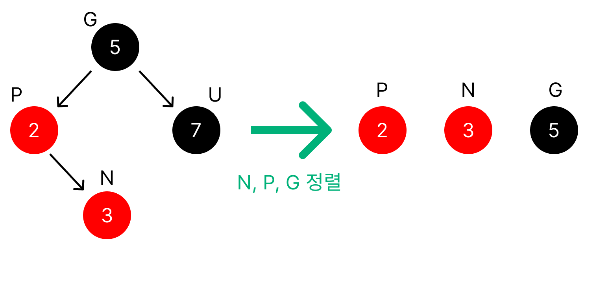
</p>

2. 셋 중 중간값을 부모로 만들고 나머지 둘을 자식으로 만든다.
3. 새로 부모가 된 노드를 검은색으로 만들고 나머지 자식들을 빨간색으로 만든다.
<p align="center">
  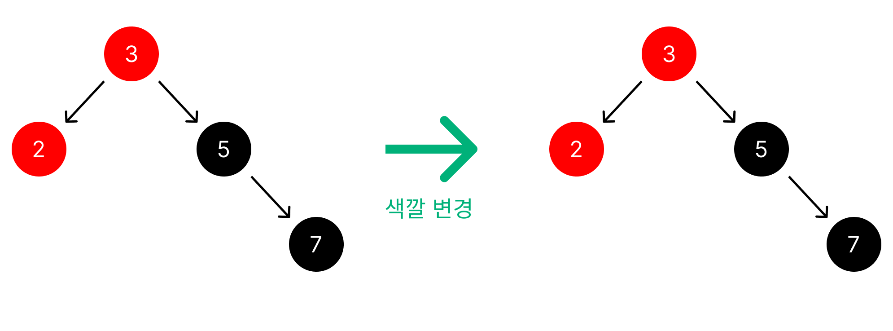
</p>

<br/>
<br/>

- 참고
  - https://ko.wikipedia.org/wiki/%EB%A0%88%EB%93%9C-%EB%B8%94%EB%9E%99_%ED%8A%B8%EB%A6%AC
  - https://code-lab1.tistory.com/62
