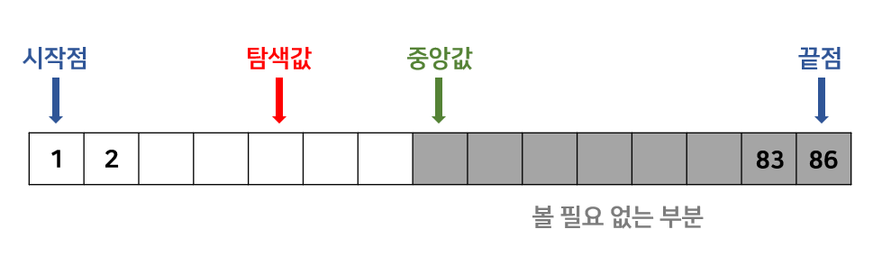
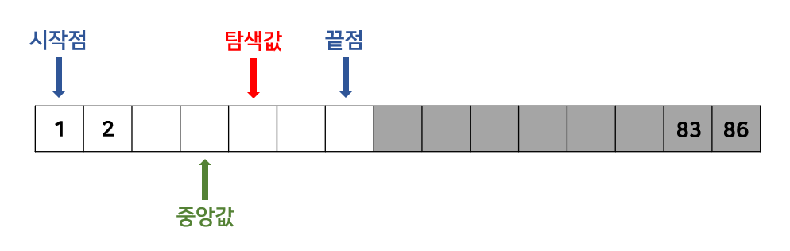

# 이분 탐색 (Binary Search)

> **오름차순으로 정렬된 정수의 리스트를 같은 크기의 두 부분 리스트로 나누고 필요한 부분에서만 탐색하도록 제한하여 원하는 원소를 찾는 알고리즘**

이분 탐색은 **오름차순 또는 내림차순으로 정렬된 배열에 적용 가능한 탐색 기법**입니다.

정렬된 배열에서 특정 값을 찾을 때 **중앙에 위치한 값을 활용**하면 매우 빠르게 탐색할 수 있습니다.

아래 그림에서 **배열은 오름차순으로 정렬**되어 있다고 가정합니다.

배열의 시작점과 끝점의 중앙에 위치한 값을 '중앙값'이라고 부르겠습니다.

만약 그림과 같이 '**탐색값 < 중앙값**'이면 **중앙값의 오른쪽 부분은 고려할 필요가 없습니다**.

오름차순으로 정렬되어 있기 때문입니다.

    

따라서 끝점은 중앙값에서 1을 뺀 위치가 됩니다.

끝점이 이동했으므로 중앙값의 위치도 아래 그림과 같이 이동합니다.

    

이번에는 '**중앙값 < 탐색값**'이므로 **중앙값의 왼쪽 부분은 볼 필요가 없습니다**.

따라서 시작점은 중앙값에 1을 더한 위치가 됩니다.

이러한 과정을 반복하며 **시작점이 끝점보다 커질 때까지 탐색을 진행**하면 됩니다.

 

### 특징

- 이분 탐색은 정렬된 배열에서 데이터를 탐색할 때 매우 효율적인 알고리즘으로, 시간 복잡도가 O(log n)으로 선형 탐색의 O(n)에 비해 월등히 빠른 성능을 보여줍니다.
- 이분 탐색을 적용하기 위해서는 반드시 배열이 오름차순 또는 내림차순으로 정렬되어 있어야 한다는 전제 조건이 필요하며, 정렬되지 않은 배열에는 사용할 수 없습니다.
- 재귀적 방법과 반복적 방법 두 가지로 구현이 가능하며, 반복적 방법이 함수 호출 오버헤드가 없어 일반적으로 더 효율적입니다.
- 추가적인 메모리 공간이 거의 필요하지 않아 공간 복잡도가 O(1)로 매우 효율적인 알고리즘입니다.

 
 

- 참고
  - https://charles098.tistory.com/133
