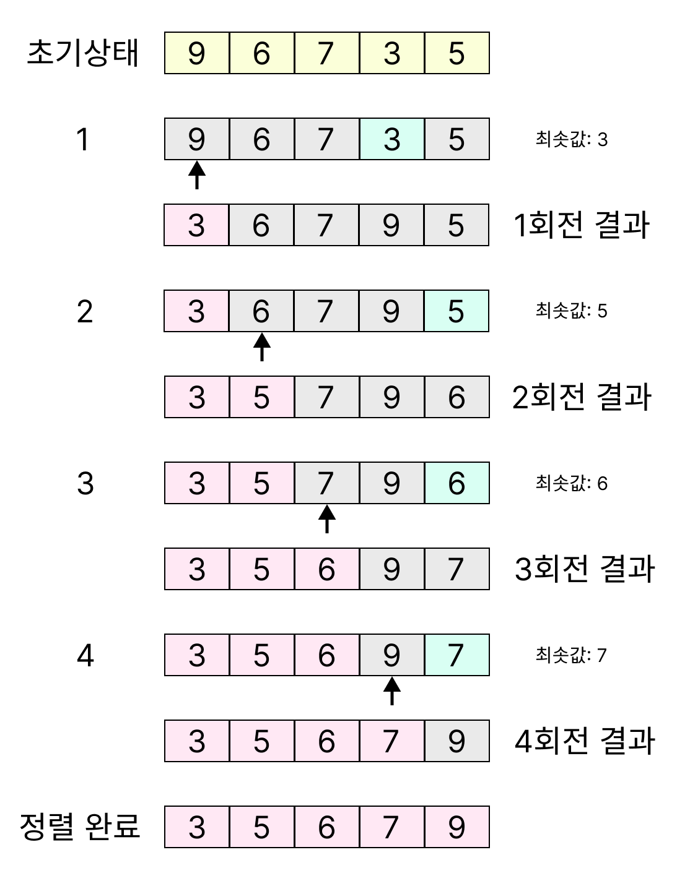
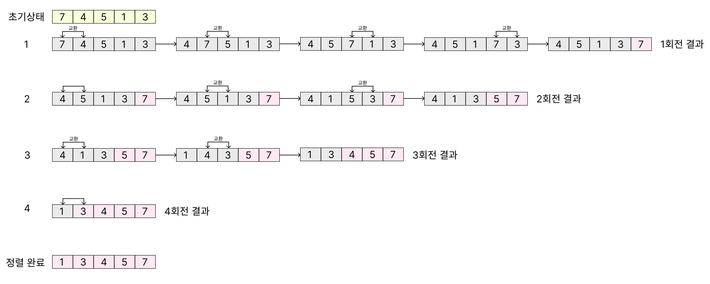
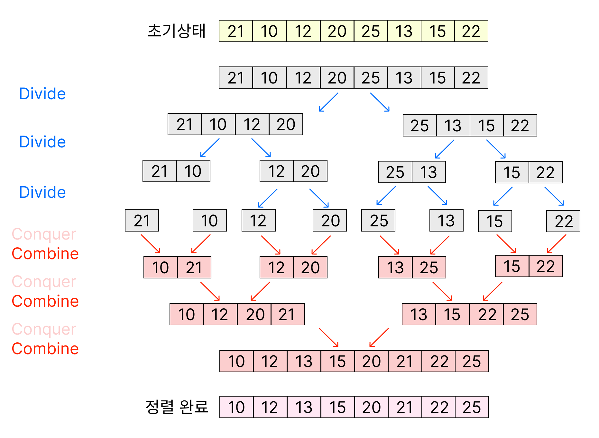
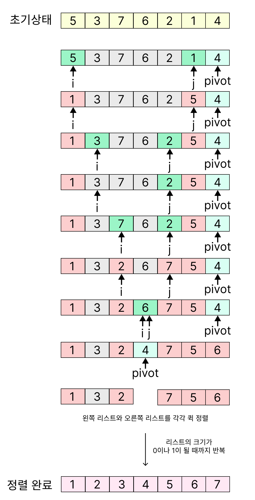
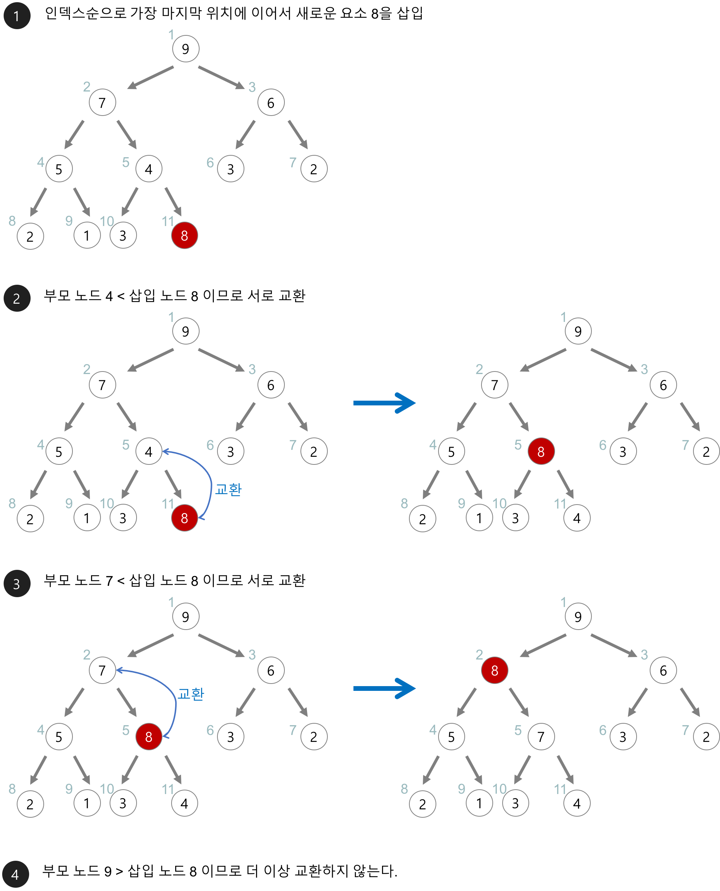
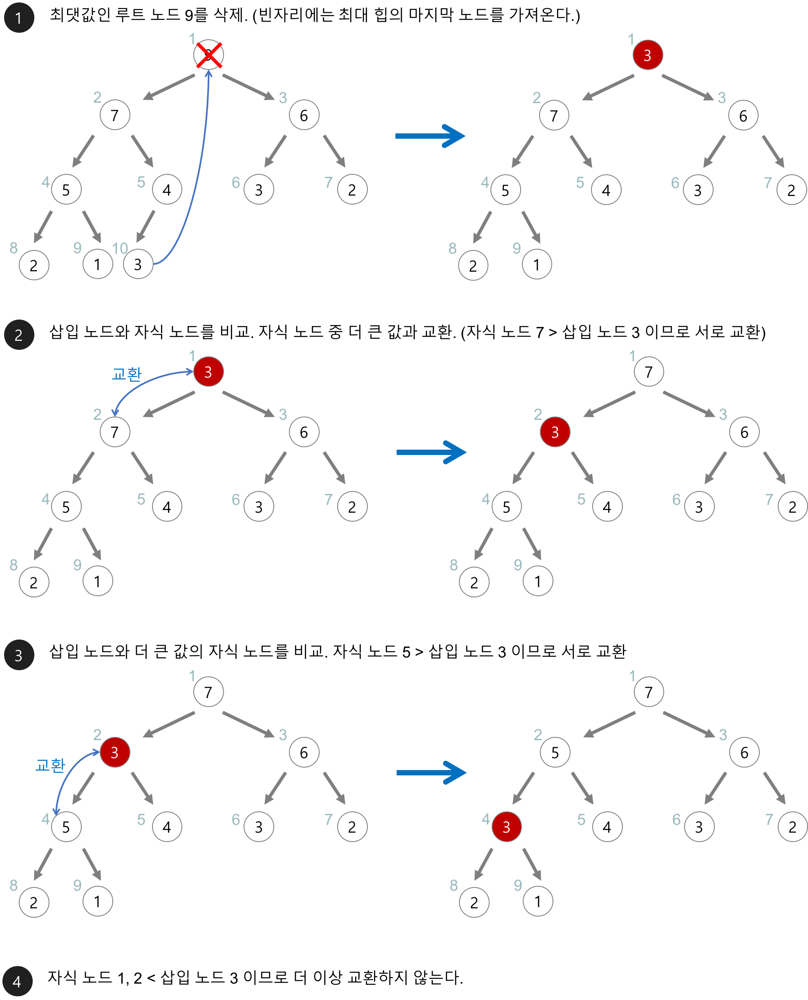

# 정렬 알고리즘

## 선택 정렬 (Selection Sort)

> **제자리 정렬 알고리즘**

선택 정렬은 알고리즘이 단순하며, 메모리가 제한적인 경우 성능상 이점이 있습니다.

선택 정렬은 다음 순서로 진행됩니다.

1. 주어진 리스트에서 최소값을 찾는다.
2. 그 값을 맨 앞에 위치한 값과 교체한다(pass).
3. 맨 처음 위치를 제외한 나머지 리스트를 같은 방법으로 교체한다.

 

### 특징

- 선택 정렬은 알고리즘의 구조가 매우 단순하고 이해하기 쉬워 초보자도 쉽게 구현할 수 있습니다.
- 주어진 배열 내에서 교환을 통해 정렬이 수행되므로 추가적인 메모리 공간이 거의 필요하지 않습니다(제자리 정렬).
- 입력 데이터의 초기 배열 상태와 관계없이 항상 일정한 비교 횟수를 수행하므로, 최선, 평균, 최악의 경우 모두 O(n^2)의 시간 복잡도를 가집니다.
- 같은 값을 가진 요소들의 상대적인 순서가 정렬 후에 보장되지 않는 불안정 정렬(unstable sort) 알고리즘입니다.
- 다른 정렬 알고리즘에 비해 교환 횟수가 적어서, 교환 비용이 큰 경우에는 상대적으로 유리할 수 있습니다.

 

### 예제

배열에 9, 6, 7, 3, 5가 저장되어 있다고 가정하고 자료를 오름차순으로 정렬합니다.

    

 
 

- 참고
  - https://gmlwjd9405.github.io/2018/05/06/algorithm-selection-sort.html
  - https://ko.wikipedia.org/wiki/%EC%84%A0%ED%83%9D_%EC%A0%95%EB%A0%AC

 

## 거품 정렬 (Bubble Sort)

> **원소의 이동이 거품이 수면으로 올라오는 모습과 비슷해 지어진 이름의 정렬 알고리즘**

배열에서 인접한 두 수(a, b)를 선택한 뒤, 정렬되어 있으면 그대로 두고 아니면 두 수를 교환하는 방식으로 진행됩니다.

오름차순 정렬 시 a < b, 내림차순 정렬 시 a > b이면 정렬된 것으로 판단합니다.

배열에 변화가 없을 때까지 처음부터 끝까지 반복합니다.

 

### 특징

- 거품 정렬은 구현이 매우 간단하고 직관적이어서 코드를 이해하고 작성하기가 쉽습니다.
- 주어진 배열 안에서 인접한 원소들을 교환하는 방식으로 정렬이 이루어지기 때문에 추가적인 메모리 공간이 거의 필요하지 않습니다(제자리 정렬).
- 입력 데이터의 초기 상태와 관계없이 항상 모든 원소 쌍을 비교하므로, 최선, 평균, 최악의 경우 모두 O(n^2)의 시간 복잡도를 가지며 이는 비효율적인 편입니다.
- 같은 값을 가진 요소들의 상대적인 순서가 정렬 후에도 유지되는 안정 정렬(stable sort) 알고리즘입니다.

 

### 예제

배열에 7, 4, 5, 1, 3이 저장되어 있다고 가정하고 자료를 오름차순으로 정렬합니다.

    

 
 

- 참고
  - https://ko.wikipedia.org/wiki/%EB%B2%84%EB%B8%94_%EC%A0%95%EB%A0%AC
  - https://gmlwjd9405.github.io/2018/05/06/algorithm-bubble-sort.html

 

## 병합 정렬 (Merge Sort)

> **비교 기반 정렬 알고리즘, 분할 정복 알고리즘**

n-way 병합 정렬의 개념은 다음과 같습니다.

1. 정렬되지 않은 리스트를 각각 하나의 원소만 포함하는 n개의 부분 리스트로 분할합니다(원소가 하나만 있는 리스트는 이미 정렬된 것으로 간주).
2. 부분 리스트가 하나만 남을 때까지 반복해서 병합하며 정렬된 부분 리스트를 생성합니다. 마지막 남은 부분 리스트가 최종 정렬된 리스트입니다.

일반적으로 사용되는 하향식 2-way 병합 정렬은 다음과 같이 작동합니다.

1. 리스트의 길이가 1 이하이면 이미 정렬된 것으로 봅니다. 그렇지 않은 경우:
2. 분할(divide): 정렬되지 않은 리스트를 절반으로 나누어 비슷한 크기의 두 부분 리스트로 만듭니다.
3. 정복(conquer): 각 부분 리스트를 재귀적으로 병합 정렬을 이용해 정렬합니다.
4. 결합(combine): 두 부분 리스트를 하나의 정렬된 리스트로 병합합니다.

 

### 특징

- 최선, 평균, 최악의 경우 모두 일관되게 O(n log n)의 시간 복잡도를 보이므로 대용량 데이터를 정렬할 때 안정적이고 예측 가능한 성능을 제공합니다.
- 안정 정렬(stable sort) 알고리즘의 특성을 가지고 있습니다.
- 정렬 과정에서 원본 배열 크기만큼의 추가적인 메모리 공간이 필요하기 때문에 공간 복잡도가 O(n)이며, 이는 메모리 사용 측면에서 다소 비효율적일 수 있습니다.
- 크기가 작은 부분 리스트에 대해서는 오버헤드가 발생할 수 있으므로, 실제 구현 시에는 작은 부분 리스트에 대해서는 삽입 정렬과 같은 단순한 알고리즘을 사용하는 최적화 기법을 적용하기도 합니다.

 

### 예제

배열에 21, 10, 12, 20, 25, 13, 15, 22이 저장되어 있다고 가정하고 자료를 오름차순으로 정렬합니다.

    

 
 

- 참고
  - https://ko.wikipedia.org/wiki/%ED%95%A9%EB%B3%91_%EC%A0%95%EB%A0%AC
  - https://gmlwjd9405.github.io/2018/05/08/algorithm-merge-sort.html

 

## 퀵 정렬

> **비교 정렬 알고리즘**

퀵 정렬은 분할 정복 방법을 통해 리스트를 정렬합니다.

1. 리스트 가운데서 하나의 원소를 고른다. 이렇게 고른 원소를 **피벗**이라고 한다.
2. 피벗 앞에는 피벗보다 값이 작은 모든 원소들이 오고, 피벗 뒤에는 피벗보다 값이 큰 모든 원소들이 오도록 피벗을 기준으로 리스트를 둘로 나눈다.

   이렇게 리스트를 둘로 나누는 것을 **분할**이라고 한다. 분할을 마친 뒤에 피벗은 더 이상 움직이지 않는다.

3. 분할된 두 개의 작은 리스트에 대해 재귀(Recursion)적으로 이 과정을 반복한다.

   재귀는 리스트의 크기가 0이나 1이 될 때까지 반복된다.

재귀 호출이 한번 진행될 때마다 최소한 하나의 원소는 최종적으로 위치가 정해지므로, 이 알고리즘은 반드시 끝난다는 것을 보장할 수 있습니다.

### 특징

- 퀵 정렬은 평균적으로 O(n log n)의 시간 복잡도를 가지며, 이는 대부분의 실제 상황에서 매우 빠른 성능을 보여줍니다.
- 최악의 경우 O(n^2)의 시간 복잡도를 가질 수 있는데, 이는 피벗이 항상 가장 작거나 가장 큰 값으로 선택될 때 발생합니다. 이를 방지하기 위해 무작위 피벗 선택이나 중간값 피벗 선택 등의 최적화 기법을 사용합니다.
- 제자리 정렬(in-place sort) 알고리즘으로, 병합 정렬과 달리 추가적인 메모리 공간이 거의 필요하지 않아 공간 복잡도가 O(log n)으로 효율적입니다.
- 불안정 정렬(unstable sort) 알고리즘으로, 같은 값을 가진 요소들의 상대적인 순서가 정렬 후에 보장되지 않습니다.
- 실제로 가장 많이 사용되는 정렬 알고리즘 중 하나로, 대부분의 프로그래밍 언어의 표준 라이브러리에서 정렬 함수의 기본 알고리즘으로 채택되거나 개선된 형태로 사용됩니다.

### 예제

배열에 5, 3, 7, 6, 2, 1, 4이 저장되어 있다고 가정하고 자료를 오름차순으로 정렬합니다.

    

 
 

- 참고
  - https://ko.wikipedia.org/wiki/%ED%80%B5_%EC%A0%95%EB%A0%AC
  - https://gmlwjd9405.github.io/2018/05/10/algorithm-quick-sort.html

 

## 힙 정렬

> **최대 힙 트리나 최소 힙 트리를 구성해 정렬하는 알고리즘**

내림차순 정렬을 위해서는 최소 힙을 구성하고 오름차순 정렬을 위해서는 최대 힙을 구성하는 방법입니다.

1. n개의 노드에 대한 완전 이진 트리를 구성한다. 이때 루트 노드부터 부모노드, 왼쪽 자식노드, 오른쪽 자식노드 순으로 구성한다.
2. 최대 힙을 구성한다. 최대 힙이란 부모노드가 자식노드보다 큰 트리를 말하는데, 단말 노드를 자식노드로 가진 부모노드부터 구성하며 아래부터 루트까지 올라오며 순차적으로 만들어 갈 수 있다.
3. 가장 큰 수(루트에 위치)를 가장 작은 수와 교환한다.
4. 2와 3을 반복한다.

 

### 특징

- 힙 정렬은 최악의 경우에도 O(n log n)의 시간 복잡도를 보장하는 효율적인 정렬 알고리즘으로, 이는 퀵 정렬의 최악의 경우인 O(n^2)보다 안정적인 성능을 제공합니다.
- 제자리 정렬(in-place sort) 알고리즘으로 추가적인 메모리 공간이 거의 필요하지 않아 공간 복잡도가 O(1)로 매우 효율적입니다.
- 불안정 정렬(unstable sort) 알고리즘입니다.
- 힙 자료구조의 특성을 활용하기 때문에 최댓값이나 최솟값을 빠르게 찾아야 하는 우선순위 큐와 같은 상황에서도 유용하게 활용될 수 있습니다.

 

### 예제

**내림차순 정렬을 위한 최대 힙(max heap)의 구현**

힙(heap)은 1차원 배열로 쉽게 구현될 수 있습니다.

정렬해야 할 n개의 요소들을 1차원 배열에 기억한 후 최대 힙 삽입을 통해 차례대로 삽입하고,

최대 힙으로 구성된 배열에서 최댓값부터 삭제합니다.

1. 최대 힙(max heap)의 삽입
   1. 힙에 새로운 요소가 들어오면, 일단 새로운 노드를 힙의 마지막 노드에 이어서 삽입한다.
   2. 새로운 노드를 부모 노드들과 교환해서 힙의 성질을 만족시킨다.

아래의 최대 힙(max heap)에 새로운 요소 8을 삽입해보자.

    

1. 최대 힙(max heap)의 삭제

   1. 최대 힙에서 최댓값은 루트 노드이므로 루트 노드가 삭제된다.

      최대 힙(max heap)에서 삭제 연산은 최댓값을 가진 요소를 삭제하는 것이다.

   2. 삭제된 루트 노드에는 힙의 마지막 노드를 가져온다.
   3. 힙을 재구성한다.

   아래의 최대 힙(max heap)에서 최댓값을 삭제해보자.

    

 
 

- 참고
  - https://ko.wikipedia.org/wiki/%ED%9E%99_%EC%A0%95%EB%A0%AC
  - https://gmlwjd9405.github.io/2018/05/10/algorithm-heap-sort.html
