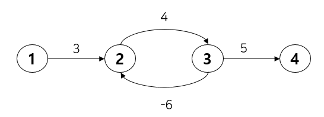
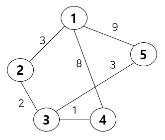
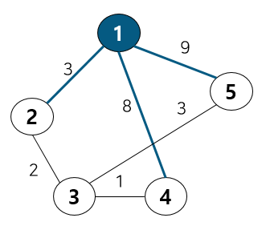
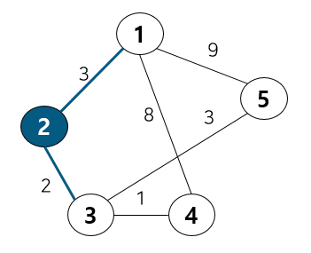
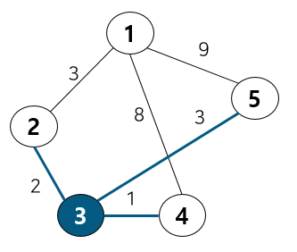
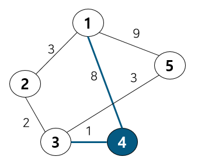
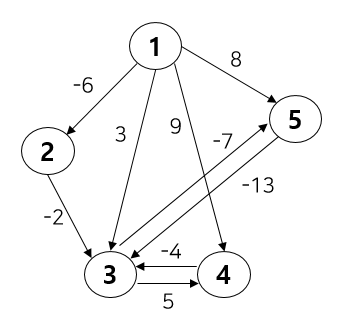
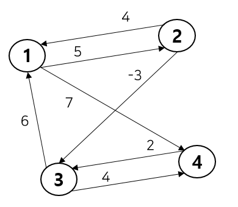

# 최단 경로

최단 거리 알고리즘이란 가중 그래프 상에서 노드 간의 탐색 비용을 최소화하는 알고리즘입니다.

### 최단 경로 계산 방식

- One-To-One
  한 지점에서 다른 특정 지점까지의 최단 경로
- One-To-All
  한 지점에서 다른 모든 지점까지의 최단 경로
- All-To-All
  모든 지점에서 모든 지점까지의 최단 경로

 

## 다익스트라(Dijkstra)

### 알고리즘 개요

다익스트라 알고리즘은 **모든 간선의 가중치가 양수**인 그래프에서만 유효합니다.

음의 가중치가 존재하면, 이미 최단 경로로 확정된 노드를 다시 방문해야 하는 상황이 발생할 수 있기 때문이며, 이 경우 벨만-포드나 플로이드-워셜 알고리즘을 사용해야 합니다.

위와 같은 사이클을 가진 그래프에서 다익스트라 알고리즘을 이용하여 최단 경로를 구한다고 가정하겠습니다.

이 경우, 1번 → 4번의 최소비용은 12입니다.

하지만, 중간에 사이클이 있기 때문에 3번 → 4번에서 넘어가지 못하고 가중치 4와 가중치 -6이 무한 반복되며 테이블이 갱신될 것입니다. (값은 무한히 작아짐)

다익스트라 알고리즘은 다음 특징을 갖습니다.

- 출발 노드에서 각 노드까지의 최단 거리를 점진적으로 확정한다.
- 매 단계에서 **가장 짧은 거리**의 노드를 선택하고, 그 노드를 거쳐 다른 노드로 가는 비용을 갱신한다.
- **중복 계산을 피하기 위해 이미 확정된 노드는 다시 탐색하지 않는다**.
- 동작 속도를 높이기 위해 **우선순위 큐(Priority Queue, 힙 구조)**를 사용한다.
- 시간 복잡도는 O((V + E) log V)

 

### 동작 방식 (절차)

1. **출발 노드를 설정하고** 모든 노드까지의 거리 테이블을 무한대(∞)로 초기화한다.
2. 출발 노드의 거리를 0으로 설정한다.
3. 방문하지 않은 노드 중 **최단 거리가 가장 짧은 노드**를 선택한다.
4. 해당 노드를 거쳐 갈 수 있는 이웃 노드들의 거리 값을 계산해, **더 짧은 경로가 있으면 업데이트**한다.
5. 모든 노드가 방문될 때까지 3–4 과정을 반복한다.

 

### 다익스트라 알고리즘의 핵심 논리

- **그리디(Greedy)**: 현재 시점에서 가장 짧은 거리의 노드를 먼저 확정한다.
- **DP 성격**: 이미 계산된 최단 거리 값을 이용해 새로운 경로를 효율적으로 갱신한다.

 

### 예시

다음 그래프에서, 1번 노드를 시작점으로 설정한다고 가정한다.

| **node** | **1** | **2** | **3** | **4** | **5** |
| -------- | ----- | ----- | ----- | ----- | ----- |
| 1        | 0     | 3     | INF   | 8     | 9     |
| 2        | 3     | 0     | 2     | INF   | INF   |
| 3        | INF   | 2     | 0     | 1     | 3     |
| 4        | 8     | INF   | 1     | 0     | INF   |
| 5        | 9     | INF   | 3     | INF   | 0     |

**노드 1을 선택했을 때**

1과 연결된 3개의 간선을 확인한다.

이 중 최소비용을 낼 수 있는 2번 노드로 이동하고 1번 노드는 방문 처리한다.

[1번 노드의 테이블 값] (변화 없음)

| 0   | 3   | INF | 8   | 9   |
| --- | --- | --- | --- | --- |

2번 노드로 이동했다.

2번노드에 연결된 노드는 1번, 3번이지만 이미 1번은 방문처리가 되었으므로 자동으로 노드 3으로 이동한 후, 2번을 방문처리해준다.

이때 테이블 값에는 변화가 있다.

1번과 3번은 연결되지 않았었지만, 계속해서 최적의 상태를 업데이트 하다가(그리디) 3번을 방문할 수 있기 때문에, 비용을 업데이트 해준다. (2+3 = 5)

| 0   | 3   | **5** | 8   | 9   |
| --- | --- | ----- | --- | --- |

이제 3번 노드로 왔다.

3번 노드에 연결된 것은 2번, 4번, 5번이지만 2번은 이미 방문했으므로 넘어간다.

4번과 5번 중 가중치가 더 적은 것은 4번이기 때문에, 4번으로 이동하고 3번은 방문처리 해준다.

테이블 값의 변화가 있다.

기존 1 → 4 비용은 8이었지만, 1 → 2 → 3 → 4의 비용은 6이므로 6으로 업데이트 해준다.

| 0   | 3   | 5   | **6** | 9   |
| --- | --- | --- | ----- | --- |

이제 4번 노드에 도착했다.

4번 노드에 연결된 것은 3번과 1번이지만 두개의 노드는 이미 방문했으므로, 알고리즘이 여기서 끝나게 된다.

따라서 1번노드에서 다른 모든 노드까지의 최종 비용은 다음과 같다.

| 0   | 3   | 5   | 6   | 9   |
| --- | --- | --- | --- | --- |

 

## 벨만 포드(Bellman Ford)

### 알고리즘 개요

벨만-포드 알고리즘(Bellman-Ford Algorithm)은 **다익스트라 알고리즘이 처리하지 못하는 음의 가중치가 있는 그래프에서도 최단 경로를 구할 수 있는 알고리즘입니다.**

벨만-포드는 단일 출발점에서 모든 노드까지의 최단 경로(One-To-All)를 구합니다.

**음의 가중치가 존재해도 작동**하며, **사이클 내에서 무한히 값이 작아지는 ‘음의 사이클(negative cycle)’ 여부도 판별**할 수 있습니다.

다익스트라는 각 단계에서 “가장 가까운 노드만 선택”하지만, 벨만-포드는 **모든 간선을 매 반복마다 전수 검사하며 최단 경로를 점진적으로 갱신합니**다.

이 때문에 다익스트라보다 계산량이 많으며, 시간 복잡도는 O(VE)입니다.

 

### 알고리즘의 핵심 개념

벨만-포드는 **그리디 대신 완전 탐색 + DP 기반의 점진적 갱신 방식**을 사용합니다.

즉, “모든 노드를 출발점으로 간주하며” 간선 정보를 통해 거리 값을 반복적으로 업데이트합니다.

- 다익스트라: 하나의 시작 노드에서 탐색 가능한 최소 경로 확정
- 벨만-포드: 모든 간선을 매번 확인하면서 경로를 최적화

이 과정은 ‘모든 간선을 V-1번 반복 검사’하여, **간선 완화(Relaxation)** 연산을 수행합니다.

 

### 동작 방식 (절차)

1. **시작 노드 설정**

   모든 노드의 거리를 무한대(∞)로 초기화하고, 시작 노드의 거리를 0으로 설정한다.

2. **간선 완화(Relaxation)**

   전체 간선을 한 번씩 탐색하면서,

   각 간선 **`(u → v)`**에 대해 **`dist[v] > dist[u] + weight(u, v)`**라면 값을 갱신한다.

3. **이 과정을 (V - 1)번 반복**

   그래프의 최대 경로 길이는 V-1개의 간선을 거치기 때문이다.

4. **음의 사이클 검증 단계**

   마지막으로 전체 간선을 한 번 더 순회해, 더 작은 경로가 발견된다면 음의 사이클이 존재하는 것이다.

 

### 예시

위와 같은 그래프가 주어졌을 때, 초기의 DP 테이블은 아래와 같다.

| INF | INF | INF | INF | INF |
| --- | --- | --- | --- | --- |

**[Iteration 1]**

첫번째로 노드 1번을 출발 노드로 지정하고, 모든 간선을 검사하여 최소 비용을 갱신한다.

| 0   | -6  | 3   | 9   | 8   |
| --- | --- | --- | --- | --- |

2번 노드로 넘어가면, 2번 노드는 3번과 연결 되어 있다.

1 → 3 비용은 3, 1 → 2 → 3 비용은 -8으로, 후자가 더 작기때문에 DP를 3 → -8로 업데이트해준다.

| 0   | -6  | -8  | 9   | 8   |
| --- | --- | --- | --- | --- |

3번 노드는 4번, 5번 노드와 연결 되어 있다.

[4번] 1 → 4 = 9이고, 1 → 2 → 3 → 4 = -3이므로, 업데이트해준다.

[5번] 1 → 5 = 8이고, 1 → 2 → 3 → 5 = -15이므로, 업데이트해준다.

| 0   | -6  | -8  | -3  | -15 |
| --- | --- | --- | --- | --- |

4번 노드는 3번과 연결 되어 있다.

4 → 3으로 가려면 1 → 4 → 3이고 비용은 5이다.

이는 이미 테이블에 저장된 경로인 1 → 2 → 3, 비용 -8보다 크기때문에 테이블 업데이트는 해주지 않는다.

| 0   | -6  | -8  | -3  | -15 |
| --- | --- | --- | --- | --- |

5번 노드는 3번과 연결 되어 있다.

DP 테이블에서 3번은 현재 1 → 2 → 3을 거친 -8이다.

1 → 5 → 3은 비용이 -5이므로 업데이트하지 않는다.

| 0   | -6  | -8  | -3  | -15 |
| --- | --- | --- | --- | --- |

자, 이제 1번노드를 시작노드로 해서 모든 노드를 돌아보았다.

이 과정을 노드 개수(V) -1 만큼 반복 진행해준다.

💡**TIP** **음의 사이클 여부를 알고싶다면?**

반복을 한번 더 해준다. (최종적으로 반복 수 = 노드개수 V)

왜냐하면, 한번 더 진행했을 때 값이 바뀐다면 음의 사이클이 있다는 뜻이기 때문이다. (무한히 작아짐)

최종적으로, 각 Iteration의 종료 결과는 아래와 같다.

[Iteration 1] = [INF, 0, -6, -8, -3, -15]

[Iteration 2] = [INF, 0, -6, -28, -23, -35]

[Iteration 3] = [INF, 0, -6, -48, -43, -55]

[Iteration 4] = [INF, 0 -6, -68, -63, -75]

[Iteration 5] = [INF, 0, -6, -88, -63, -75]

 

## 플로이드 워셜 (Floyd Warshall)

### 알고리즘 개요

플로이드-워셜 알고리즘은 **그래프의 모든 정점 쌍 (i, j)** 에 대해, **중간에 거칠 수 있는 노드들을 하나씩 고려하며 최단 경로를 점진적으로 갱신하는 방식입니다.**

모든 간선의 가중치가 양수일 때뿐만 아니라, **음의 가중치가 존재해도 작동 가능**하며,

단, **음의 사이클(negative cycle)** 이 존재할 경우 올바른 결과를 얻을 수 없습니다.

즉, 어떤 노드를 경유했을 때 더 짧은 경로가 된다면, 그것을 최단 경로로 갱신하며 전체 거리 행렬을 업데이트합니다.

시간 복잡도는 **O(V³)** 로, **모든 정점에 대해 모든 정점을 비교하는 3중 반복 구조**를 갖습니다.

 

### 알고리즘의 핵심 개념

플로이드-워셜은 **동적 계획법(Dynamic Programming)** 을 이용한 알고리즘입니다.

**점화식**

**`dist[i][j] = min(dist[i][j], dist[i][k] + dist[k][j])`**

- i: 출발 노드
- j: 도착 노드
- k: 경유 노드

즉, *i에서 j로 직접 가는 비용*과 *i → k → j로 가는 비용* 중 더 작은 값을 선택하여 테이블을 갱신합니다.

반복이 진행될수록, 더 많은 노드를 경유한 가능한 경로가 고려되며, 결과적으로 **모든 노드 쌍 간의 최소 거리값**이 완성됩니다.

 

### 동작 방식 (절차)

1. **초기 설정**
   - 그래프 정보를 거리 행렬 형태로 입력받는다.
   - 자기 자신으로의 비용(**`dist[i][i]`**)은 0으로 초기화하고,
     직접 연결되어 있지 않은 노드 간의 비용은 ∞(무한대)로 설정한다.
2. **점화식 적용 (3중 반복문 구조)**
   - 모든 노드를 하나씩 경유지(k)로 두며 다음을 반복한다.
     - 출발 노드(i) 선택
     - 도착 노드(j) 선택
     - **`dist[i][j] = min(dist[i][j], dist[i][k] + dist[k][j])`**
   - 각 반복마다 새로운 중간 경유 노드를 고려하여 최단 거리를 갱신한다.
3. **모든 노드를 경유한 후**
   - 최종적으로 테이블에는 각 노드 쌍 간의 **최단 거리(dist[i][j])** 가 저장된다.
   - 이 테이블 값을 그대로 출력하면 모든 노드 간의 최소 이동 비용을 확인할 수 있다.
4. **음의 사이클 검출**
   - 반복이 끝난 후, **`dist[i][i] < 0`** 인 경우
     그래프 내에 음의 사이클이 존재함을 의미한다.
   - 이때는 올바른 최단 경로를 구할 수 없다.

 

### 플로이드-워셜 알고리즘의 특징

- **DP 기반의 All-To-All 최단 경로 탐색 알고리즘**
- **음의 가중치 허용**, 단 **음의 사이클은 불가능**
- **거리 행렬(Matrix)** 을 지속적으로 갱신
- **시간 복잡도**: O(V³)
- **공간 복잡도**: O(V²)

 

### 예시

위의 그림같은 그래프가 있을때, 초기 DP 테이블은 아래와 같다.

| node | 1   | 2   | 3   | 4   |
| ---- | --- | --- | --- | --- |
| 1    | INF | 5   | INF | 7   |
| 2    | 4   | INF | -3  | INF |
| 3    | 6   | INF | INF | 4   |
| 4    | INF | INF | 2   | INF |

3중 for문을 사용해 거쳐가는 노드(k)를 설정 후, 테이블 업데이트를 진행한다.

거쳐가는 노드(k)가 1일때의 경우를 보자.

**[Iteration 1]** 거쳐가는 노드(k) = 1

**( k=1 )**: 노드 1을 거쳐 노드 1~4를 탐색하는 과정

**<첫번째 행 업데이트>**: 노드 1에서 노드 1을 거쳐 노드 1~4까지 탐색

graph[1][1] = min(graph[1][1], graph[1][1] + graph[1][1]) : 0 vs 0+0 = 0, 업데이트X **graph[k][k] = 0**

graph[1][2] = min(graph[1][2], graph[1][1] + graph[1][2]) : 5 vs 0+5 = 5, 업데이트X

graph[1][3] = min(graph[1][3], graph[1][1] + graph[1][3]) : INF vs 0+INF = INF, 업데이트X

graph[1][4] = min(graph[1][4], graph[1][1] + graph[1][4]) : 7 vs 0+7 = 7, 업데이트X

[Iteration 1]의 **첫번째 행 결과 테이블**

graph[k][k] = 0으로 바뀐 것만 제외하면 업데이트가 없다.

| node | 1     | 2   | 3   | 4   |
| ---- | ----- | --- | --- | --- |
| 1    | **0** | 5   | INF | 7   |
| 2    | 4     | INF | -3  | INF |
| 3    | 6     | INF | INF | 4   |
| 4    | INF   | INF | 2   | INF |

 

**<두번째 행 업데이트>**: 노드 2에서 노드 1을 거쳐 노드 1~4까지 탐색

graph[2][1] = min(graph[2][1], graph[2][1] + graph[1][1]) : 4 vs 4+0 = 0, 업데이트X

graph[2][2] = min(graph[2][2], graph[2][1] + graph[1][2]) : INF vs 4+5 = 9, **업데이트O**

graph[2][3] = min(graph[2][3], graph[2][1] + graph[1][3]) : -3 vs 4+INF = -3, 업데이트X

graph[2][4] = min(graph[2][4], graph[2][1] + graph[1][4]) : INF vs 4+7 = 11, **업데이트O**

[Iteration 1]의 **두번째 행 결과 테이블**

| node | 1   | 2   | 3   | 4   |
| ---- | --- | --- | --- | --- |
| 1    | INF | 5   | INF | 7   |
| 2    | 4   | 9   | -3  | 11  |
| 3    | 6   | INF | INF | 4   |
| 4    | INF | INF | 2   | INF |

 

**<세번째 행 업데이트>**: 노드 3에서 노드 1을 거쳐 노드 1~4까지 탐색

graph[3][1] = min(graph[3][1], graph[3][1] + graph[1][1]) : 6 vs 6+0 = 0, 업데이트X

graph[3][2] = min(graph[3][2], graph[3][1] + graph[1][2]) : INF vs 6+5 = 11, **업데이트O**

graph[3][3] = min(graph[3][3], graph[3][1] + graph[1][3]) : INF vs 6+INF = INF, 업데이트X

graph[3][4] = min(graph[3][4], graph[3][1] + graph[1][4]) : 4 vs 6+7 = 13, 업데이트X

[Iteration 1]의 **세번째 행 결과 테이블**

| node | 1   | 2   | 3   | 4   |
| ---- | --- | --- | --- | --- |
| 1    | INF | 5   | INF | 7   |
| 2    | 4   | INF | -3  | INF |
| 3    | 6   | 11  | INF | 4   |
| 4    | INF | INF | 2   | INF |

 

**<네번째 행 업데이트>**: 노드 4에서 노드 1을 거쳐 노드 1~4까지 탐색

graph[4][1] = min(graph[4][1], graph[4][1] + graph[1][1]) : INF vs INF+0 = INF, 업데이트X

graph[4][2] = min(graph[4][2], graph[4][1] + graph[1][2]) : INF vs INF+5 = INF, 업데이트X

graph[4][3] = min(graph[4][3], graph[4][1] + graph[1][3]) : INF vs INF = INF, 업데이트X

graph[4][4] = min(graph[4][4], graph[4][1] + graph[1][4]) : INF vs INF+7 = INF, 업데이트X

[Iteration 1]의 **네번째 행 결과 테이블**

| node | 1   | 2   | 3   | 4   |
| ---- | --- | --- | --- | --- |
| 1    | INF | 5   | INF | 7   |
| 2    | 4   | INF | -3  | INF |
| 3    | 6   | INF | INF | 4   |
| 4    | INF | INF | 2   | INF |

[Iteration 1]의 과정이 끝났다! 이제 이 과정을 **노드의 수만큼 반복**해주면 된다.

Iteration 2는 노드 1~4에서 노드 2를 거쳐 노드 1~4를 탐색하는 경우.

Iteration 3는 노드 1~4에서 노드 3를 거쳐 노드 1~4를 탐색하는 경우.

Iteration 4는 노드 1~4에서 노드 4를 거쳐 노드 1~4를 탐색하는 경우.

 
 

> 참고
>
> - https://young3060.tistory.com/entry/Algorithm-%EC%B5%9C%EB%8B%A8%EA%B2%BD%EB%A1%9C-%EC%95%8C%EA%B3%A0%EB%A6%AC%EC%A6%98-%EB%AA%A8%EC%9D%8C-%EB%8B%A4%EC%9D%B5%EC%8A%A4%ED%8A%B8%EB%9D%BC-%EB%B2%A8%EB%A7%8C-%ED%8F%AC%EB%93%9C-%ED%94%8C%EB%A1%9C%EC%9D%B4%EB%93%9C-%EC%9B%8C%EC%85%9C
