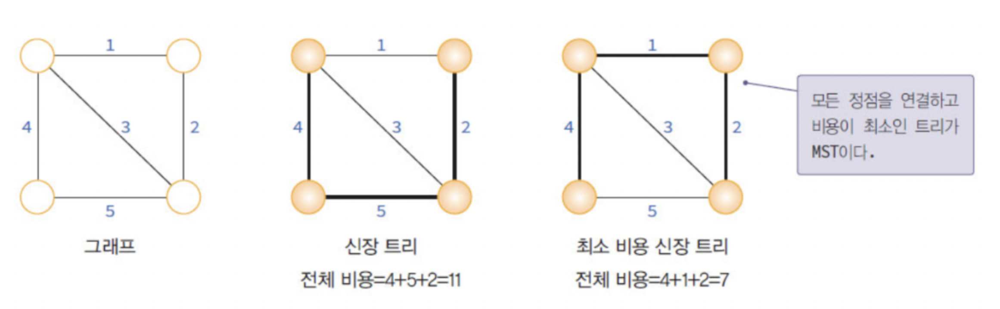
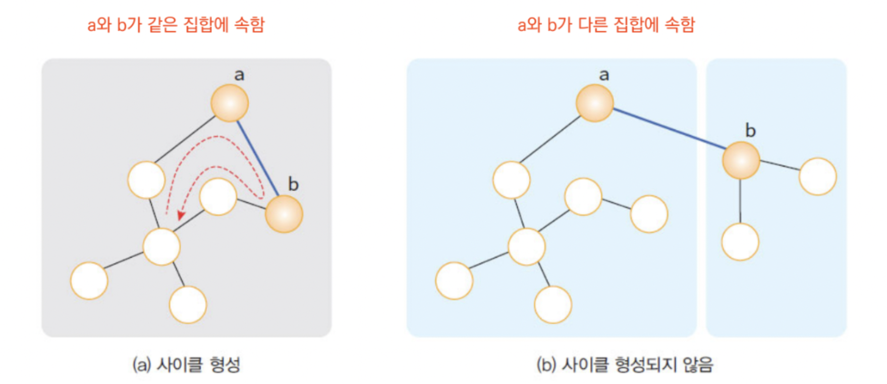
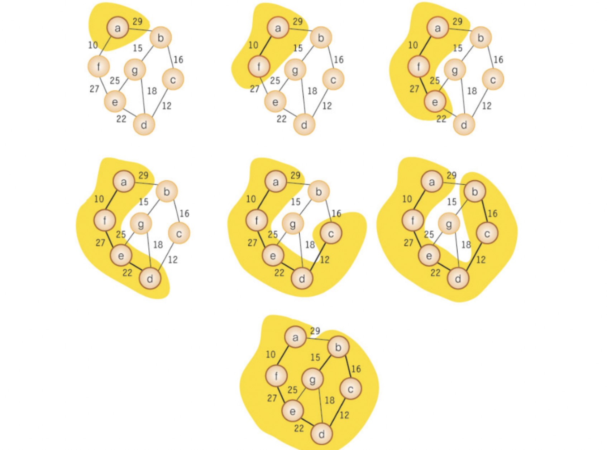

# 최소 비용 (MST)

> **그래프 이론에서 모든 정점을 최소 비용으로 연결하는 트리 구조**를 구하는 알고리즘 개념

 

## 최소 비용 신장 트리(MST) 개념

신장 트리(Spanning Tree)란 **그래프 내의 모든 정점을 사이클 없이 연결하는 부분 그래프**를 의미합니다.

즉, N개의 정점을 가진 그래프에서 **정확히 N-1개의 간선을 가지며, 모든 노드들이 서로 연결되어 있는** 구조를 말합니다.

이 중에서도 **각 간선의 가중치(비용) 합이 가장 작은 신장 트리**를 최소 비용 신장 트리(MST)라고 합니다.

따라서 MST는 **사이클이 없고, 전체 연결 비용이 최소인 트리 형태**를 가지게 됩니다.

 

## MST의 특징

- **모든 정점이 연결되어 있어야 합니다.**
  트리 구조이므로, 그래프가 완전히 연결되어 있지 않다면 MST를 만들 수 없습니다.
- **사이클이 존재하지 않습니다.**
  만약 간선의 수가 N개 이상이면, 특정 노드 간에 두 경로 이상이 생겨 사이클이 발생합니다.
  MST는 이러한 순환 연결을 제거하여 **한 경로만 존재하도록** 합니다.
- **최소 비용 보장**
  여러 개의 신장 트리가 존재할 수 있지만,
  MST는 **간선의 총합이 최소인 유일하거나 여러 개의 해**로 구성됩니다.

 

## MST의 주요 알고리즘

최소 비용 신장 트리를 찾는 대표적인 알고리즘은 두 가지입니다.

### 1. Kruskal Algorithm (크루스칼 알고리즘)

- **간선 중심 접근 방식**입니다.
  그래프의 모든 간선을 가중치 기준으로 **오름차순 정렬**한 뒤,
  사이클이 생기지 않는 선에서 하나씩 선택합니다.
- **Union-Find 자료구조**(서로소 집합, Disjoint Set)를 활용하여
  간선 추가 시 사이클이 생기는지 빠르게 판별합니다.
- **시간 복잡도:** O(E log E)
- **적합한 경우:** 간선이 적은 **희소 그래프(Sparse Graph)**

**절차 요약**

1. 그래프의 모든 간선을 가중치 기준으로 정렬합니다.
2. 가장 가중치가 작은 간선을 하나씩 선택합니다.
3. 선택 시 사이클이 생기지 않으면 트리에 포함합니다.
4. 간선의 수가 (정점 수 - 1)이 되면 종료합니다.

 

### 2. Prim Algorithm (프림 알고리즘)

- **정점 중심 접근 방식**입니다.
  한 시작 정점에서 출발해, **현재 트리에 연결된 간선 중 가장 작은 가중치의 간선**을 반복적으로 선택합니다.
- 우선순위 큐(Priority Queue)를 사용해, 매 단계에서 최소 비용 간선을 효율적으로 선택합니다.
- **시간 복잡도:** O(V²) (배열 사용 시), O((V + E) log V) (힙 사용 시)
- **적합한 경우:** 간선이 많고 연결이 조밀한 **밀집 그래프(Dense Graph)**

**절차 요약**

1. 임의의 정점에서 시작하여, 모든 정점의 연결 비용을 기록합니다.
2. 아직 방문하지 않은 정점 중 최소 비용 간선을 선택해 트리에 추가합니다.
3. 선택한 정점과 인접한 노드들의 최소 비용을 갱신합니다.
4. 모든 정점이 방문될 때까지 반복합니다.

 

### MST 알고리즘 비교

| 구분        | 크루스칼(Kruskal)   | 프림(Prim)               |
| ----------- | ------------------- | ------------------------ |
| 접근 방식   | 간선 중심           | 정점 중심                |
| 자료구조    | Union-Find          | 우선순위 큐(Heap)        |
| 시간 복잡도 | O(E log E)          | O(V²) / O((V + E) log V) |
| 적용 그래프 | 희소 그래프(Sparse) | 밀집 그래프(Dense)       |
| 사이클 검사 | 필요                | 불필요                   |

 
 

> 참고
>
> - https://en.wikipedia.org/wiki/Minimum_spanning_tree
> - https://velog.io/@dongvelop/%EC%B5%9C%EC%86%8C%EB%B9%84%EC%9A%A9-%EC%8B%A0%EC%9E%A5%ED%8A%B8%EB%A6%AC-MST
