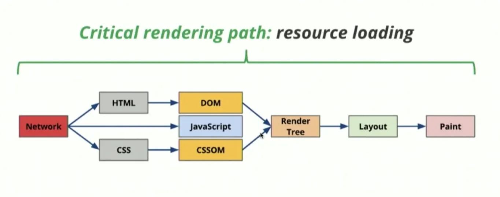
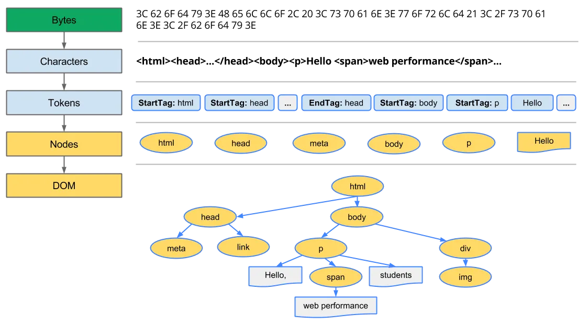

# 브라우저 동작 방법

## 웹 브라우저

브라우저는 웹 서버에서 양방향으로 통신을 하며 HTML 문서, 멀티미디어 등의 컨텐츠를 열람할 수 있게 해주는 GUI 기반의 소프트웨어 프로그램입니다.

프론트엔드 개발자에게 있어 브라우저는 거의 모든 것과 같습니다.

브라우저를 통해 개발을 하고, 사용자는 이러한 브라우저를 통해 웹 어플리케이션에 접속할 수 있습니다.

 

### 브라우저의 주요 기능

브라우저의 주요 기능은 사용자가 선택한 자원을 서버에 요청하고 브라우저에 표시하는 것입니다.

자원은 보통 HTML 문서지만 PDF나 이미지 또는 다른 형태일 수 있으며, 자원의 주소는 URI(Uniform Resource Identifier)에 의해 정해집니다.

URI는 각 자원의 서버 주소를 말합니다.

이 주소는 서버 어딘가에 명시되어 있고, 명시된 주소를 통해 서버에게 해당 주소의 자원을 요청하여 받아오게 됩니다.

URI를 통한 자원 요청 방법은 브라우저에 있는 주소입력 창이 될 수도 있고, 데이터 요청을 위한 API 주소가 될 수도 있습니다.

브라우저는 HTML과 CSS 명세에 따라 HTML 파일을 해석해서 표시하는데 이 명세는 웹 표준화 기구인 W3C(World Wide Web Consortium)에서 정합니다.

과거에는 브라우저들이 일부만 이 명세에 따라 구현하고 독자적인 방법으로 확장함으로써 웹 제작자가 심각한 호환성 문제를 겪었지만 최근에는 대부분의 브라우저가 표준 명세를 따릅니다.

 

## 브라우저의 구조

    

- **사용자 인터페이스**
  URI를 입력할 수 있는 주소 표시줄, 이전/다음 버튼, 북마크 등 요청한 페이지를 보여주는 창을 제외한 나머지 부분
- **브라우저 엔진**
  사용자 인터페이스와 렌더링 엔진 사이의 동작을 제어
  브라우저 엔진은 전체적인 흐름 관리, 렌더링 엔진은 화면에 실제로 출력하는 세부 동작을 담당
- **렌더링 엔진**
  요청한 콘텐츠를 표시 — 예를 들어 HMTL을 요청하면 HTML과 CSS를 파싱하여 화면에 표시
- **네트워킹 (통신)**
  HTTP 요청과 같은 네트워크 호출에 사용됨. 플랫폼 독립적인 인터페이스로 각 플랫폼 하부에서 실행됨
- **UI 백엔드**
  브라우저가 동작하고 있는 운영체제의 인터페이스를 따르는 UI들을 처리 — ex) 얼럿(Alert)이나 셀렉트 박스(Select)
- **자바스크립트 파서**
  JavaScript를 해석하고 실행하는 역할 — 가장 유명한 엔진으로 Chrome에 탑재된 구글의 V8이 있음
- **자료 저장소**
  브라우저 자체에서 하드디스크와 같이 데이터를 로컬에 저장하기 위한 레이어로, 쿠키나 로컬 스토리지, 세션 스토리지, IndexedDB, 웹 SQL, 파일시스템 등에 접근하고 데이터를 저장하는 데 사용됨

 

### 브라우저 엔진

브라우저 엔진과 렌더링 엔진은 이름이 비슷하고 기능이 밀접하게 연결되어 있지만, 구체적인 역할에 따라 명확히 구분됩니다.

브라우저가 화면에 웹페이지를 보여줄 때 각 엔진이 담당하는 과정과 기능을 구별해 설명할 수 있습니다.

브라우저 엔진은 브라우저의 사용자 인터페이스(UI)와 내부 엔진들(렌더링 엔진, 자바스크립트 엔진 등) 사이에서 동작을 제어하고 조정합니다.

예를 들어,

- 사용자가 주소창에 URL을 입력하면 이 요청을 렌더링 엔진에 전달합니다.
- 네트워킹, 저장소, 자바스크립트 엔진 등 다양한 컴포넌트와 소통하여 브라우저 전체 동작의 흐름을 관리합니다.
- 런타임 환경에서 리소스 로드, DOM 이벤트 분배 등 다양한 추가 역할을 수행합니다.

즉, 브라우저 엔진은 실제로 화면에 무엇을 그릴지 결정하고, 명령을 조율하는 관리자 역할입니다.

 

### 렌더링 엔진

렌더링 엔진은 브라우저 엔진으로부터 전달받은 리소스(HTML, CSS, 이미지 등)를 실제로 "시각적으로 표현"하는 핵심 엔진입니다.

- HTML을 파싱하여 DOM(Document Object Model) 트리를 생성합니다.
- CSS를 파싱하여 CSSOM(CSS Object Model) 트리를 만듭니다.
- DOM과 CSSOM을 결합하여 렌더 트리(Render Tree)를 만듭니다.
- 렌더 트리를 기반으로 요소의 레이아웃(위치, 크기)과 페인팅(픽셀로 변환)을 수행하여 화면에 출력합니다.

즉, 렌더링 엔진은 실제로 "브라우저 화면에 보이는 웹페이지를 그려내는" 일에 집중합니다.

대부분의 문서나 커뮤니티에서는 두 엔진을 구분하지 않고 혼용해서 쓰는 경우도 많지만, 엄밀히 보면 브라우저 엔진은 전체적인 흐름 관리, 렌더링 엔진은 화면에 실제로 출력하는 세부 동작을 담당합니다.

 

### 렌더링 엔진 동작 과정

    

우리가 어떠한 웹 페이지에 접속하게 되면, 네트워크를 통해 해당 웹 페이지의 HTML 문서를 얻어올 수 있습니다.

그러면 렌더링 엔진은 위의 다이어그램과 같은 과정을 거쳐 읽어 들인 HTML 문서를 해석합니다.

브라우저 엔진마다 해석 방식이 조금씩 다를 순 있지만, 크게 다음과 같은 네 단계로 이루어져 있다고 봐도 무방합니다.

1. 파싱(Parsing)
2. 렌더 트리(Render Tree) 구축
3. 레이아웃(Layout) 또는 리플로우(Reflow)
4. 페인트(Paint)

위에서 이야기한 모든 과정들을 일컬어 **중요 렌더링 경로(Critical Rendering Path)**라고 부릅니다.

각 단계에서 리소스를 로드하는 순서나 작성한 스크립트의 내용에 따라 웹 페이지의 반응 속도가 달라질 수 있습니다.

1. **파싱**

    

**파싱(Parsing)은 토큰화(Tokenize)된 코드를 구조화하는 과정**을 말합니다.

이러한 파싱 과정을 전문적으로 해주는 부분을 파서(Parser)라고 부릅니다.

파싱 과정은 입력받은 문자열이 정해진 **문법(Grammar)**들을 모두 따르는지를 확인하는 과정으로, 브라우저는 HTML, CSS, JavaScript 세 종류의 언어를 해석할 수 있습니다.

그중에서 JavaScript는 렌더링 엔진 레이어가 아니라 JavaScript 해석기라는 별도의 레이어에서 언어를 해석합니다.

따라서 렌더링 엔진에서는 HTML과 CSS를 파싱합니다.

---

 

    

브라우저는 위에서 이야기한 토큰화 된 HTML의 문자열들을 이용해 **파스 트리(Parse Tree)** 를 생성합니다.

파스 트리는 브라우저가 읽어야 할 HTML 코드를 트리 모양으로 구조화하여 나타낸 것입니다.

브라우저는 파스 트리를 이용해 **DOM(Document Object Model)** 트리를 새로 만들기 때문에 파스 트리를 이용해서 바로 렌더를 할 수 없습니다.

파스 트리는 토큰화 된 문자열을 단순하게 구조화한 트리에 불과했지만, DOM 트리는 우리가 실제로 상호작용할 수 있는 HTML 엘리먼트로 이루어진 트리입니다.

따라서 우리가 실제로 JavaScript로 상호작용할 수 있는 부분은 DOM 트리죠.

 

- HTML 파서와 CSS 파서
  > **HTML 파서의 특징**
  > 한편, HTML 파서는 다른 파서와 비교했을 때 조금 독특한 특징을 갖고 있습니다.
  > HTML 파서의 첫 번째 특징은 **오류에 너그러운(forgiving nature) 속성**입니다.
  > 다시 말해, HTML을 파싱하는 도중 어떠한 에러가 발생한다면, 브라우저는 자체적으로 에러를 복구하려 합니다.
  > 이러한 규칙들은 HTML Document Type Definition (DTD)에 의해 정의되고 있습니다.
  > HTML 파서는 명세된 규칙들을 따르는 예외 처리를 따로 해주어야 합니다.
  > 그리고 이는 일반적인 파서의 규칙만으로는 적용하기가 어렵습니다.
  > 정확하게는 대부분의 프로그래밍 언어가 [촘스키 계층](https://ko.wikipedia.org/wiki/%EC%B4%98%EC%8A%A4%ED%82%A4_%EC%9C%84%EA%B3%84)의 [문맥 자유 문법(Context-Free Grammar)](https://ko.wikipedia.org/wiki/%EB%AC%B8%EB%A7%A5_%EC%9E%90%EC%9C%A0_%EB%AC%B8%EB%B2%95)에 속하는 것에 반해, HTML은 자체의 특징 때문에 위 계층에 속하지 않기 때문입니다.
  ***
  
  HTML 파서의 두 번째 특징은 **파싱 과정이 중단될 수 있다는 것**입니다.
  HTML은 파싱 도중 `<script>`, `<link>` 같은 외부 태그를 만나게 되면 HTML 파싱을 즉시 중단하고 해당 태그의 해석을 실행합니다.
  만약 해당 태그가 외부 파일을 참조하고 있다면 다운로드를 한 후 해석을 시작합니다.
  이는 네트워크를 통해 먼저 받아온 코드부터 해석을 실행할 수 있는 HTML과는 달리 외부 콘텐츠들은 증분적(Incrementally)으로 해석을 할 수 없기 때문입니다.
  또 다른 이유는 `<script>`에 DOM을 직접 수정할 수 있는 내용이 있을 수도 있기 때문입니다.
  이러한 문제점을 해결하기 위해서 일부 브라우저에서는 [예측 파싱(Speculative parsing)](https://developer.mozilla.org/en-US/docs/Glossary/speculative_parsing) 기법을 이용해 별도의 스레드에서 외부 스크립트, 링크, 스타일 등을 불러오기도 합니다.
  HTML 파서의 세 번째 특징은 **재시작(Reentrant)**입니다.
  위에서 말한 것처럼 HTML의 파싱 과정은 어떠한 외부의 요인으로 인해 방해받을 수 있습니다.
  파싱 중간에 외부의 요인으로 인해 DOM이 추가, 변경, 삭제될 수 있습니다.
  이러한 경우에 HTML은 처음부터 다시 파싱 과정을 거칩니다.
  즉, 바이트를 문자로 변환하고, 토큰을 식별한 후 노드로 변환하고 DOM 트리를 빌드합니다.
  이 때문에 처리해야 할 HTML이 많을 때에는 파싱 시간이 오래 걸릴 수 있습니다.
  ***
  > **CSS 파싱** > 
  > CSSOM
  > 한편 CSS 파싱은 [**공식적인 명세**](https://www.w3.org/TR/CSS2/grammar.html)가 있기 때문에, 파싱 과정이 HTML에 비해 그렇게 복잡하지는 않습니다.
  > 일반적으로 CSS을 링크하는 코드가 HTML 코드 내에 삽입되어 있기 때문에, HTML을 파싱하는 도중에 CSS 파싱이 시작됩니다.
  > 네트워크를 통해 먼저 받아온 코드부터 해석을 실행할 수 있는 HTML 파서와는 달리, CSS 파서는 전체 파일을 모두 다운로드할 때까지 파싱을 시작할 수 없습니다.
  > 전체 CSS 파일을 다운로드한 후 CSS 파싱 과정이 끝나게 되면, 코드에서 명세한 내용과 순서를 바탕으로 DOM과 같은 트리를 구성하는데 이를 **CSSOM(CSS Object Model)** 트리라 부릅니다.
  > 이 트리에는 스타일, 규칙, 선택자 등의 정보가 노드에 들어가게 됩니다.

 

1. **렌더 트리 구축**

DOM 트리가 구성되는 동안 브라우저는 **렌더 트리(Render Tree)**를 구성하기 시작합니다.

DOM + CSSOM = 렌더 트리

렌더 트리는 기본적으로 **화면에 나타나는 요소들을 결정하는 트리**입니다.

렌더 트리는 DOM 트리와 CSSOM 트리를 조합하여 만들어지고, 이때 화면에 그려지지 않는 요소들은 트리에 나타나지 않습니다.

즉 렌더 트리는 DOM 트리와 정확하게 1:1로 매칭이 되지는 않습니다.

1. **레이아웃 또는 리플로우**

렌더 트리 구성이 끝나면 레이아웃(혹은 리플로우) 단계가 이어집니다.

레이아웃 단계에서는 **렌더 트리에서 계산되지 않았던 노드들의 크기와 위치, 레이어 간 순서와 같은 정보를 계산하여 좌표에 나타냅니다.**

1. **페인트**

페인트 단계는 말 그대로 **레이아웃 단계를 통해 화면에 배치된 엘리먼트들에게 색을 입히고 레이어의 위치를 결정하는 단계**입니다.

더 나은 UX(User experience)를 위해, 렌더링 엔진은 각 콘텐츠를 가능한한 빨리 스크린에 띄워야 합니다.

따라서 모든 HTML 요소들을 렌더링 엔진으로 넣어서 한번에 출력하는 것이 아니라, 일부 콘텐츠는 먼저 트리 과정을 거쳐 스크린에 나타나고, 그 와중에 웹의 다른 요소들은 네트워크를 통해 렌더링 엔진으로 읽어들어 오는 순차적인 방식으로 입출력이 진행됩니다.

 
 

> 참고
>
> - https://inpa.tistory.com/entry/%EB%B0%B1%EC%97%94%EB%93%9C-%EB%A1%9C%EB%93%9C%EB%A7%B5-%F0%9F%8C%90-%EB%B8%8C%EB%9D%BC%EC%9A%B0%EC%A0%80%EC%99%80-%EB%8F%99%EC%9E%91-%EC%9B%90%EB%A6%AC
> - https://yozm.wishket.com/magazine/detail/1338/
> - https://d2.naver.com/helloworld/59361
> - https://www.reddit.com/r/learnjavascript/comments/czhnj8/what_is_the_difference_between_a_browser_engine/
