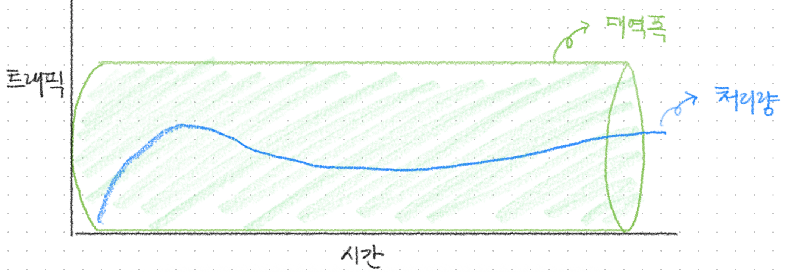

# 네트워크(Network)란?

## 네트워크란?

네트워크는 Net과 Work의 합성어로, 그물처럼 서로 긴밀하게 연결되어 있는 것을 뜻합니다.

보통 IT에서 사용되는 정의로 보자면 두 대 이상의 컴퓨터 또는 장치들이 연결되어 정보를 주고받을 수 있는 시스템을 말하며, 통신 과정 전체를 아우르는 개념이라 할 수 있습니다.

그렇다면 좋은 네트워크란 무엇일까요?

## 좋은 네트워크란?

좋은 네트워크란 신뢰성이 높고, 빠르며, 안전한 네트워크를 의미합니다.

처리량이 많고 지연 시간이 짧으며, 장애 발생 가능성이 적고, 보안이 잘 갖춰진 네트워크가 좋은 네트워크라고 할 수 있습니다.

 
 

# 처리량과 지연 시간

“처리량이 많고 지연 시간이 짧으며…”

지연 시간 및 처리량은 컴퓨터 네트워크의 성능을 측정하는 두 가지 지표로, 위에서 언급한 것처럼 좋은 네트워크가 되기 위해선 **처리량**과 **지연 시간**이 중요합니다.

## 지연 시간(Latency)

지연 시간은 요청이 처리되는 시간입니다. **네트워크를 통해 데이터를 전송하는 데 걸리는 시간**을 보여줍니다.

지연이나 랙이 길게 발생하는 네트워크는 지연 시간이 길고, 응답 시간이 빠른 네트워크는 지연 시간이 짧습니다.

### 측정 방법

지연 시간은 핑 시간을 측정하여 네트워크 지연 시간을 측정할 수 있습니다.

대부분의 운영 체제는 해당 작업을 수행하는 `ping` 명령어를 지원합니다.

왕복 시간은 **밀리초 단위**로 표시되며 네트워크에서 데이터를 전송하는 데 걸리는 시간을 알려줍니다.

## 처리량(Throughput)

처리량은 **특정 시간 동안 실제로 네트워크를 통과할 수 있는 평균 데이터 양**을 가리킵니다. 이는 목적지에 성공적으로 도착한 데이터 패킷의 수와 데이터 패킷 손실을 나타냅니다.

### 측정 방법

처리량은 네트워크 테스트 도구를 사용하거나 수동으로 처리량을 측정할 수 있습니다.

처리량을 수동으로 테스트하려면 파일을 전송하고 도착하는 데 걸리는 시간으로 파일 크기를 나누면 됩니다.

그러나 지연 시간과 대역폭이 처리량에 영향을 미치기 때문에, 대역폭 및 지연 시간과 같은 다른 요인과 함께 처리량을 보고하는 네트워크 테스트 도구를 주로 사용합니다.

원래는 네트워크 처리량을 **초당 비트 수(bps)**로 측정했으나 데이터 전송 기술이 발전함에 따라 훨씬 더 높은 가치를 달성할 수 있게 되었습니다.

따라서 **초당 킬로바이트(KBps)**, **초당 메가바이트(MBps)**, **심지어 초당 기가바이트(GBps)** 단위로 처리량을 측정할 수 있습니다.

## 대역폭, 지연 시간, 처리량 간의 관계

### 대역폭(Bandwidth)

대역폭은 **단위 시간 내 전달할 수 있는 최대 크기의 용량**을 의미합니다. 이는 주어진 시간 동안 네트워크를 통해서 흐를 수 있는 최대 비트 수를 나타냅니다.

대역폭이 높을수록 많은 데이터가 네트워크에 실려 전달될 수 있습니다. **초당 메가바이트(MBps) 단위**로 측정하며, **대역폭은 네트워크의 이론상 최대 처리량**이라고 생각하면 됩니다.

대역폭은 전송할 수 있는 데이터의 양이고, 처리량은 실제 네트워크 제한에 따라 특정 순간에 전송할 수 있는 실제 데이터 양입니다. **큰 대역폭은 속도나 우수한 네트워크 성능을 보장하지 않지만 대역폭이 클수록 처리량이 많아집니다.**

그렇다면, **왜 대역폭이 크다고 해서 속도나 성능이 보장되지 않을까요?**

1. 네트워크 지연 (latency)

   대역폭이 아무리 커도, 지연 시간이 길면 응답 속도는 느려짐.

2. 패킷 손실 (packet loss)

   네트워크 중간에서 데이터가 손실되면 재전송 발생

3. 혼잡 (Conjestion)

   여러 사용자가 동시에 같은 네트워크를 사용할 경우 병목 현상 발생

4. 네트워크 장비의 성능 제한

   서버, 라우터, 스위치 등이 처리할 수 있는 최대 속도보다 대역폭이 더 크다면 병목 발생

5. 프로토콜 오버헤드

   예: TCP는 패킷 순서 확인, 오류 확인 등을 하기 때문에 실제 전송 가능한 양은 줄어듦

결론적으로 **대역폭은 가능성**이고, **처리량은 현실**입니다.

물이 흐르는 파이프로 비유했을 때, 대역폭은 파이프의 지름에 해당하고 처리량은 파이프를 통해 실제 흘러간 물의 양이 됩니다.

파이프의 지름이 크다고 해도 그 안에 물이 충분히 흐르지 않거나, 물이 흐르는 속도가 느리거나, 중간에 물이 새면 실제 흐르는 물의 양은 줄어듭니다.

 
 